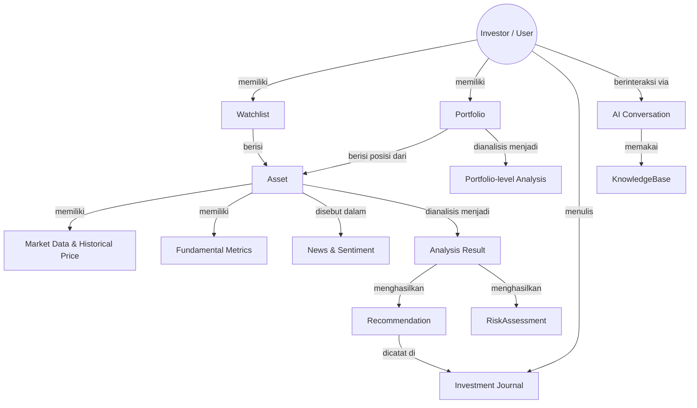
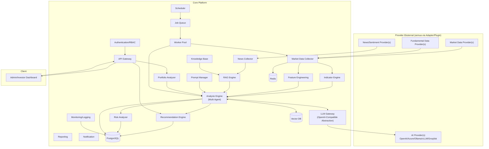
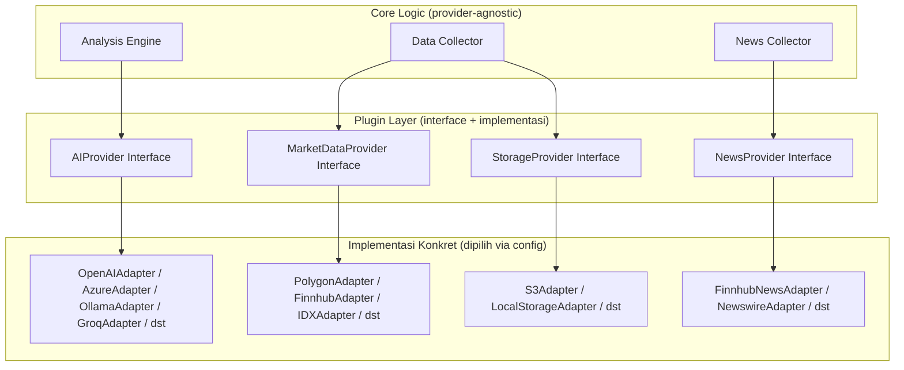
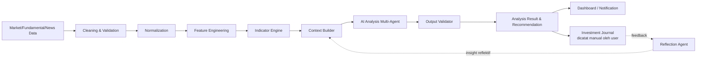
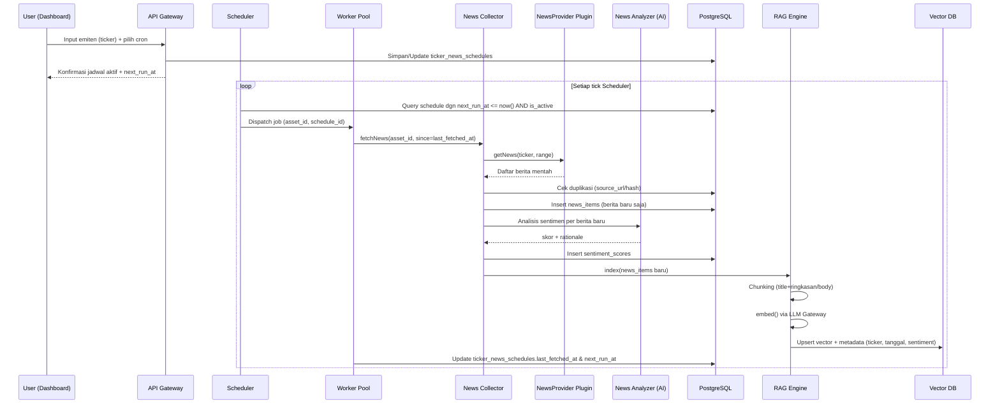
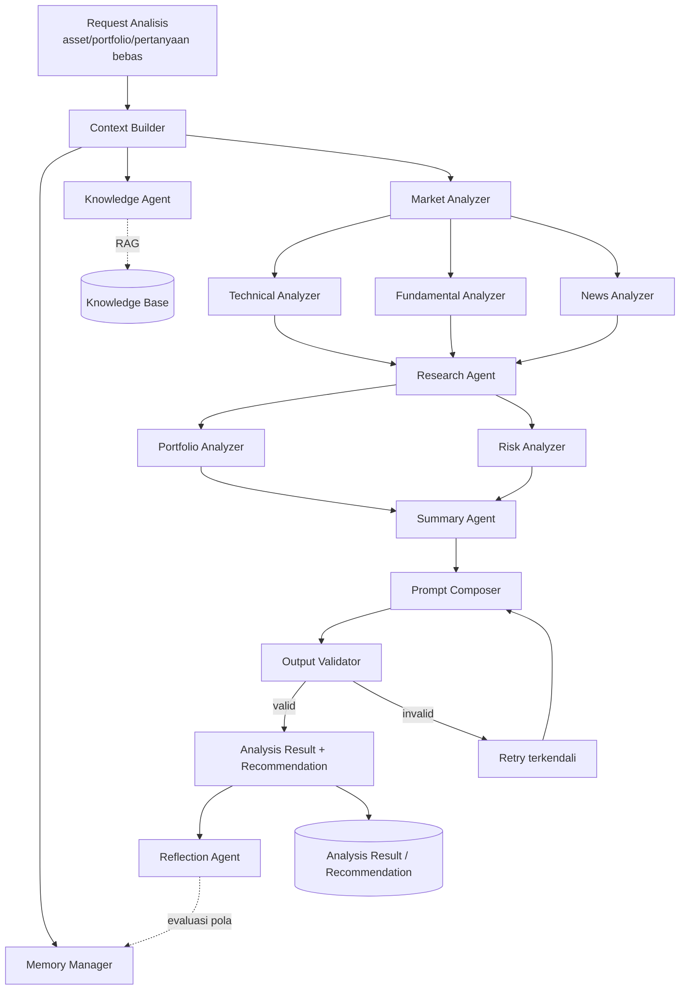

```mermaid
erDiagram
    USERS ||--o{ WATCHLISTS : owns
    USERS ||--o{ PORTFOLIOS : owns
    USERS ||--o{ INVESTMENT_JOURNAL : writes
    USERS ||--o{ AI_CONVERSATIONS : has
    WATCHLISTS ||--o{ WATCHLIST_ITEMS : contains
    PORTFOLIOS ||--o{ PORTFOLIO_HOLDINGS : contains
    ASSETS ||--o{ WATCHLIST_ITEMS : referenced_by
    ASSETS ||--o{ PORTFOLIO_HOLDINGS : referenced_by
    ASSETS ||--o{ HISTORICAL_PRICES : has
    ASSETS ||--o{ TECHNICAL_INDICATORS : computed_for
    ASSETS ||--o{ FUNDAMENTAL_METRICS : has
    ASSETS ||--o{ NEWS_ITEMS : mentions
    NEWS_ITEMS ||--o{ SENTIMENT_SCORES : analyzed_into
    NEWS_ITEMS ||--o{ NEWS_EMBEDDINGS : chunked_into
    USERS ||--o{ TICKER_NEWS_SCHEDULES : configures
    ASSETS ||--o{ TICKER_NEWS_SCHEDULES : monitored_by
    TICKER_NEWS_SCHEDULES ||--o{ NEWS_ITEMS : triggers_fetch_of
    ASSETS ||--o{ ANALYSIS_RESULTS : analyzed_into
    ANALYSIS_RESULTS ||--o{ RECOMMENDATIONS : produces
    ANALYSIS_RESULTS ||--o{ RISK_ASSESSMENTS : produces
    PORTFOLIOS ||--o{ PORTFOLIO_ANALYSIS : evaluated_into
    RECOMMENDATIONS ||--o{ INVESTMENT_JOURNAL : referenced_by
    AI_CONVERSATIONS ||--o{ AI_MESSAGES : contains
    AI_MESSAGES ||--o{ PROMPT_TEMPLATES : uses
    KNOWLEDGE_BASE ||--o{ KNOWLEDGE_CHUNKS : split_into
    USERS ||--o{ NOTIFICATIONS : receives
    USERS ||--o{ AUDIT_LOGS : generates
    SCHEDULER_JOBS ||--o{ JOB_QUEUE : dispatches
    AI_PROVIDERS ||--o{ AI_MESSAGES : used_by
```

```mermaid
flowchart LR
    A[1. Input Emiten] --> B[2. Pilih Cron]
    B --> C[3. Simpan Jadwal\nticker_news_schedules]
    C --> D[4. Scheduler memicu\nsesuai cron terpenuhi]
    D --> E[5. Fetch Berita\nvia NewsProvider Plugin]
    E --> F[6. Sentiment Analysis\nNews Analyzer Agent]
    F --> G[7. Simpan ke Database\nnews_items + sentiment_scores]
    G --> H[8. Chunking + Embedding]
    H --> I[9. Upsert ke Vector DB\nnews_embeddings]
    I --> J[RAG siap dipakai\nResearch Agent / Knowledge Agent]
```

# Dokumen Desain Teknis
## AI Investment Decision Support Platform

**Bursa:** Bursa Efek Indonesia (IDX)
**Prinsip inti:** Platform ini adalah *decision-support tool*, bukan trading bot. AI menghasilkan analisis, rekomendasi, dan simulasi sebagai bahan pertimbangan. **Tidak ada** koneksi ke broker, tidak ada order execution, tidak ada keputusan investasi otomatis. Seluruh keputusan beli/jual dilakukan manual oleh pengguna di luar sistem ini.

---

## Cara membaca dokumen ini

Dokumen ini menjelaskan satu sistem: apa yang dibangun, mengapa dibangun begitu, dan apa yang sengaja tidak dibangun. Ia disusun menurut aliran data — dari sumber, lewat perhitungan, ke penalaran AI, lalu ke layar — bukan menurut urutan pengerjaan.

Setiap keputusan desain di sini ditulis dengan alasannya. Itu bukan gaya penulisan melainkan syarat: sebagian besar keputusan pada platform ini punya alternatif yang terlihat lebih wajar, dan tanpa alasan tertulis alternatif itu akan tampak seperti perbaikan. Beberapa di antaranya sudah pernah dicoba dan gagal dengan cara tertentu — kegagalan itu ikut dicatat, karena itulah bagian yang tidak bisa diturunkan ulang dari kode.

Angka yang muncul di dokumen ini — berapa persen bursa yang cocok dengan sebuah kriteria, berapa milidetik sebuah endpoint menjawab, berapa emiten yang punya riwayat cukup — adalah hasil pengukuran terhadap data sungguhan, bukan estimasi. Di mana sesuatu belum terukur, itu dinyatakan.

| Bagian | Isi |
|---|---|
| I — Produk & Batasan | Untuk siapa, dan yang secara arsitektur tidak mungkin dilakukan |
| II — Arsitektur | Bentuk sistem, plugin, basis data, modul, permukaan API |
| III — Data | Dari mana angkanya datang dan apa yang tidak tersedia |
| IV — Lapisan AI | Multi-agent, prompt, abstraksi penyedia, keluaran dwibahasa |
| V — Yang Dilihat Pembaca | Watchlist, penyaringan, strategi, alert, antarmuka |
| VI — Operasi | Konfigurasi, keamanan, deployment, risiko, batas yang diketahui |

---

# Bagian I — Produk & Batasan


## 1. Ringkasan Eksekutif

AI Investment Decision Support Platform adalah sistem modular yang membantu investor menganalisis saham dengan menggabungkan data pasar, data fundamental, berita/sentimen, dan reasoning AI multi-agent — lalu menyajikannya sebagai **analisis terstruktur dan rekomendasi bertingkat (Strong Buy → Sell)** lengkap dengan alasan, confidence score, skenario bullish/bearish, dan level teknikal kunci.

Berbeda dari dua pendekatan sebelumnya (UI Automation & Execution via Broker API), platform ini **secara desain tidak memiliki jalur ke eksekusi transaksi sama sekali** — bukan karena guardrail yang bisa dimatikan, tapi karena memang tidak ada modul Execution Engine atau Broker Adapter dalam arsitektur ini. Ini menyederhanakan banyak aspek: tidak ada risiko finansial langsung dari bug sistem, tidak ada kebutuhan lisensi broker/API trading, dan permukaan risiko keamanan jauh lebih kecil.

**Prinsip desain utama:**

| Prinsip | Penjelasan |
|---|---|
| Read-only by design | Sistem tidak pernah menulis/mengirim apa pun ke sistem eksternal (broker, akun trading) — hanya membaca data & menghasilkan analisis |
| Provider-agnostic di semua layer | AI provider (OpenAI-compatible), market data provider, dan news source semuanya diabstraksi lewat interface yang bisa diganti via konfigurasi |
| Explainability wajib | Setiap rekomendasi harus menyertakan alasan, indikator pendukung/bertentangan, dan skenario — bukan sekadar label |
| AI ≠ Advisor Berlisensi | Output diposisikan sebagai *informational analysis*, bukan nasihat investasi berlisensi — bahasa & disclaimer di seluruh sistem harus konsisten dengan ini |
| Modular & plug-in | Setiap sumber data/provider adalah plugin yang bisa ditambah/diganti tanpa mengubah core logic |
| Full traceability | Setiap output AI tersimpan dengan versi prompt, provider/model yang dipakai, dan data yang jadi konteks — bisa direproduksi/diaudit |

**Satu hal yang membentuk hampir semua keputusan lain:** platform ini berjalan di atas sumber data gratis dan publik. Itu pilihan yang disengaja, dan konsekuensinya tidak disembunyikan — sebagian kapabilitas yang lazim ditawarkan produk sejenis memang tidak bisa dibangun di atasnya, dan bagian yang tidak bisa dibangun didaftar apa adanya di Bagian III.

---


## 2. Lingkup & Batasan Produk

### Problem Statement

Investor individu punya akses ke banyak data (harga, laporan keuangan, berita) tapi kesulitan **mensintesis** semuanya menjadi pemahaman yang koheren dan cepat diambil sebelum mengambil keputusan. Tools yang ada umumnya terpecah: charting terpisah dari fundamental, fundamental terpisah dari berita, dan tidak ada yang menjelaskan "kenapa" secara naratif dengan mempertimbangkan konteks lengkap sekaligus dan konsisten.

### Target Pengguna

| Persona | Kebutuhan Utama |
|---|---|
| Investor individu aktif | Analisis cepat multi-dimensi (teknikal+fundamental+sentimen) sebelum keputusan manual |
| Investor pemula | Penjelasan indikator & istilah pasar modal yang mudah dipahami (AI Learning Assistant) |
| Pemegang portofolio jangka menengah-panjang | Evaluasi diversifikasi, risiko, dan simulasi perubahan alokasi |
| Peneliti/analis independen | Riset emiten mendalam, perbandingan antar emiten, ringkasan laporan |

### Scope

**In-scope:** Ingestion data pasar/fundamental/berita, analisis teknikal & fundamental & sentimen berbasis AI, portfolio analysis (read-only terhadap data yang diinput manual oleh user), recommendation engine (informational), knowledge base & RAG untuk edukasi, prompt engineering terkelola, dashboard laporan.

**Out-of-scope (permanen, bukan hanya fase awal):** Koneksi ke broker/akun trading apa pun, order execution, auto-rebalancing otomatis tanpa persetujuan manusia, sinyal yang diformat sebagai instruksi eksekusi ("beli sekarang", "jual sekarang").

### AI Capabilities — Ringkasan Fungsional

| Kapabilitas | Output |
|---|---|
| AI Financial Analyst | Analisis fundamental (rasio, valuasi, pertumbuhan) |
| AI Technical Analyst | Analisis teknikal multi-indikator & multi-timeframe |
| AI Market Research Assistant | Ringkasan berita, riset emiten, perbandingan kompetitor |
| AI Portfolio Advisor | Evaluasi diversifikasi, konsentrasi, simulasi skenario |
| AI Risk Advisor | Estimasi risiko, drawdown historis, korelasi aset |
| AI Learning Assistant | Penjelasan indikator/istilah untuk edukasi pengguna |

### Functional Requirements (ringkas)

| ID | Requirement | Prioritas |
|---|---|---|
| FR-01 | Sistem mengambil data pasar/fundamental/berita dari provider terkonfigurasi | Must |
| FR-02 | Sistem menghitung indikator teknikal multi-timeframe | Must |
| FR-03 | AI menghasilkan analisis teknikal, fundamental, dan sentimen terpisah maupun tergabung | Must |
| FR-04 | AI menghasilkan rekomendasi bertingkat (Strong Buy–Sell) dengan struktur lengkap (§14.4) | Must |
| FR-05 | Sistem mendukung evaluasi portofolio yang diinput/disinkron manual oleh user | Must |
| FR-06 | Sistem menyediakan knowledge base + RAG untuk edukasi & konteks analisis | Should |
| FR-07 | AI provider dapat diganti via konfigurasi tanpa mengubah kode (OpenAI-compatible) | Must |
| FR-08 | Setiap rekomendasi dapat ditelusuri kembali (prompt version, model, data konteks) | Must |
| FR-09 | Sistem TIDAK memiliki endpoint/modul apa pun yang bisa mengirim order ke broker | **Must (hard constraint arsitektur)** |
| FR-10 | Pengguna dapat menyimpan jurnal keputusan investasi pribadi (manual) untuk direview AI (Reflection) | Should |
| FR-11 | Sistem memindai seluruh emiten bursa yang riwayatnya cukup dalam satu pass, dan alert maupun penyaring membaca hasil yang sama | Must |
| FR-12 | Setiap kondisi yang dilaporkan menyebutkan namanya sendiri; kondisi yang tidak dapat dievaluasi dibedakan dari yang dievaluasi dan tidak terpenuhi | Must |
| FR-13 | Analisis tersimpan dapat dirender dalam bahasa kedua tanpa menghasilkan analisis kedua | Should |
| FR-14 | Penyedia AI, jadwal, dan gerbang pendaftaran dapat diubah operator tanpa deploy ulang | Must |
| FR-15 | Pekerjaan panjang berjalan lewat antrean dan hasilnya diumumkan lewat kanal event, bukan ditahan di atas satu request HTTP | Must |

### Non-Functional Requirements

| Kategori | Requirement |
|---|---|
| Scalability | Setiap layer (data collector, AI engine, RAG) scale independen |
| Maintainability | Provider baru (AI/data) ditambah via plugin, tanpa ubah core |
| Observability | Metrics & tracing di seluruh pipeline, termasuk biaya token per request |
| Security | Lihat §26 |
| Auditability | Setiap output AI & keputusan sistem tercatat lengkap dengan konteksnya |
| Performance | Analisis on-demand < 10 detik untuk kasus umum; laporan mendalam bisa async |
| Caching | Data pasar & hasil analisis yang belum stale di-cache agresif untuk kurangi biaya API |
| Asynchronous Processing | Analisis berat (riset mendalam, backfill data) dijalankan via job queue, bukan blocking request |
| Resilience | Kegagalan satu provider (data/AI) tidak menjatuhkan seluruh sistem — fallback/circuit breaker |
| Extensibility | Arsitektur plugin memungkinkan penambahan kapabilitas AI baru tanpa refactor besar |

### Asumsi & Constraints

- Data portofolio pengguna diinput/disinkron manual (upload/entry), **bukan** hasil automation terhadap akun broker.
- AI generatif dipakai untuk reasoning & narasi; perhitungan numerik (indikator, rasio keuangan) tetap dilakukan deterministik oleh Indicator Engine/Feature Engineering, bukan diminta LLM menghitung dari nol (mengurangi risiko halusinasi angka).
- Semua sumber data eksternal dipakai sesuai lisensi masing-masing (lihat §9).
- Output sistem secara konsisten diberi disclaimer bahwa ini adalah *AI-generated analysis for informational purposes*, bukan nasihat investasi dari penasihat berlisensi — penting agar posisi produk jelas secara hukum maupun ekspektasi pengguna.

---


## 3. Model Domain

Sebelum masuk ke desain database teknis, berikut model domain konseptual — entitas inti dan hubungan bisnisnya secara bahasa domain (bukan skema tabel):



**Entitas inti & definisi domain:**

| Entitas | Definisi Domain |
|---|---|
| **Investor** | Pengguna platform; pemilik seluruh data pribadi (watchlist, portfolio, journal) |
| **Asset** | Instrumen investasi (saham, dsb) yang menjadi subjek analisis |
| **Watchlist** | Kumpulan asset yang dipantau investor, belum tentu dimiliki |
| **Portfolio** | Representasi kepemilikan aktual investor (input manual), dasar Portfolio Analysis |
| **Market Data** | Data harga/volume historis & terkini per asset |
| **Fundamental Data** | Data laporan keuangan & rasio per asset |
| **News & Sentiment** | Berita & hasil analisis sentimen terkait asset/pasar makro |
| **Analysis Result** | Output terstruktur dari AI Layer atas satu asset pada satu waktu |
| **Recommendation** | Kesimpulan actionable-informational dari Analysis Result (Strong Buy...Sell + alasan) |
| **Risk Assessment** | Evaluasi risiko terkait satu asset atau satu portofolio |
| **Investment Journal** | Catatan keputusan investor sendiri — dipakai Reflection Agent untuk evaluasi pola keputusan investor (bukan pola strategi bot) |
| **Knowledge Base** | Kumpulan dokumen (istilah, strategi, laporan) untuk RAG |
| **Conversation** | Sesi interaksi investor dengan AI (tanya-jawab bebas maupun terstruktur) |

**Catatan desain penting:** Domain model ini sengaja **tidak memiliki entitas `Order`, `Execution`, atau `Broker`** — konsisten dengan hard constraint bahwa platform ini murni decision-support.

---


# Bagian II — Arsitektur


## 4. Arsitektur Sistem



**Prinsip arsitektur kunci:**
- **Tidak ada komponen "Execution"** dalam diagram ini sama sekali — berbeda tegas dari dua desain sebelumnya. Ini bukan modul yang "dinonaktifkan", tapi memang tidak dirancang/dibangun.
- **Empat titik abstraksi provider**: AI Provider (lewat LLM Gateway), Market Data Provider, News Provider, Fundamental Data Provider — masing-masing punya interface plugin sendiri (lihat §5).
- **RAG Engine terpisah dari Analysis Engine** agar knowledge retrieval bisa dipakai lintas kapabilitas (technical, fundamental, learning assistant) tanpa duplikasi logic.

---


## 5. Arsitektur Plugin

Seluruh dependensi eksternal diakses lewat interface plugin, bukan pemanggilan langsung ke SDK provider tertentu — ini fondasi requirement "provider dapat diganti melalui konfigurasi".



| Interface | Kontrak Method Kunci | Alasan Desain |
|---|---|---|
| `AIProvider` | `chatCompletion()`, `embed()`, `streamCompletion()` | Detail per §16 |
| `MarketDataProvider` | `getQuote()`, `getHistoricalCandles()`, `subscribeRealtime()` | Setiap provider data (§9) punya adapter sendiri |
| `NewsProvider` | `getNews(ticker, range)`, `getSentiment()` (jika provider menyediakan native) | Bisa dikombinasi dengan sentiment analysis internal jika provider tidak menyediakan skor sentimen |
| `StorageProvider` | `store()`, `retrieve()`, `delete()` | Untuk knowledge base document, laporan, backup |

**Prinsip:** Menambah provider baru = menulis satu adapter baru yang mengimplementasikan interface yang sudah ada, plus entry konfigurasi (`ai_providers`/`data_providers` table, §7) — **tanpa mengubah kode Core Logic**. Konfigurasi mendukung multi-provider aktif sekaligus (mis. AI provider berbeda untuk task ringan vs task kompleks — lihat multi-model routing §16.10).

---


## 6. Desain Basis Data

### ERD Konseptual



### Kelompok Tabel & Rancangan Kolom Kunci

**A. Users & Personal Data**
| Tabel | Kolom Kunci | Catatan |
|---|---|---|
| `users` | id, email, password_hash, mfa_enabled, role, status, status_reason, suspended_until | Akun platform. `status` adalah enum (aktif/suspend/ban), bukan boolean: sebuah flag tidak bisa membedakan suspend dua hari dari ban permanen, sehingga alasannya harus disimpan terpisah — dan penanda yang bisa bertentangan dengan alasan di sebelahnya adalah cara akun terban tetap bisa masuk |
| `watchlists` / `watchlist_items` | id, user_id (FK), name / watchlist_id (FK), asset_id (FK) | `name` unik per pengguna: kelompok watchlist *adalah* nama itu. Unik pada `(watchlist_id, asset_id)`, sehingga satu emiten boleh berada di beberapa kelompok |
| `portfolios` / `portfolio_holdings` | id, user_id (FK) / portfolio_id (FK), asset_id (FK), qty, avg_price, input_method | `input_method` (manual/import) — penting karena tidak ada sinkronisasi otomatis ke broker |
| `investment_journal` | id, user_id (FK), asset_id (FK) nullable, decision, note, recommendation_ref (FK) nullable, created_at | Jurnal keputusan investor sendiri |

**B. Asset & Market Data**
| Tabel | Kolom Kunci | Catatan |
|---|---|---|
| `assets` | id, ticker, exchange, sector, industry | Master data instrumen |
| `historical_prices` | id, asset_id (FK), timeframe, timestamp, OHLCV, source | Partisi per timeframe/tahun |
| `technical_indicators` | id, asset_id (FK), timeframe, timestamp, indicator_name, value (JSONB) | JSONB untuk indikator multi-value |
| `fundamental_metrics` | id, asset_id (FK), period, metric_name, value, source | Rasio & data laporan keuangan |

**C. News, Sentiment & Scheduled Ingestion**
| Tabel | Kolom Kunci | Catatan |
|---|---|---|
| `ticker_news_schedules` | id, user_id (FK), asset_id (FK), cron_expression, preset_label, is_active, status (active/needs_attention), last_fetched_at, next_run_at, created_at | Basis flow §6.3 — satu record per kombinasi user+emiten+cron |
| `news_items` | id, asset_id (FK) nullable, schedule_id (FK) nullable, source, source_url, dedup_hash, headline, body_summary, published_at, is_indexed (bool) | `dedup_hash` atas URL+judul, karena satu berita disindikasikan dengan beberapa URL. `asset_id` mencatat *pengambilan terjadwal milik emiten mana yang mengambilnya* — bukan tentang siapa isinya, yang ditangani `news_item_issuers` |
| `news_sources` | id, name, feed_url (unik), asset_id (FK) nullable, is_active, last_status, last_error, consecutive_failures, last_fetched_at | Feed yang dibaca platform. Hidup di basis data, bukan di setelan: yang memutuskan publikasi mana diikuti bukan yang men-deploy ulang stack. Hasil pembacaan terakhir ikut disimpan, karena feed yang mulai menjawab 404 jika tidak akan tampak persis seperti feed yang memang sepi |
| `issuers` | id, ticker (unik), name, sector, sub_sector, industry, listing_board, listed_on, website, aliases (JSONB), is_listed, synced_at | Direktori lengkap perusahaan tercatat IDX. Sengaja bukan baris di `assets`: sebuah `Asset` adalah instrumen yang datanya dimiliki platform dan bisa dianalisis, sedangkan ini data referensi untuk menentukan sebuah berita membahas siapa |
| `news_item_issuers` | id, news_item_id (FK), issuer_id (FK), ticker, method, matched_text | Emiten yang dibahas satu berita — jamak, karena berita sektor membahas beberapa sekaligus. `method` dan `matched_text` disimpan agar tanda yang keliru menyebut sebabnya sendiri |
| `sentiment_scores` | id, news_item_id (FK), score, model_used, rationale | Hasil News Analyzer |
| `news_embeddings` | id, news_item_id (FK), chunk_text, embedding (vector), metadata (JSONB: ticker, published_at, sentiment_score) | Hasil chunking+embedding (langkah 8–9, §6.3) — dipakai RAG Engine saat retrieval, terpisah dari `knowledge_chunks` karena siklus hidup & filter (per-ticker, per-waktu) berbeda dari dokumen statis |

**D. Analysis, Recommendation, Risk**
| Tabel | Kolom Kunci | Catatan |
|---|---|---|
| `analysis_results` | id, asset_id (FK), analysis_type, generated_at, model_used, prompt_version | Satu record per run analisis |
| `recommendations` | id, analysis_result_id (FK), label, confidence, reasoning, supporting_factors (JSONB), conflicting_factors (JSONB), bullish_scenario, bearish_scenario, support_level, resistance_level, target_price, suggested_stop, horizon | Sesuai struktur wajib §14.4 |
| `risk_assessments` | id, analysis_result_id (FK) nullable, portfolio_id (FK) nullable, risk_type, score, detail (JSONB) | Bisa per-asset maupun per-portofolio |
| `portfolio_analysis` | id, portfolio_id (FK), diversification_score, sector_concentration (JSONB), correlation_matrix (JSONB), simulated_at | Hasil Portfolio Analyzer |

**E. AI Conversation, Prompt, Knowledge Base**
| Tabel | Kolom Kunci | Catatan |
|---|---|---|
| `ai_providers` | id, name, type (openai-compatible), base_url, is_active, priority | Basis multi-provider config (§16) |
| `ai_conversations` | id, user_id (FK), context_type, created_at | Sesi tanya-jawab bebas maupun terstruktur |
| `ai_messages` | id, conversation_id (FK), agent_name, role, content, provider_id (FK), tokens_used, cost_estimate | `cost_estimate` mendukung cost monitoring (§16.9) |
| `prompt_templates` | id, name, category, template_text, version, is_active | Versioning wajib |
| `knowledge_base` | id, title, source, category, uploaded_at | Dokumen sumber RAG |
| `knowledge_chunks` | id, knowledge_base_id (FK), embedding (vector), chunk_text | Untuk retrieval |

**F. System — Notification, Audit, Config, Scheduler**
| Tabel | Kolom Kunci | Catatan |
|---|---|---|
| `notifications` | id, user_id (FK), channel, event, message, context (JSONB), read_at | `event` enum tertutup berisi kejadian; `context` membawa fakta terstruktur sehingga klien menyusun kalimatnya sendiri dalam bahasa yang sedang dipilih |
| `audit_logs` | id, actor_type (user/ai/system), actor_id, action, entity, before, after, created_at | Append-only |
| `system_configuration` | id, scope, key, value (JSONB) | Termasuk konfigurasi provider aktif |
| `scheduler_jobs` | id, job_type, cron_expr, is_active | |
| `job_queue` | id, scheduler_job_id (FK) nullable, payload (JSONB), status, retry_count | |

**Alasan desain menyeluruh:**
- **Tidak ada tabel `orders`/`executions`/`brokers`** — konsisten dengan hard constraint arsitektur (§3, 4).
- **`recommendations` menyimpan seluruh field struktur wajib** (§14.4) sebagai kolom eksplisit (bukan blob teks bebas) agar Output Validator bisa memvalidasi kelengkapan secara terprogram, dan agar UI bisa render konsisten.
- **`ai_providers` + `ai_messages.provider_id`** memungkinkan audit "model/provider mana yang menghasilkan rekomendasi ini" — penting untuk reproducibility & cost tracking multi-provider (§16).
- **`portfolio_holdings.input_method`** menjaga kejelasan bahwa data portofolio adalah input pengguna, bukan hasil automation — relevan untuk audit & ekspektasi produk.
- **`investment_journal.recommendation_ref`** menghubungkan keputusan investor dengan rekomendasi yang pernah diberikan (jika relevan), menjadi basis Reflection Agent tanpa mengasumsikan investor selalu mengikuti rekomendasi AI.
- **`ticker_news_schedules` terpisah dari `scheduler_jobs` generik** karena punya siklus hidup & atribut spesifik (per user+emiten, status `needs_attention`) yang akan janggal bila dipaksakan ke tabel job generik; `scheduler_jobs`/`job_queue` tetap dipakai di lapisan eksekusi (§12.2) sebagai mekanisme dispatch umum.
- **`news_embeddings` terpisah dari `knowledge_chunks`** karena berita punya dimensi waktu (relevansi meluruh) dan filter per-ticker yang tidak berlaku untuk dokumen statis (istilah, strategi) di Knowledge Base — memisahkan keduanya memudahkan strategi retensi/pembersihan berbeda (mis. purge embedding berita lama tanpa menyentuh knowledge base inti).
- **`news_items.is_indexed` & `source_url`** langsung mendukung idempotency pipeline §6.3 (cegah duplikasi fetch & embedding berulang).

---


## 7. Spesifikasi Modul

| Modul | Tujuan | Tanggung Jawab | Input | Output | Dependensi |
|---|---|---|---|---|---|
| Authentication | Login & session | Verifikasi identitas, token management | credentials | session token | — |
| User Management | Kelola profil & preferensi | CRUD user, preferensi horizon investasi | user data | user record | Authentication |
| Market Data Collector | Ambil data pasar/fundamental dari provider terkonfigurasi | Scheduling fetch, normalisasi awal | Provider config | raw+normalized data | MarketDataProvider plugin |
| Indicator Engine | Hitung indikator teknikal | Kalkulasi deterministik multi-timeframe | OHLCV | nilai indikator | Market Data Collector |
| Feature Engineering | Turunkan fitur untuk AI | Rolling stats, normalisasi fitur | data mentah+indikator | feature vector | Indicator Engine |
| News Collector | Ambil berita per-emiten sesuai jadwal cron pengguna (§6.3) | Fetch incremental, deduplikasi, trigger sentiment analysis & indexing RAG | `ticker_news_schedules` yang jatuh tempo | raw news tersimpan + trigger embedding | NewsProvider plugin, Scheduler |
| Knowledge Base | Simpan dokumen sumber pengetahuan | Manajemen dokumen (istilah, laporan, strategi) | dokumen | dokumen tersimpan | StorageProvider plugin |
| RAG Engine | Retrieval kontekstual dari Knowledge Base | Chunking, embedding, similarity search | query | konteks relevan | Knowledge Base, LLM Gateway (embedding) |
| LLM Gateway | Abstraksi provider AI (§16) | Routing, retry, fallback, rate limit | request terstandar | response terstandar | AIProvider plugin |
| Prompt Manager | Kelola template & versi prompt | Simpan, versi, sajikan template sesuai kategori | request kategori | template terkompilasi | — |
| Analysis Engine | Orkestrasi multi-agent (§14) | Jalankan seluruh agent sesuai alur | data + konteks | Analysis Result | Indicator Engine, RAG, LLM Gateway |
| Recommendation Engine | Susun rekomendasi terstruktur final | Validasi kelengkapan struktur (§14.4) | Analysis Result | Recommendation | Analysis Engine, Output Validator |
| Portfolio Analyzer | Evaluasi portofolio pengguna | Diversifikasi, konsentrasi, simulasi | Portfolio data | Portfolio Analysis | Analysis Engine |
| Risk Analyzer | Evaluasi risiko asset/portofolio | Estimasi risiko, drawdown, korelasi | Data historis + portfolio | Risk Assessment | Analysis Engine |
| Reporting | Hasilkan laporan (PDF/dashboard) | Kompilasi hasil analisis jadi laporan | request laporan | file/laporan | Analysis Result, Recommendation |
| Notification | Kirim alert (bukan sinyal trading — mis. "analisis baru tersedia", "berita penting") | Kirim multi-channel | event | notifikasi terkirim | Queue |
| Settings | Kelola preferensi & konfigurasi provider aktif | UI/API untuk ubah provider, threshold | input user | config tersimpan | System Configuration |
| Scheduler | Jadwalkan job berkala, termasuk news ingestion per-emiten (§6.3) | Polling jadwal jatuh tempo, dispatch ke Queue | `ticker_news_schedules`/`scheduler_jobs` | job terjadwal | Queue |
| Logging | Pencatatan operasional | Log terpusat lintas modul | event | log record | — |
| Monitoring | Observability sistem | Metrics, tracing, dashboard kesehatan | metrics/log | dashboard/alert | Prometheus/Grafana |
| Admin Dashboard | UI kontrol & monitoring untuk admin | Kelola provider, user, lihat metrics | interaksi admin | tampilan & aksi | API Gateway |
| Plugin Manager | Muat & kelola plugin provider | Registrasi, validasi, aktivasi plugin | plugin package | provider terdaftar | Interface plugin masing-masing |
| Configuration | Manajemen config global | Simpan/serve konfigurasi | key/value | config aktif | — |

---


## 8. Permukaan API

| Endpoint | Method | Fungsi |
|---|---|---|
| `/auth/login` | POST | Login user |
| `/assets/{ticker}/analysis` | POST | Trigger/ambil analisis terbaru untuk suatu asset |
| `/assets/{ticker}/recommendation` | GET | Ambil rekomendasi terbaru (struktur §14.4) |
| `/portfolio` | GET/POST | Kelola data portofolio (input manual) |
| `/portfolio/analysis` | GET | Ambil Portfolio Analysis terbaru |
| `/portfolio/simulate` | POST | Simulasikan perubahan alokasi (what-if, read-only) |
| `/watchlist` | GET/POST/DELETE | Kelola watchlist |
| `/journal` | GET/POST | Kelola Investment Journal |
| `/chat` | POST | Percakapan bebas dengan AI (Learning Assistant, Research Agent) |
| `/knowledge-base` | GET/POST | Kelola dokumen knowledge base |
| `/news-schedules` | GET/POST/PUT/DELETE | Kelola jadwal fetch berita per-emiten (input emiten + pilih cron, §6.3) |
| `/news-schedules/{id}/run-now` | POST | Trigger fetch manual di luar jadwal (mis. untuk uji coba) |
| `/assets/{ticker}/news` | GET | Ambil berita & sentimen tersimpan untuk suatu emiten |
| `/providers` | GET/PUT | Kelola konfigurasi AI/data provider aktif (admin) |
| `/audit-logs` | GET | Ekspor audit trail |
| `/assets/{ticker}/strategy` | GET | Pembacaan sikap tersimpan dari dua sisi posisi (§20) |
| `/stock-picks` | GET | Penyaringan emiten per horizon, termasuk kandidat dekat-ARA (§19) |
| `/monitoring/quotes` | GET | Observasi harga terakhir untuk emiten yang dipantau (§21) |
| `/monitoring/poll` | POST | Observasi manual di luar interval worker |
| `/alerts` | GET | Alert yang terbentuk untuk pengguna |
| `/alerts/{id}/acknowledge` | POST | Tandai alert sudah dibaca |
| `/watchlist/categories` | GET | Daftar kelompok watchlist beserta jumlah anggotanya |
| `/watchlist/categories` | POST | Buat kelompok kosong tanpa harus menambah emiten |
| `/watchlist/categories/{name}` | PATCH/DELETE | Ganti nama / hapus kelompok (anggota pindah ke `Default`) |
| `/translate` | POST | Render prosa analisis tersimpan ke bahasa lain (§17) |
| `/ws/events` | WS | Kanal event per pengguna; token dikirim di frame pertama (§22) |
| `/alerts/acknowledge`, `/alerts/delete` (+ `-all`) | POST | Aksi massal atas alert, dibatasi pemiliknya (§21.5) |
| `/admin/news-sources/fetch-all` | POST | Antre pembacaan seluruh feed aktif (§12.6) |
| `/admin/issuers`, `/admin/issuers/sync` | GET/POST | Direktori emiten dan penyegarannya dari IDX (§12.7) |
| `/admin/news/retag` | POST | Menandai ulang berita tersimpan setelah alias diperbaiki (§12.9) |

> **Catatan desain API:** Tidak ada endpoint `/orders`, `/execute`, atau sejenisnya di seluruh permukaan API — konsisten dengan hard constraint arsitektur di §3–4.

---


# Bagian III — Data


## 9. Sumber Data: Yang Tersedia dan Yang Tidak

Bab ini menetapkan dari mana angka pada platform ini berasal. Ia dibagi dua karena ada dua jenis pengetahuan yang berbeda: survei atas apa yang ditawarkan pasar penyedia data, dan hasil pengujian terhadap endpoint sungguhan. Keduanya tidak selalu sepakat, dan ketika berbeda yang kedua yang dipakai.

### Batasan yang dipilih

**Platform ini memakai sumber gratis dan publik, termasuk yang tidak resmi.** Itu keputusan produk, bukan keterbatasan yang belum sempat diperbaiki, dan seluruh isi bab ini adalah konsekuensinya.

Harga yang dibayar dinyatakan terbuka: endpoint tak berdokumen bisa berubah tanpa pemberitahuan, batas lajunya tidak diumumkan, dan status lisensinya tidak sejelas API berbayar. Kode menanggungnya dengan cara yang spesifik — bentuk respons diperiksa alih-alih dipercaya, permintaan dijeda, dan setiap kegagalan pembacaan disimpan agar sumber yang mati bisa dibedakan dari sumber yang memang sepi.

Yang **tidak** ditanggung: syarat IDX melarang redistribusi komersial. Ini aman untuk riset pribadi dan perlu ditinjau ulang sebelum dipakai lebih luas (§26).

### Survei penyedia data

Tabel ini adalah pemetaan awal atas pasar penyedia. Ia dipertahankan karena tetap benar sebagai gambaran pilihan yang ada — dan karena ia menjelaskan apa yang dilepas oleh batasan di atas.

| Sumber | Kualitas Data | Historical | Realtime | Latency | Biaya | Legal Usage | Rate Limit |
|---|---|---|---|---|---|---|---|
| **Yahoo Finance** (endpoint tidak resmi) | Sedang, kadang tidak konsisten | Cukup panjang, gratis | Delayed (~15 menit) | Sedang | Gratis | **Abu-abu** — bukan API resmi berdokumen, ToS Yahoo membatasi automated commercial use | Tidak terjamin |
| **IDX (Bursa Efek Indonesia)** | **Paling autoritatif untuk saham Indonesia** | Tersedia historis resmi | Delayed di kanal publik; realtime butuh lisensi vendor resmi | Rendah (kanal resmi) | Gratis (delayed) / berbayar (realtime berlisensi) | **Paling legal** untuk data IDX | Bergantung kanal |
| **Alpha Vantage** | Baik (tier berbayar), terbatas di free tier | Baik | Realtime tier tinggi | Sedang | Free tier ketat → berbayar | Resmi, terdokumentasi | Ketat di free tier (5 req/menit) |
| **Finnhub** | Baik, termasuk news/sentiment/earnings | Baik | Realtime (WebSocket) tier berbayar | Rendah–Sedang | Free tier tersedia → berbayar | Resmi, terdokumentasi | Jelas per tier |
| **Polygon.io** | Sangat baik, granular (tick-level) | Sangat baik | Realtime (WebSocket), latency rendah | Rendah | Berbayar untuk realtime/historis granular | Resmi, terdokumentasi | Jelas per tier |
| **Twelve Data** | Baik, indikator siap pakai | Baik | Realtime tier berbayar | Sedang | Free tier terbatas → berbayar | Resmi, terdokumentasi | Jelas per tier |
| **Financial Modeling Prep** | Sangat baik untuk fundamental (laporan keuangan, rasio) | Baik | Umumnya delayed | Sedang | Free tier terbatas → berbayar | Resmi, terdokumentasi | Jelas |
| **TradingView** | Baik untuk visual/charting, bukan untuk pipeline data mentah | Terbatas untuk automation | Realtime di layanan berbayar, tanpa API data resmi untuk redistribusi | — | Berbayar untuk fitur | **Tidak ada API data resmi untuk automation pihak ketiga** — ToS melarang scraping/redistribusi | — |
| **Investing.com** | Sedang, baik untuk referensi manual | Baik untuk referensi | Delayed | — | Tidak ada API resmi publik | **Tidak direkomendasikan** — scraping melanggar ToS | — |
| **Financial News (agregator berlangganan)** | Bervariasi tergantung penyedia | — | Umumnya realtime untuk tier berbayar | Rendah–Sedang | Bervariasi | Pilih penyedia dengan lisensi redistribusi/API resmi (mis. layanan newswire berbayar), hindari scraping situs berita | Bervariasi |
| **Economic Calendar (provider terkonfirmasi API)** | Baik untuk data terjadwal (rilis data makro) | Historis tersedia di sebagian besar provider | Update terjadwal | Rendah | Bervariasi, banyak free tier | Pilih provider dengan API resmi | Bervariasi |

**Rekomendasi kombinasi:**

| Kebutuhan | Rekomendasi Utama | Fallback |
|---|---|---|
| Harga & data resmi IDX | Data resmi/berlisensi IDX atau vendor data resmi Indonesia | Provider agregator Indonesia berbayar dengan lisensi jelas |
| Data global (jika platform mendukung multi-market) | Polygon.io / Finnhub | Twelve Data / Alpha Vantage |
| Fundamental mendalam | Financial Modeling Prep | Data resmi laporan keuangan/keterbukaan informasi IDX |
| Berita & sentimen | Finnhub News/Sentiment + newswire berlisensi | RAG atas dokumen resmi (keterbukaan informasi, siaran pers) |
| **Dihindari sebagai sumber pipeline otomatis** | Yahoo Finance endpoint tidak resmi, scraping TradingView/Investing.com | — karena status legal tidak jelas/eksplisit dilarang ToS |

**Yang akhirnya dipakai** berbeda dari rekomendasi tabel di atas, dan bedanya adalah batasan yang dipilih: harga dari endpoint `chart` Yahoo, rekaman sesi dan fundamental dari API bursa sendiri, berita dari feed RSS publik. Tidak satu pun berbayar, dan tidak semuanya resmi.

### Apa yang benar-benar tersedia, diuji bukan diasumsikan

Semua yang berikut ditetapkan dengan pengujian terhadap endpoint sungguhan, bukan dari dokumentasi, dan sebagian besar bertentangan dengan asumsi yang wajar.

**Yahoo `quoteSummary` menolak (401).** Endpoint `chart` untuk harga tetap terbuka. Workaround tidak diimplementasikan: memakai endpoint tak berdokumen yang terbuka adalah satu hal, menembus kontrol akses yang ditambahkan penyedia adalah hal lain.

**Alpha Vantage tidak meliput fundamental IDX.** Diuji dengan kunci sungguhan: `BBCA.JKT`, `BBCA.JK`, dan `BBRI.JKT` semuanya mengembalikan kosong. Tepat untuk ekuitas AS, keliru untuk pasar ini.

**Fundamental IDX diambil dari API statistik bursa sendiri**, melalui klien yang menyajikan sidik jari TLS peramban karena endpoint-nya di balik Cloudflare. Tidak ada akun, kredensial, atau paywall di sana — yang dilewati adalah manajemen bot, bukan kontrol akses. Yang **tidak** dilewati adalah syarat IDX yang melarang redistribusi komersial: ini aman untuk riset pribadi dan perlu ditinjau ulang sebelum dipakai lebih luas (§26). Konsekuensi praktis yang ditanggung kode: endpoint bisa berubah tanpa pemberitahuan sehingga bentuk responsnya diperiksa alih-alih dipercaya, dan batasnya tidak dipublikasikan sehingga permintaannya dijeda.

**Satuan IDX tidak berdokumen, dan salah menanganinya adalah galat seratus atau semiliar kali lipat yang tidak tertangkap pemeriksaan tipe apa pun.** Uang dalam miliar rupiah — aset BBCA datang sebagai `1433701.78`, berarti Rp 1.434 triliun. `roa`, `roe`, dan `npm` dalam persen sementara penyedia lain memakai pecahan: IDX menulis `20.82` dan Alpha Vantage `0.345` untuk konsep yang sama. Keduanya ditetapkan dengan membandingkan emiten lintas tiga orde besaran.

**Basis periode `ytd` ditambahkan** ke kosakata `period_type`. IDX melaporkan kumulatif berjalan: laporan bertanggal 30 September memuat sembilan bulan pendapatan. Menyebutnya tahunan melebihkan sepertiga, kuartalan mengurangi tiga kali lipat, dan `ttm` jendela yang sama sekali berbeda.

**Retrieval berjalan tanpa model embedding.** Banyak gateway swakelola hanya melayani model chat dan menjawab `/embeddings` dengan 404. Pencarian token eksak — kode emiten, nama metrik, rasio — tidak terpengaruh; yang hilang adalah pencocokan parafrasa.

**Gateway AI swakelola punya batas waktunya sendiri, dan batas itu bergerak.** Pada satu pengukuran, prompt seukuran analyzer (1.170 token masuk, 600 token keluar) dijawab HTTP 504 pada detik ke-90 sementara permintaan 10 token butuh 16 detik; pada pengukuran berikutnya gateway yang sama menjawab dalam 167 milidetik. Karena itu timeout adalah kolom per penyedia, bukan konstanta: menaikkan timeout klien tidak bisa menembus batas di sisi gateway, tetapi menyamakan semua penyedia pada satu angka membuat yang cepat menunggu selama yang lambat. Memecah pekerjaan menjadi job-job yang lebih pendek (§17.2) mengurangi paparannya; menaikkan batas gateway itu sendiri adalah pekerjaan operatornya.

---


## 10. Pipeline Data



| Tahap | Penjelasan |
|---|---|
| Cleaning & Validation | Deteksi data hilang/outlier, validasi range harga wajar |
| Normalization | Samakan timezone, precision, symbol mapping antar provider |
| Feature Engineering | Turunan fitur (return, volatility rolling) untuk indikator & AI |
| Indicator Engine | Hitung seluruh indikator teknikal deterministik |
| Context Builder | Susun konteks final (data + memory + knowledge) sebelum AI |
| AI Analysis | Multi-agent reasoning (§14) |
| Output Validator | Validasi struktur & bahasa sebelum disimpan/ditampilkan |
| Dashboard/Notification | Penyajian ke pengguna |
| Investment Journal → Reflection | Loop pembelajaran personal investor (bukan pembelajaran strategi trading otomatis) |

---


## 11. Pemindaian Seluruh Bursa

**Satu pass, satu kosakata, dua pembaca.** Kriteria yang sama dijalankan atas setiap emiten yang riwayatnya cukup, hasilnya disimpan. Alert membacanya untuk emiten yang dipantau; penyaring membacanya untuk seluruh pasar. Bedanya satu filter.

**Kecocokan direkam dari kandidat alert itu sendiri, bukan dari daftar terpisah.** Penyaring dengan daftar aturannya sendiri akan menyimpang dari alert: sebuah kriteria lalu berarti satu hal di layar monitoring dan hal lain yang berbeda tipis di layar picks.

### Dari mana datanya

**Satu permintaan per sesi memberi OHLCV untuk seluruh 963 emiten.** Rekaman akhir sesi bursa memuat open, high, low, close, volume, nilai, frekuensi, serta pembelian dan penjualan asing. Setahun perdagangan untuk seluruh bursa karena itu berbiaya beberapa ratus permintaan, bukan beberapa ratus ribu — dan itulah yang membuat pemindaian seluruh pasar terjangkau sama sekali.

**Backfill dipecah satu job per tanggal, bukan satu job untuk setahun.** Ditahan dalam satu job, tiga ratus permintaan berurutan adalah satu unit kerja yang berjalan berpuluh menit, mengulang dari awal ketika gagal di permintaan kedua ratus, dan tampak persis seperti hang selama itu. Dipecah, tiap tanggal punya retry sendiri, batas konkurensi antrean menahan lajunya, dan satu kegagalan berbiaya satu sesi.

**Akhir pekan dilewati saat perencanaan, bukan ditemukan handler.** Bursa menjawab dengan daftar kosong, yang berbiaya satu permintaan untuk mempelajari sesuatu yang sudah diketahui kalender.

**Sesi tanpa volume bukan sebuah bar.** IDX tetap menerbitkan emitennya dengan high, low, dan open bernilai nol serta penutupan sebelumnya dibawa maju. Disimpan apa adanya, setiap baris seperti itu adalah bar yang rentangnya seluruh harga — yang menghancurkan ATR dan setiap rata-rata yang menyentuhnya. Barisnya tetap disimpan; ia hanya tidak ditawarkan sebagai bar.

**`OpenPrice` sering nol meski emitennya berdagang.** Beberapa ratus emiten melaporkannya begitu pada sesi biasa. Di mana ia hilang, penutupan sebelumnya menggantikannya — satu-satunya nilai yang membuat barnya tetap konsisten — dan artinya gap tidak bisa dideteksi untuk sesi itu, yang memang benar: datanya tidak mengatakan.

### Kualitas kriteria, diukur bukan diasumsikan

**Sebuah kriteria hanya bisa dinilai terhadap pasar sungguhan.** Tes unit membuktikan sebuah aturan menyala pada masukan yang dirancang untuk menyalakannya; ia tidak bisa mengatakan aturan itu cocok pada separuh bursa. Maka tingkat kecocokan tiap kriteria diukur terhadap seluruh emiten, dan yang cocok pada mayoritas pasar diperlakukan sebagai konstanta bernama, bukan filter.

Dua aturan kalibrasi berlaku untuk kriteria baru mana pun.

**Level terdekat berarti terdekat.** Ekstrem 52 minggu adalah level *terjauh*, dan memakainya sebagai pengganti membuat setiap saham yang berdagang di tengah rentangnya menunjukkan rasio imbal-risiko di atas dua — 44% pasar, yang bukan filter. Detektor pivot yang sama dengan analisis per-emiten memberi 18%, dan biayanya dapat diabaikan: seluruh pemindaian hitungan detik.

**Kriteria adalah peristiwa, bukan keadaan.** Desil terbawah dari riwayat sendiri secara konstruksi adalah kejadian satu-dari-sepuluh, jadi squeeze yang cocok pada 36% pasar menandakan aturannya menyatakan keadaan yang bertahan. Squeeze yang bertahan dua puluh sesi tidak layak berbunyi dua puluh kali. Dinyatakan pada saat *memasukinya*: 2%.

### Membacanya

**Dua tab, satu data.** "Watchlist saya" dan "seluruh bursa" berbeda satu filter. Membangunnya sebagai dua fitur adalah cara keduanya mulai berselisih tentang arti sebuah kriteria.

**Watchlist kosong bukan berarti tanpa filter.** "Saya tidak mengikuti apa pun" adalah jawaban yang sah, dan mengembalikan seluruh bursa untuk itu adalah kebalikan dari yang diminta pembaca.

**Beberapa kriteria digabung dengan OR.** Pembaca yang mencentang tiga kriteria meminta apa pun yang menunjukkan salah satunya, bukan nama langka yang menunjukkan ketiganya.

**Yang ditampilkan adalah kriterianya, bukan skor.** Hitungan kondisi yang terpenuhi dirender sebagai satu angka mengundang pembacaan sebagai probabilitas sesuatu.

**Seluruh hasil satu run berbagi satu tanggal.** Dikunci pada sesi terakhir tiap emiten, penyaring hanya akan mengembalikan nama yang berdagang pada tanggal paling akhir — yang diam-diam membuang setiap emiten tidak likuid, justru bagian pasar tempat penyaring paling berguna. Seberapa segar bar tiap baris disimpan di dalam sinyalnya.

**Pencarian ada di kedua tab.** Yang dicocokkan adalah kodenya, bukan teks sinyal: pesan alert dibangun dari template, jadi kata-katanya berulang di ratusan baris dan mencocokkannya mengembalikan hampir semuanya. Kode emiten adalah hal yang sudah dibawa pembaca saat tiba.

**Tab dibuka pada watchlist.** Pemindaiannya sendiri selalu seluruh indeks — itulah yang membuat tab global layak dibuka — tetapi hal pertama yang dicari pembaca ketika membuka layar adalah segelintir nama yang ia pegang.

### Kendali operator

**Impor berjalan dari cron, bukan tiap tick penjadwal.** Operator yang memutuskan kapan platform menyentuh bursa. Bedanya dengan sapuan berita: jadwal ini punya bawaan — `0 18 * * 1-5`, sejam setelah penutupan, hari kerja saja — karena ini bursa yang menerbitkan tentang pasarnya sendiri, dan penyaring yang diam sampai seseorang menemukan setelan adalah penyaring yang terlihat rusak. Ekspresinya dibaca dalam waktu bursa (WIB), bukan UTC.

**Pemicunya disebar acak.** Endpoint-nya tidak mengumumkan batas laju, jadi risikonya bukan kuota tertulis melainkan terlihat seperti bot: permintaan yang mendarat tepat pukul 18:00:00.000 setiap hari kerja adalah jadwal, dan jadwal itulah yang jadi sasaran pembatasan laju. Offsetnya diturunkan dari waktu jatuh tempo dengan hash, bukan diundi dari `random` — penjadwal yang berdetak dua kali di dalam jendela menghitung penundaan yang sama pada kedua kali dan mengantre satu pekerjaan; angka acak baru tiap detik akan mengantre pekerjaan baru tiap menit.

**Tiga pemicu manual, terpisah.** Impor menarik rekaman sesi hari ini lalu merantai pemindaian; pemindaian saja menghitung ulang tanpa jaringan dan itulah yang ditekan setelah sebuah aturan berubah; backfill mengisi riwayat satu pekerjaan per sesi. Dipisah karena ketiganya gagal karena alasan berbeda dan layak dicoba ulang sendiri-sendiri.

**Menekan tombol berarti mengantre, bukan menjalankan.** Antreanlah yang memegang `SKIP LOCKED` dan kunci dedup. Menjalankan impor langsung dari permintaan HTTP berlomba dengan worker yang sedang berjalan, dan hasilnya adalah pelanggaran unique constraint yang terbaca seperti bug skema padahal sebenarnya dua penulis atas baris yang sama.

**Menunya ada di dasbor admin, bukan di monitoring.** Yang diatur adalah kapan platform menarik data, bukan apa yang dilihat seorang pembaca.

---


## 12. Berita: Sumber, Direktori Emiten & Penandaan

### Sumber feed

**Pipeline berita bisa berjalan hijau tanpa menyimpan apa pun yang ditulis manusia.** Jadwal berjalan, handler sukses, laporan hijau, tabel kosong — cukup dengan provider default yang menunjuk fixture tes, atau dengan nol jadwal yang pernah dibuat sehingga adapter yang bekerja pun tak pernah dipanggil. Kesunyian subsistem ini tidak pernah terlihat seperti kegagalan, dan itulah alasan setiap penjaga di bawah ini ada.

**Sumber feed hidup di basis data, bukan di setelan.** Orang yang memutuskan publikasi mana yang diikuti bukan orang yang men-deploy ulang stack.

**Dua bentuk feed, dibedakan oleh URL-nya sendiri, bukan oleh flag.** URL yang memuat `{ticker}` disubstitusi per emiten dan penerbitnya yang mencari — hasilnya tidak disaring lagi. URL biasa adalah feed umum yang diambil sekali untuk semua emiten.

**Nol sumber adalah galat, bukan hasil kosong.** Mengembalikan nol artikel akan memberi tahu jadwal bahwa tidak ada berita, dan ia akan terus mengatakan itu selamanya.

**Halaman error HTML adalah XML yang sah.** Server yang menjawab 404 dengan halaman bergaya akan terparsir bersih dan menghasilkan nol entri, yang terbaca di hilir sebagai "tidak ada berita hari ini" dan bertahan begitu selamanya. Elemen akar yang memisahkan feed dari dokumen yang kebetulan terparsir, sehingga hanya `rss`, `feed`, dan `rdf` yang diterima.

**Setiap feed membawa hasil pembacaan terakhirnya** — status, galat, dan hitungan kegagalan berturut-turut. Tanpa itu, feed yang mulai menjawab 404 tidak bisa dibedakan dari feed yang memang sepi. Tombol uji mengambil feed saat itu juga dan menampilkan beberapa judul teratas: hitungan menjawab "apakah sesuatu terparsir", hanya judulnya yang menjawab "apakah ini feed yang Anda maksud".

**Satu feed mati tidak menghilangkan berita sembilan belas lainnya.** Perilaku yang membuat kesunyian subsistem ini dulu begitu sulit disadari adalah kegagalan yang menghentikan semuanya dan tidak melaporkan apa pun.

### Dua arah pengambilan

**Pipeline per emiten punya lantai yang tidak bisa ditembus.** Untuk tiap emiten yang dipantau seseorang, feed dicari. Artinya sebuah berita hanya pernah terlihat kalau ada emiten yang mencarinya: liputan atas perusahaan yang tidak dipantau siapa pun bukan sekadar tak tertandai — ia tidak pernah diambil. Feed umum juga dibaca ulang sekali per emiten, dan tiap kali seluruh isinya yang tidak cocok dibuang.

**Sapuan membalik arahnya.** Setiap feed aktif dibaca sekali, semua isinya disimpan, lalu atribusi dilakukan setelahnya terhadap direktori emiten penuh. Berita yang menyebut enam bank ditandai ke enam bank, bukan diarsipkan di bawah satu yang kebetulan mengambilnya. Keduanya hidup berdampingan: jadwal tetap menjamin kesegaran untuk emiten yang dipantau — termasuk yang beritanya datang lewat URL pencarian bertemplat yang tak bisa disapu — dan sapuan mengisi seluruh sisanya.

### Jadwal per emiten, dari fetch sampai siap dipakai RAG

Jalur kedua dari dua di atas, dijabarkan penuh karena ia yang menyentuh paling banyak modul: dari jadwal yang dipilih pengguna, lewat pengambilan dan analisis sentimen, sampai berita itu bisa diambil kembali sebagai konteks oleh Research Agent.

#### Alur



#### Interaksi antar modul



#### Detail tiap langkah

| Langkah | Modul Penanggung Jawab | Penjelasan |
|---|---|---|
| **1. Input Emiten** | Dashboard → API Gateway | User memilih/mencari ticker dari `assets`. Bisa lebih dari satu emiten sekaligus (bulk), masing-masing boleh punya cron berbeda |
| **2. Pilih Cron** | Dashboard → Scheduler | User memilih preset (§12.4) atau custom cron expression; sistem menghitung `next_run_at` awal |
| **3. Simpan Jadwal** | Scheduler / DB | Disimpan sebagai record `ticker_news_schedules` (§6.2, tabel baru) — satu record per kombinasi (user/akun, emiten, cron) |
| **4. Trigger Scheduler** | Scheduler | Proses berjalan berkala (mis. tiap 1 menit) memeriksa jadwal mana yang `next_run_at <= now()` dan `is_active = true`, lalu men-dispatch job ke Queue |
| **5. Fetch Berita** | Worker Pool → News Collector → NewsProvider plugin | Fetch **incremental**: hanya berita sejak `last_fetched_at` untuk menghindari duplikasi & menghemat kuota API provider |
| **6. Sentiment Analysis** | News Analyzer (AI Agent, §14.2) | Setiap berita baru dianalisis: skor sentimen + alasan singkat, mengikuti kategori prompt "Ringkasan Berita" (§15.1) |
| **7. Simpan ke Database** | News Collector | `news_items` (berita mentah) dan `sentiment_scores` (hasil analisis) disimpan; deduplikasi berbasis `source_url`/hash konten sebelum insert |
| **8. Chunking + Embedding** | RAG Engine | Konten berita (judul + ringkasan/isi) dipecah jadi chunk sesuai ukuran optimal untuk embedding, lalu di-embed lewat LLM Gateway (`embed()`, §16.3) |
| **9. Upsert ke Vector DB** | RAG Engine | Chunk + vector disimpan dengan metadata (`ticker`, `published_at`, `sentiment_score`) agar retrieval bisa difilter per-emiten/rentang waktu saat dipakai Research Agent atau Knowledge Agent |

**Idempotency & error handling:**
- Setiap job fetch bersifat idempotent — bila gagal di tengah jalan (mis. NewsProvider timeout), `last_fetched_at` **tidak** ter-update, sehingga retry berikutnya otomatis mengambil ulang rentang yang sama tanpa kehilangan berita.
- Kegagalan berulang pada satu jadwal (mis. 5x gagal berturut-turut) memicu notifikasi ke user/admin dan menandai schedule sebagai `needs_attention` (bukan otomatis nonaktif, agar tidak diam-diam berhenti tanpa sepengetahuan user).
- Embedding **tidak diulang** untuk berita yang sudah pernah di-index (dicek via flag `news_items.is_indexed`) — mencegah biaya embedding berulang saat retry.

#### Preset cron

Agar user tidak perlu menulis cron expression manual (kecuali power user), Dashboard menyediakan preset:

| Preset | Cron Expression | Cocok untuk |
|---|---|---|
| Setiap 15 menit | `*/15 * * * *` | Investor aktif, emiten watchlist utama |
| Setiap 1 jam | `0 * * * *` | Pemantauan reguler |
| 2x sehari (jelang buka & tutup bursa, WIB) | `0 8,15 * * 1-5` | Ringkasan sebelum & sesudah sesi trading |
| Harian (pagi, sebelum bursa buka) | `0 7 * * 1-5` | Investor jangka menengah–panjang |
| Mingguan (Senin pagi) | `0 7 * * 1` | Watchlist pasif / emiten non-prioritas |
| Custom | Ditentukan user | Power user, kebutuhan spesifik |

> Hari kerja bursa (`1-5` = Senin–Jumat) dipakai sebagai default preset karena relevansi berita emiten Indonesia terkonsentrasi pada hari perdagangan, tapi user tetap bisa memilih cron custom yang mencakup akhir pekan bila diperlukan (mis. berita global/makro yang tidak terikat jam bursa).

> **Batas kewajaran (guardrail operasional):** Sistem menerapkan minimum interval per-schedule (mis. tidak kurang dari 5 menit) untuk mencegah beban berlebih ke NewsProvider dan potensi melanggar rate limit provider (§9) — validasi ini dilakukan saat user memilih cron di langkah 2.

### Direktori emiten

**Tabel tersendiri, bukan baris di `assets`.** Sebuah `Asset` adalah instrumen yang datanya dimiliki platform dan bisa dianalisis; memasukkan 962 perusahaan tercatat ke sana mengiklankan 962 instrumen yang bisa dianalisis dengan harga yang hanya ada untuk segelintir. Ini data referensi, dan justru lengkap karena tidak mengaku lebih dari itu.

**Sumbernya endpoint profil perusahaan IDX sendiri** — asal publik yang sama yang sudah dibaca adapter fundamental, jadi tidak menambah dependensi maupun pertanyaan baru tentang dari mana datanya.

**Kelengkapannya adalah tempat recall penandaan berpijak.** Emiten yang hilang dari tabel tidak menghasilkan tanda yang salah, ia menghasilkan kesunyian — dan kesunyian tak bisa dibedakan dari berita yang memang tidak menyebut siapa pun.

**Emiten yang hilang dari feed ditandai, bukan dihapus.** Beritanya masih ada dan masih merujuknya. Tanda yang menunjuk baris yang tidak ada lagi lebih buruk daripada tanda yang menunjuk perusahaan yang tidak lagi diperdagangkan.

### Menentukan sebuah berita membahas siapa

**Tanda disimpan di tabel relasi, bukan kolom.** Satu berita rutin membahas beberapa perusahaan, dan `news_items.asset_id` hanya memuat satu. Kolom itu tetap dengan artinya semula: pengambilan terjadwal milik emiten mana yang mengambil artikel tersebut — fakta yang berbeda dari siapa yang dibicarakan artikel itu.

**Kecocokan disimpan bersama tandanya** — metodenya dan teks yang cocok — sehingga tanda yang keliru menyebut sebabnya sendiri dan alias di baliknya bisa diperbaiki.

**Kode dicocokkan peka huruf besar, dan itu diukur bukan diasumsikan.** `BANK`, `LABA`, `AGRO`, dan `RAYA` semuanya kode emiten sungguhan sekaligus kata Indonesia biasa. Dicocokkan tanpa memperhatikan kapitalisasi, "bank sentral menaikkan suku bunga" menandai Bank Aladin dan "laba bersih" menandai Ladangbaja. Terhadap judul sungguhan itu bukan kasus pinggiran, itu mayoritas kalimat.

**Judul yang seluruhnya kapital tidak dicocokkan pada kode sama sekali.** Kapitalisasi adalah satu-satunya sinyal yang memisahkan kode dari kata, jadi teks yang seluruhnya kapital tidak membawa sinyal itu. Namanya tetap dicocokkan; tanda yang hilang berbiaya lebih kecil daripada tanda yang salah.

**Nama yang dimiliki dua emiten tidak dimiliki keduanya.** Ambiguitas tidak bisa diselesaikan dengan memilih salah satu, jadi aliasnya dibuang. Tanda hasil tebakan lebih buruk daripada tanda yang tidak ada: ia memasukkan berita perusahaan lain ke dalam bukti yang dijadikan dasar penalaran sebuah analisis.

**Berita yang menyebut belasan emiten tidak ditandai ke satu pun.** Itu daftar — rekap indeks, tabel teraktif — bukan liputan tentang siapa pun, dan menandainya ke lima puluh perusahaan membuat feed masing-masing tidak berguna.

**Menandai ulang mengganti, bukan menambah.** Justru itu gunanya bisa memperbaiki alias: koreksi harus mampu membatalkan tanda salah yang disebabkannya, bukan hanya berlaku untuk yang datang besok.

**Berita bertanda masuk ke tab berita emitennya dan ke bukti analisisnya.** Menyaring `asset_id` — kolom siapa-yang-mengambil — untuk menjawab apa-isinya menghasilkan nol, dengan benar dan tanpa guna. Setiap artikel membawa alasan ia ada di sana beserta emiten lain yang disebutnya, sehingga berita sektor terbaca sebagai berita sektor.

### Indeks alias

**Nama yang lazim dipakai tidak bisa diturunkan dari nama terdaftar.** Liputan menulis "BCA", bukan "PT Bank Central Asia Tbk"; "Indomie" ketika emitennya Indofood CBP; "Tolak Angin" ketika emitennya Sido Muncul. Huruf-hurufnya memang tidak ada di sana. Maka indeksnya ditulis tangan — ia pengetahuan, bukan algoritma, dan setiap entri adalah klaim bahwa satu untai kata tertentu dalam liputan pasar Indonesia berarti satu emiten tertentu.

**Yang sengaja tidak dimasukkan sama pentingnya.** ARTO adalah "Bank Jago", tidak pernah "Jago" — *jago* kata biasa. TINS adalah "PT Timah", tidak pernah "Timah" — logamnya ditulis terus-menerus tanpa perusahaannya terlibat. GIAA adalah "Garuda Indonesia", tidak pernah "Garuda". Bentuk dua huruf seperti "XL" mencocoki terlalu banyak prosa.

**Anak usaha dan merek produk masuk bila beritanya memang tentang induk yang tercatat.** Artikel tentang tarif Telkomsel adalah artikel tentang pendapatan TLKM; tentang harga Indomie adalah tentang margin ICBP.

**Inisial tidak diturunkan secara mekanis.** Mengambil huruf pertama tampak seperti aturan yang menghasilkan "BRI" dari "Bank Rakyat Indonesia", dan memang begitu — tetapi diukur atas direktori 962 emiten terhadap satu hari feed pasar Indonesia, satu hasil benar berbanding delapan salah: `bps` untuk HOKI mencocoki Badan Pusat Statistik, `sri` untuk SRIL mencocoki Sri Mulyani, `apa` untuk NASA mencocoki apa saja. Tidak ada dalam susunan hurufnya yang memisahkan "bni" dari "apa", jadi aturannya tidak bisa diperbaiki dengan diperketat. Nama yang lazim dipakai adalah pengetahuan, dan pengetahuan ditulis tangan.

**Daftar alias efektif dihitung saat pencocokan, bukan disimpan.** Disimpan, emiten yang diimpor bulan lalu selamanya memakai aturan bulan lalu: menambahkan "Indomie" ke indeks tidak akan menjangkau siapa pun sampai seseorang menyinkronkan ulang, dan pengetatan aturan turunan meninggalkan alias yang seharusnya dihapus tetap duduk di tabel. Kolom `aliases` karena itu hanya berisi tambahan yang diketik seseorang, dan sinkronisasi tidak menyentuhnya.

**Aturan "semua kata umum berarti alias umum" terdengar benar dan salah.** Ia menolak "Bank Mandiri", "Semen Indonesia", "Kimia Farma", dan "Bank Raya" — semuanya nama sehari-hari emiten sungguhan. Frasa yang hendak ditangkapnya berbiaya satu tanda meragukan; aturannya sendiri berbiaya liputan beberapa perusahaan terbesar di bursa. Kegenerikan adalah sifat sebuah kata sendirian; dua kata bersama adalah nama.

**Tetapi turunan mekanis tidak mendapat kelonggaran yang sama.** Indeks boleh menyebut "Bank Mandiri" karena ada orang yang memeriksanya. Turunan tidak diperiksa siapa pun, dan dengan kelonggaran itu ia menghasilkan "kawasan industri" untuk KIJA — Bahasa Indonesia untuk lahan industri — yang mencocoki berita tentang kawasan industri di Madura.

**Alias yang terlalu umum ditolak saat disimpan, bukan didiamkan.** "Bank" sebagai alias bukan satu tanda sempit, melainkan beberapa ratus tanda yang salah. Administrator yang mengetiknya berhak diberi tahu saat itu juga, bukan menemukannya seminggu kemudian di dalam tanda-tanda.

---

## 13. Kalender Agenda Emiten

Ini satu-satunya permukaan pada platform yang menghadap ke depan, dan karena itu yang paling mungkin dibaca sebagai ramalan. Setiap keputusan di bawah mendorong ke arah sebaliknya.

**Yang dinyatakan adalah jadwal, bukan akibat.** "TLKM merilis laporan pada 30 April" adalah fakta. "TLKM merilis laporan pada 30 April, pertimbangkan masuk sebelumnya" adalah sinyal trading berpakaian entri kalender — dan tidak adanya kolom tempat kalimat kedua bisa hidup adalah penjaganya. Alert yang lahir dari kalender ini menyebut tanggal dan berhenti.

**Sumbernya tiga, dan urutannya adalah urutan kepercayaan.** Entri manual operator; tanggal yang diekstraksi dari liputan yang sudah ditandai ke emiten; dan bursa, bila endpoint-nya menjawab. Setiap baris membawa sumbernya sendiri ke layar, karena tanggal dari filing bursa dan tanggal yang diangkat dari judul berita bukan klaim yang sama.

**Bursa memang menerbitkan kalender, tetapi tidak pada endpoint yang bisa diandalkan.** Diuji langsung: satu permintaan dijawab JSON, permintaan berikutnya dijawab halaman tantangan Cloudflare. Kolektor yang dibangun di atasnya akan bekerja saat pengembangan lalu diam-diam berhenti di produksi tanpa gagal — persis kegagalan yang sudah pernah dibayar pipeline berita.

**Ekstraksi dari liputan menukar recall demi presisi, dengan sengaja.** Entri yang hilang berarti pembaca memeriksa di tempat lain; entri yang salah berarti pembaca merencanakan sesuatu di sekitar rapat yang tidak akan terjadi. Karena itu: artikel yang menyebut lebih dari satu tanggal dilewati seluruhnya — jadwal dividen memuat cum, ex, recording, dan pembayaran, dan memilih satu dari empat adalah lemparan koin yang dicetak sebagai entri kalender. Artikel tanpa tanggal juga dilewati. Artikel yang tidak bisa diatribusikan ke emiten mana pun tidak menghasilkan entri, karena menebak di sini berarti menempelkan tanggal pada perusahaan yang salah.

**Tahun yang tidak ditulis ditambatkan pada tanggal terbit artikel, bukan pada hari ini** — supaya menjalankan ulang ekstraktor beberapa bulan kemudian tidak diam-diam menggeser setiap tanggal yang sudah ditemukannya. Dan tanggal yang sudah lewat tidak digulirkan ke tahun depan kecuali hasilnya dekat: artikel Desember yang menyebut "20 Januari" berarti Januari berikutnya, lima puluh satu hari lagi; artikel Agustus yang menyebut "20 Juli" berarti Juli yang baru saja lewat, dan menggulirkannya akan menerbitkan rapat sebelas bulan ke depan yang tidak dijadwalkan siapa pun.

**Pemberitahuan hanya untuk emiten yang dipantau seseorang.** Kalendernya sendiri mencakup seluruh bursa dan bisa dijelajahi utuh, tetapi pemberitahuan tak diminta tentang perusahaan yang tidak diminati siapa pun di sini bukan informasi, melainkan kebisingan yang datang pada jadwalnya sendiri.

**Kuncinya pada peristiwa, bukan pada hari.** Rapat yang seminggu lagi tidak boleh mengumumkan dirinya setiap pagi sampai terjadi. Tanggal ikut ke dalam kunci karena peristiwa yang dijadwal ulang adalah fakta yang berbeda dan layak disebut lagi; pengguna ikut ke dalam kunci karena `dedup_key` unik secara global, sehingga kunci bersama berarti siapa pun yang diproses kedua tidak pernah diberi tahu.

**Tanggal mekanis mendapat jendela lebih panjang.** Ex-date menggeser kuotasi sebesar dividennya, apa pun pendapat siapa pun. Pembaca yang tidak tahu sedang menatap grafik yang tampak jatuh tanpa sebab.

---


# Bagian IV — Lapisan AI


## 14. Arsitektur Multi-Agent

### Diagram Alur Multi-Agent



### Tanggung Jawab Tiap Agent

| Agent | Tanggung Jawab | Input | Output |
|---|---|---|---|
| **Market Analyzer** | Orkestrasi analisis, sintesis kondisi makro/sektor sebagai konteks awal | Data pasar, indeks, sektor | Ringkasan kondisi pasar |
| **Technical Analyzer** | Interpretasi indikator & pola chart multi-timeframe | Output Indicator Engine | Bias teknikal + level kunci |
| **Fundamental Analyzer** | Evaluasi rasio, valuasi, pertumbuhan, perbandingan industri/kompetitor | Data fundamental | Insight & skor fundamental |
| **News Analyzer** | Analisis berita, sentimen sosial, pengumuman regulator, makro | News/sentiment feed | Skor sentimen + isu utama + alasan |
| **Research Agent** | Riset mendalam emiten (dipicu on-demand, bukan tiap sinyal rutin) — menggabungkan semua analyzer + knowledge base | Output analyzer + KB | Laporan riset naratif |
| **Portfolio Analyzer** | Evaluasi diversifikasi, konsentrasi sektor, alokasi, korelasi, simulasi perubahan | Data portfolio (input manual) | Insight portofolio + hasil simulasi |
| **Risk Analyzer** | Estimasi risiko per-asset & per-portofolio, drawdown historis | Data historis + portfolio | Risk Assessment terstruktur |
| **Knowledge Agent** | Retrieval konteks dari Knowledge Base via RAG | Query dari agent lain | Konteks relevan |
| **Reflection Agent** | Evaluasi pola keputusan investor sendiri (dari Investment Journal) — **bukan** evaluasi strategi trading bot | Journal + hasil historis rekomendasi vs keputusan aktual investor | Insight reflektif untuk investor (mis. "Anda cenderung menahan posisi rugi lebih lama dari rencana awal") |
| **Summary Agent** | Rangkai seluruh insight jadi Analysis Result & Recommendation terstruktur final | Output seluruh agent | Struktur final (§14.4) |
| **Context Builder** | Susun konteks input terstandar sebelum prompt (data + memory + preferensi user) | Request + data mentah | Konteks terstruktur |
| **Prompt Composer** | Rangkai template prompt (§15) + konteks jadi prompt final | Template + konteks | Prompt siap kirim ke LLM Gateway |
| **Memory Manager** | Simpan & ambil preferensi investor, riwayat interaksi, horizon investasi yang pernah dinyatakan | Interaksi berjalan | Memory terstruktur |
| **Output Validator** | Validasi skema output LLM (mis. semua field rekomendasi wajib terisi, confidence dalam rentang valid) | Output mentah LLM | Output tervalidasi / trigger retry |

### Technical & Fundamental & Sentiment Analysis — Cakupan

Perhitungan numerik (indikator teknikal, rasio fundamental) dilakukan oleh **Indicator Engine/Feature Engineering** secara deterministik (bukan LLM yang menghitung), lalu hasilnya diinterpretasikan secara kualitatif oleh AI. Ini mengurangi risiko halusinasi angka.

| Kategori | Cakupan |
|---|---|
| Technical | Trend, Momentum, RSI, MACD, EMA, SMA, Bollinger Band, ATR, ADX, Ichimoku, Volume Analysis, Candlestick Pattern, Support/Resistance, Breakout Detection, Volatility, Market Structure, Smart Money Concept (Order Block/FVG/Supply-Demand — ditandai *lower confidence* karena tidak baku secara statistik, sama seperti pada dokumen sebelumnya), Multi-Timeframe Analysis |
| Fundamental | Financial Ratio, Revenue/Earnings Growth, Cash Flow, Debt, Valuation (P/E, P/BV, EV/EBITDA, dst), Dividend Analysis, Industry & Competitor Comparison |
| Sentiment | Berita, media sosial, laporan perusahaan (ringkasan kualitatif dari filing), pengumuman regulator, makro ekonomi — masing-masing diberi skor + alasan naratif |

### Recommendation Engine — Struktur Output Wajib

Setiap rekomendasi yang dihasilkan AI **harus** memenuhi struktur berikut (divalidasi Output Validator sebelum disimpan/ditampilkan):

| Field | Keterangan |
|---|---|
| Label | Strong Buy / Buy / Watchlist / Hold / Reduce / Sell |
| Confidence Score | 0–100, dengan definisi kalibrasi yang konsisten (bukan angka sembarang dari LLM) |
| Alasan Utama | Narasi ringkas kenapa label ini diberikan |
| Indikator Pendukung | List indikator/fakta yang mendukung |
| Indikator Bertentangan | List indikator/fakta yang bertentangan (wajib ada — mencegah bias konfirmasi) |
| Faktor Risiko | Risiko spesifik yang relevan |
| Skenario Bullish | Kondisi & implikasi jika pasar bergerak naik |
| Skenario Bearish | Kondisi & implikasi jika pasar bergerak turun |
| Level Support | Dari Technical Analyzer |
| Level Resistance | Dari Technical Analyzer |
| Target Price | Jika tersedia basis perhitungan (valuasi/teknikal), disertai metodologi singkat |
| Stop Loss Usulan | **Ditandai eksplisit "usulan", bukan instruksi** — sesuai requirement |
| Horizon Investasi | Jangka pendek/menengah/panjang sesuai basis analisis |

> **Batasan bahasa output (hard rule, ditegakkan di level Prompt Composer & Output Validator):** Sistem tidak boleh menghasilkan kalimat berbentuk instruksi eksekusi langsung (mis. "Beli sekarang", "Jual semua posisi Anda sekarang juga"). Bahasa selalu bersifat informasional-kondisional (mis. "Berdasarkan analisis X dan Y, area ini menunjukkan potensi ..., namun perlu dipertimbangkan risiko Z"). Ini diperkuat lewat template prompt (§15) dan dicek ulang oleh Output Validator sebagai bagian dari validasi skema/gaya bahasa.
### Triase sebelum model dipanggil

**Satu run multi-agen adalah belasan panggilan model, dan tanpa triase semuanya berbiaya sama** baik emiten itu bergerak keras maupun diam sepanjang sesi. Pipeline tidak punya cara membedakan keduanya sebelum ia mulai, jadi ia membayar kasus kedua dengan harga kasus pertama.

**Keputusannya aritmetika, diambil sebelum ada prompt.** Yang dibaca adalah angka yang sudah dihitung platform — sinyal tersimpan dari pemindaian, kriteria yang cocok, rentang sesi terhadap ATR emiten itu sendiri. Keluarannya dua hal: seberapa dalam run ini pantas, dan tier model mana yang melayaninya.

**Ini tidak meramalkan apa pun.** Skornya menjawab "seberapa banyak yang sedang terjadi pada emiten ini" — pernyataan tentang beberapa sesi terakhir yang sudah selesai saat dibaca. Ia tidak membawa pandangan arah dan tidak melekatkan probabilitas. Penamaan lebih penting dari biasanya di sini: sebuah angka yang menempel pada kode emiten akan dibaca sebagai ramalan kecuali kodenya berhati-hati, jadi tidak ada apa pun di lapisan ini yang disebut sinyal, prediksi, atau confidence. Dua emiten yang bergerak sama kerasnya — satu naik, satu turun — ditriase identik.

**Membuka sebuah emiten dan menekan "jalankan analisis" selalu mendapat run penuh.** Orang yang bertanya langsung punya alasan yang tidak diketahui angka mana pun, dan melayaninya dengan jalur murah membuat fitur terasa rusak justru saat dipakai dengan sengaja. Penghematannya ada pada pemanggil terjadwal dan batch, bukan pada pembaca.

**Batas hanya pernah menurunkan, tidak pernah menaikkan.** Agen yang meminta tier murah memintanya atas pertimbangannya sendiri, dan batas yang tinggi tidak boleh mempromosikannya.

**Keputusannya menyebutkan alasannya,** dan itu ikut dilaporkan bersama hasil analisis. Run yang ditriase turun menghasilkan prosa yang lebih dangkal karena alasan yang dinyatakan, dan pembaca yang membandingkan dua analisis berhak tahu yang mana yang diturunkan.

**Yang jujur harus dinyatakan: triase tidak bisa membuat analisis mendalam jadi lebih murah.** Ia hanya bisa menghindari membeli analisis mendalam untuk emiten yang tidak sedang mengalami apa pun.


### Untuk siapa analisis ini ditulis

**Memory Manager sudah menyimpan horizon dan sikap risiko sejak lapisan AI ada, dan konteks prompt sudah membawanya — tetapi tidak ada satu pun template yang menginterpolasinya.** Akibatnya platform menanyakan bagaimana seseorang berinvestasi lalu menulis setiap analisis dengan cara yang sama. Profil kini disuntikkan ke *system message*, bukan diserahkan ke tiap template: aturan yang harus diulang di sebelas template adalah aturan yang akan hilang di template kedua belas.

**Pembingkaian bukan kesimpulan.** Yang berubah adalah penekanan, urutan, dan seberapa banyak dijelaskan. Yang **tidak** boleh berubah adalah sikap, level, dan confidence — dua investor yang melihat emiten yang sama pada hari yang sama melihat fakta yang sama, dan platform yang mengatakan "jual" kepada yang hati-hati dan "beli" kepada yang agresif bukan sedang mempersonalisasi, ia sedang mengatakan kepada masing-masing apa yang ingin mereka dengar. Instruksi itu ditulis eksplisit di dalam bloknya, termasuk larangan melunakkan risiko atau menjatuhkan indikator yang bertentangan karena profil pembacanya.

| Preferensi | Yang diubahnya |
|---|---|
| Horizon | Apa yang layak didalami: level dekat dan likuiditas, struktur tren, atau daya tahan neraca |
| Sikap risiko | Seberapa rinci sisi buruk dijabarkan — bukan seberapa sering sesuatu disebut layak beli |
| Kosakata pasar | Apakah istilah teknikal dijelaskan saat pertama muncul |
| Kedalaman penjelasan | Panjang narasi |
| Mode privasi | Satu-satunya yang berkonsekuensi di luar kata-kata: mode tinggi mengarahkan data pribadi hanya ke penyedia swakelola |

**Yang belum dinyatakan tidak menghasilkan pembingkaian apa pun.** Bawaan Memory Manager ada supaya kode punya sesuatu untuk dibaca, bukan supaya model diberi tahu bahwa investornya meminta sesuatu. Antarmuka pun menandai mana yang bawaan dan mana yang benar-benar dipilih: preferensi hasil dugaan yang dipantulkan kembali sebagai "Anda mengatakan" adalah cara sebuah produk mulai keliru tentang orang dengan percaya diri.


---


## 15. Prompt Engineering

### Kategori Prompt

| Kategori | Dipakai oleh | Tujuan |
|---|---|---|
| Analisis Teknikal | Technical Analyzer | Interpretasi indikator & pola jadi narasi bias teknikal |
| Analisis Fundamental | Fundamental Analyzer | Interpretasi rasio/valuasi jadi insight kualitatif |
| Ringkasan Berita | News Analyzer | Ringkas & beri skor sentimen berita |
| Ringkasan Emiten | Research Agent | Profil emiten ringkas (bisnis, posisi kompetitif) |
| Analisis Portofolio | Portfolio Analyzer | Narasi diversifikasi/konsentrasi/risiko portofolio |
| Evaluasi Risiko | Risk Analyzer | Narasi risk assessment |
| Perbandingan Emiten | Research Agent | Analisis komparatif dua/lebih emiten |
| Penjelasan Indikator | Knowledge Agent / Learning Assistant | Edukasi istilah/indikator untuk pemula |
| Simulasi Skenario | Portfolio Analyzer | Narasi hasil simulasi what-if alokasi |
| Review Keputusan Investasi | Reflection Agent | Evaluasi pola keputusan investor dari Investment Journal |

### Alur Prompt


**Prinsip desain prompt:**
- Setiap template prompt untuk kategori yang menghasilkan output actionable-informational (rekomendasi, target price) menyertakan **instruksi eksplisit anti-instruksi-eksekusi** ("gunakan bahasa kondisional-informasional, jangan berikan perintah beli/jual langsung").
- Prompt versioned (`prompt_templates.version`); setiap `ai_messages` mencatat versi yang dipakai untuk reproducibility.
- Output Validator memeriksa dua hal: **kelengkapan struktur** (field wajib §14.4 terisi) dan **kepatuhan bahasa** (tidak ada kalimat instruksi eksekusi) sebelum hasil disimpan/ditampilkan.

---


## 16. Integrasi OpenAI-Compatible

### Prinsip Abstraksi

LLM Gateway mengimplementasikan kontrak **OpenAI-Compatible** sebagai *lingua franca* internal, karena mayoritas provider (termasuk yang self-hosted) sudah mendukung skema request/response ala OpenAI (`/v1/chat/completions`, `/v1/embeddings`). Provider yang tidak 100% kompatibel dibungkus adapter tambahan agar tetap menyajikan kontrak yang sama ke Core Logic.

```mermaid
flowchart TB
    AE[Analysis Engine / Agent lain] --> LG[LLM Gateway]
    LG --> ROUTER[Model Router\n(pilih provider/model sesuai task+config)]
    ROUTER --> P1["OpenAI Adapter"]
    ROUTER --> P2["Azure OpenAI Adapter"]
    ROUTER --> P3["Ollama Adapter (local)"]
    ROUTER --> P4["vLLM Adapter (self-hosted)"]
    ROUTER --> P5["LM Studio Adapter (local)"]
    ROUTER --> P6["Groq Adapter"]
    ROUTER --> P7["DeepSeek Adapter"]
    ROUTER --> P8["OpenRouter Adapter"]
    ROUTER --> P9["Generic OpenAI-Compatible Adapter"]
    LG --> RETRY[Retry & Backoff Layer]
    LG --> RATELIMIT[Rate Limiter]
    LG --> FALLBACK[Model Fallback Chain]
    LG --> COST[Token Usage & Cost Tracker]
    LG --> CB[Circuit Breaker]
```

### Chat Completion

- Kontrak internal mengikuti skema `messages[]` (system/user/assistant/tool), `temperature`, `max_tokens`, `stop`.
- Setiap agent (§14) memanggil lewat kontrak yang sama; perbedaan provider ditangani sepenuhnya di adapter, tidak bocor ke logic agent.

### Embedding

- Dipakai oleh RAG Engine untuk indexing Knowledge Base & query time retrieval.
- Kontrak: `embed(text[]) → vector[]`. Model embedding dikonfigurasi terpisah dari model chat completion (bisa provider berbeda — mis. embedding lokal untuk hemat biaya, chat completion pakai model cloud untuk kualitas reasoning).

### Function Calling / Tool Calling

- Dipakai terutama oleh **Research Agent & Knowledge Agent** untuk memanggil RAG retrieval atau query data terstruktur (mis. "ambil rasio fundamental 3 tahun terakhir untuk ticker X") sebagai *tool*, bukan untuk memanggil aksi eksternal apa pun di luar baca-data.
- **Guardrail penting:** Daftar tool yang bisa dipanggil AI di sistem ini **seluruhnya read-only** (query data, retrieval knowledge base) — tidak ada satu pun tool yang terdaftar untuk menulis/mengeksekusi transaksi, konsisten dengan hard constraint arsitektur.
- Tidak semua provider mendukung tool calling native secara identik — adapter menangani perbedaan skema (mis. Ollama/vLLM versi tertentu mungkin perlu prompting-based tool calling sebagai fallback).

### Structured Output

- Untuk output yang harus mengikuti skema ketat (Recommendation §14.4), gunakan structured output/JSON mode bila provider mendukung; jika tidak, fallback ke *prompt-enforced JSON + Output Validator* sebagai lapisan keamanan tambahan (jangan hanya mengandalkan provider).

### Streaming

- Dipakai untuk UX chat/percakapan bebas (Research Agent, Learning Assistant) agar respons terasa responsif.
- Untuk output terstruktur (Recommendation), **streaming dinonaktifkan** — tunggu response lengkap agar Output Validator bisa memvalidasi keseluruhan struktur sebelum ditampilkan (mencegah tampilan rekomendasi yang "terpotong").

### Vision (opsional)

- Dipakai opsional untuk membaca chart/gambar yang diunggah user (mis. screenshot chart dari sumber lain untuk didiskusikan). Bukan untuk membaca UI aplikasi trading (tidak relevan dengan arsitektur ini yang sepenuhnya API-based).

### Retry & Rate Limiting

| Mekanisme | Penjelasan |
|---|---|
| Retry dengan backoff eksponensial | Untuk error transient (5xx, timeout) |
| Rate Limiter per-provider | Menghormati limit masing-masing provider (§9 analog untuk AI provider), mencegah throttling |
| Circuit Breaker | Jika satu provider gagal berulang, alihkan sementara ke fallback tanpa terus mencoba provider yang down |

### Token Usage & Cost Monitoring

- Setiap `ai_messages` mencatat `tokens_used` & `cost_estimate` (dihitung dari pricing table per model yang dikonfigurasi).
- Dashboard admin menampilkan agregat biaya per hari/per agent/per user untuk kontrol biaya operasional.
- Budget alert: notifikasi jika biaya harian/bulanan mendekati ambang yang dikonfigurasi.

### Multi-Model Routing & Model Fallback

| Strategi | Contoh Penerapan |
|---|---|
| Routing berbasis kompleksitas task | Task ringan (ekstraksi/summary sederhana) → model kecil/murah (mis. via Groq/lokal); reasoning kompleks (Research Agent, Recommendation) → model besar berkualitas tinggi |
| Routing berbasis privasi | Data sensitif/portofolio pribadi → prioritaskan provider self-hosted (Ollama/vLLM) bila kebijakan privasi mengharuskan |
| Fallback chain | Jika provider utama gagal/rate-limited → otomatis coba provider berikutnya dalam chain yang dikonfigurasi (bukan hard fail) |
| A/B & evaluasi kualitas | Kemampuan membandingkan output beberapa model untuk kategori prompt yang sama, guna evaluasi kualitas berkelanjutan |

**Konfigurasi contoh (konseptual, bukan kode):**

| Provider | Role | Prioritas |
|---|---|---|
| OpenAI/Azure OpenAI (model besar) | Reasoning kompleks (Research, Recommendation) | Primary |
| Groq/DeepSeek (latency rendah/murah) | Task ringan (ekstraksi, klasifikasi sentimen) | Primary untuk task ringan |
| Ollama/vLLM/LM Studio (self-hosted) | Data sensitif / fallback saat cloud down / mode privasi tinggi | Fallback / conditional |
| OpenRouter | Akses cepat ke banyak model tanpa integrasi individual | Fallback umum |
| Generic OpenAI-Compatible Server | Server internal kustom masa depan | Extensible slot |

> Semua ini murni **konfigurasi** (`ai_providers` table + `system_configuration`), bukan hard-coded — administrator dapat menambah/mengubah routing tanpa deploy ulang kode.

---


## 17. Keluaran Dwibahasa & Respons Bertahap

### Satu analisis, dua render

**Desain yang tampak wajar dan salah:** menghasilkan analisis dua kali, satu per bahasa. Dua jalur independen atas bukti yang sama bisa mencapai sikap berbeda. Pembaca yang melihat "beli" di satu kolom dan "tahan" di kolom lain tidak punya cara menyelesaikannya, dan platform telah menerbitkan dua analisis yang bertentangan atas emiten yang sama dengan otoritas setara.

**Maka: satu analisis, terjemahan adalah render darinya.** Aslinya tetap otoritatif, setiap terjemahan menyatakan berasal dari analisis mana, dan terjemahan yang gagal meninggalkan aslinya utuh alih-alih menghasilkan campuran separuh jadi.

- **Hanya prosa yang diterjemahkan.** Label sikap yang diterjemahkan akan menjadi nilai yang tidak ada di enum; harga yang diterjemahkan tidak bermakna. Label, harga, confidence, model, dan versi prompt dibawa apa adanya.
- **Hasil separuh ditolak.** Terjemahan yang menjatuhkan `conflicting_factors` akan tampil sebagai analisis utuh yang kebetulan kehilangan bagian yang membantahnya.
- **Penjaga bahasa-eksekusi berlaku pada keluarannya.** Sumber yang lolos dalam Bahasa Indonesia bisa kembali sebagai "buy now" dalam Bahasa Inggris; aturan yang hanya ditegakkan pada aslinya akan berlubang selebar fitur ini.
- **Refleksi jurnal melewati jalur sensitif**, karena catatan pribadi tidak boleh sampai ke penyedia yang analisisnya sendiri akan ditolak ke sana.

**Bahasa Inggris adalah bahasa utama.** Model yang tersedia di sini bernalar lebih andal di dalamnya, dan setiap aturan yang menguji keluaran — terutama penjaga bahasa-eksekusi — ditulis dan diuji terhadap teks Inggris.

**Kedua bahasa disimpan untuk setiap agen, bukan hanya untuk rekomendasi.** Tab analisis menampilkan temuan tiap agen, dan sakelar yang menerjemahkan kesimpulannya saja akan meninggalkan bukti di bawahnya dalam bahasa yang tidak diminta pembaca. Dirender sekali dan disimpan, bukan dipanggil ulang tiap kali sakelar ditekan atas teks yang tidak bisa berubah.

**Satu panggilan per agen, bukan satu panggilan untuk semuanya.** Membatch lebih murah, tetapi `translate` menolak respons yang menjatuhkan satu kunci — dan dengan seluruh agen dalam satu payload, satu kelalaian akan membuang seluruh himpunan. Per agen, kegagalan hanya membebani render agen itu.

**Bahasa asli datang dari kontennya, bukan dari antarmuka.** Bahasa keluaran adalah setelan server (`AIDSS_ANALYSIS_LANGUAGE`, default `en`): prosanya berbahasa Inggris apa pun bahasa antarmuka pembaca. Sakelar yang menyimpulkannya dari locale memberi label "EN" pada prosa Indonesia dan, saat ditekan, meminta terjemahan **ke bahasa yang sudah dipakai teks itu** — permintaan yang tidak pernah cocok dengan terjemahan tersimpan mana pun, sehingga ia memanggil endpoint setiap kali untuk hasil yang sudah ada di basis data. Maka setiap respons berprosa menyatakan `language`-nya sendiri, dan sakelarnya menampilkan pasangan itu.

### Terjemahan sebagai job kedua

**Dirender di dalam run analisis, terjemahan menggandakan waktu sebelum pembaca punya apa pun** — untuk bahasa yang mungkin tidak pernah ia buka. Yang lebih menentukan: setiap detik tambahan di dalam satu job adalah detik tambahan yang harus dilewati **tanpa satu pun panggilan model gagal**. Pekerjaan yang lebih panjang tidak sekadar terasa lambat, ia lebih mungkin tidak selesai sama sekali, dan saat gagal ia membuang analisis yang sudah berhasil bersama terjemahan yang belum.

**Dipecah, kegagalan menjadi parsial alih-alih total.** Terjemahan yang gagal meninggalkan analisis Inggris yang utuh dan terbaca — bentuk yang sama dengan aturan di §17.1, hanya ditegakkan pada tingkat job.

**Di-enqueue di transaksi yang sama dengan penyimpanan hasilnya,** dengan `dedup_key` per `analysis_result_id`. Commit yang sama yang membuat analisis ada juga membuat terjemahannya terantre; tidak ada jendela di mana hasil tersimpan tanpa pekerjaan lanjutan yang menemaninya. Kunci dedup berarti percobaan ulang tidak membayar render kedua atas teks yang sudah dirender.

**Kedua rute — sinkron maupun antrean — berperilaku sama.** Endpoint sinkron tetap ada untuk skrip, dan bila ia menerjemahkan inline sementara jalur antrean tidak, sistem akan punya dua bentuk hasil yang berbeda tergantung siapa yang memanggilnya.

**Sakelar bahasa baru muncul setelah bahasa kedua benar-benar ada.** Ditawarkan lebih awal, ia berpindah ke tempat kosong: pembaca menekannya, tidak terjadi apa-apa, dan kontrol itu telah mengajari mereka untuk tidak mempercayainya. Gerbangnya adalah isi datanya, bukan tebakan atas waktu.

**Event `translation_ready` memicu render ulang, bukan permintaan muat ulang.** Halaman yang sudah terbuka mengambil ulang analisisnya dan sakelarnya muncul sendiri.

**Toast dan notifikasi, keduanya, untuk event yang sama.** Notifikasi adalah catatan: ia bertahan, terhitung di lencana, dan masih ada besok — untuk pembaca yang sudah beranjak. Toast adalah interupsi bagi yang masih menatap halamannya saat itu. Keduanya perlu, karena keduanya orang yang berbeda. Tidak ada informasi yang hanya hidup di toast.

---


# Bagian V — Yang Dilihat Pembaca


## 18. Watchlist & Pengelompokan

**Kelompok bukan konsep baru yang ditempelkan.** `watchlists` membawa `name` dengan batasan unik per pengguna sejak skema awal, dan `watchlist_items` menggantung padanya. Sebuah kelompok *adalah* nama itu.

**Satu emiten boleh berada di beberapa kelompok.** Keunikan ada pada `(watchlist_id, asset_id)`. BBCA adalah bank sekaligus pembagi dividen, dan memaksa memilih di antara keduanya membuat pengelompokan kurang berguna dibanding tanpa pengelompokan sama sekali.

**Kelompok bisa dibuat kosong.** Kelompok yang hanya lahir sebagai efek samping menambah emiten membuat penataan watchlist hanya mungkin sambil mengisinya: yang ingin tiga kelompok harus lebih dulu mencari tiga emiten untuk dimasukkan. Kelompok kosong adalah bentuk watchlist yang sedang akan dibangun seseorang. Pembuatan implisit saat menambah emiten tetap ada, karena menolak sebuah penambahan demi kelompok yang bisa saja langsung dibuat bukan perbaikan.

**Nama yang bentrok dijawab 409, bukan diam-diam mengembalikan yang sudah ada.** Hasilnya akan terlihat sama persis dengan berhasil membuat yang baru, dan pembaca akan mengira punya dua. Hal yang sama berlaku pada ganti nama: penggabungan tidak dicoba, karena itu diam-diam menyatukan dua kelompok yang sengaja dipisahkan dan membatalkannya harus manual.

**Menghapus kelompok memindahkan anggotanya ke `Default`, tidak menghapusnya.** Membubarkan pengelompokan bukan hal yang sama dengan memutuskan berhenti memantau emiten di dalamnya, dan keduanya mudah tertukar ketika satu aksi melakukan keduanya. `Default` sendiri tidak bisa dihapus — ia tempat segalanya mendarat, jadi menghapusnya membuat fallback tidak punya tempat jatuh.

**Nama dipangkas,** sebab tanpa itu "Perbankan" dan "Perbankan " menjadi dua kelompok yang terlihat identik di antarmuka.

---


## 19. Penyaringan Emiten & Horizon

**Ini penyaringan, bukan ramalan.** Perbedaan itu adalah keseluruhan desainnya. Setiap kriteria adalah aturan bernama dan dapat diperiksa atas snapshot indikator yang sudah dihitung mesin. Tidak ada yang meramalkan harga, tidak ada yang melekatkan probabilitas, dan skor adalah **hitungan kondisi yang terpenuhi**, bukan peluang naik.

**Semestanya seluruh bursa** — setiap emiten yang punya rekaman sesi cukup, sekitar delapan ratus, bukan segelintir yang riwayat harganya sudah diimpor. Daftar yang hanya bisa menampilkan nama yang sudah Anda ikuti tidak akan pernah memunculkan nama yang belum Anda pikirkan, padahal itu satu-satunya guna sebuah penyaring. Watchlist adalah **filter di atas pass yang sama**, bukan semesta yang berbeda, sehingga sebuah kriteria berarti hal yang sama baik kotaknya dicentang maupun tidak.

**Peringkatnya dibaca, bukan dihitung saat diminta.** Satu snapshot indikator berbiaya sekitar 44 milidetik dan kriterianya butuh satu per emiten, jadi memeringkat bursa secara langsung berbiaya setengah menit — pada setiap muat halaman dan setiap kali horizon diganti. Pemindaian (§15) sudah menghitung snapshot itu untuk setiap emiten, jadi keempat horizon dievaluasi di sana dan penyajiannya menjadi satu query. Terukur: 800 emiten, sekitar 200 milidetik.

**Horizon menyebut jendela pembacaan, bukan lama kejadian.** `7d` berarti "kondisi yang lazim dibaca dalam jendela sepekan", bukan "akan naik dalam tujuh hari". Tanpa dinyatakan, angka itu terbaca sebagai yang kedua.

| Horizon | Kondisi yang dibaca |
|---|---|
| 1 hari | Bar naik pada volume di atas rata-rata, menekan resistance, stokastik berbalik, breakout berjalan |
| 7 hari | Histogram MACD positif, RSI pulih di 40–65, SMA20 di atas SMA50, volume mendukung |
| 14 hari | ADX menunjukkan kekuatan tren, +DI di atas −DI, harga di atas SMA50, belum terlalu regang |
| 30 hari | Harga di atas SMA200, SMA50 di atas SMA200, pulih dari drawdown, return 60-bar positif |

**Setiap hasil menyebut alasannya** dalam kosakata pembaca — "MACD histogram positif", bukan "skor 0,72" — beserta kondisi yang **tidak** terpenuhi, karena "kenapa emiten ini tidak muncul" sama seringnya ditanyakan.

**Kondisi yang tidak bisa diperiksa bukan kondisi yang gagal.** Keduanya membuat sebuah tes bernilai salah, dan menyamakannya menghasilkan kebohongan yang spesifik dan tenang. Rekaman sesi bursa memuat sekitar enam puluh sesi per emiten, sehingga rata-rata 200-bar bernilai kosong untuk setiap emiten; dihitung sebagai kegagalan, horizon 30 hari melaporkan skor terbaik di pasar 2,0 dari plafon 3,9 — dan pembaca melihat saham biasa-biasa saja padahal yang terjadi adalah emiten itu memenuhi segala hal yang bisa diukur siapa pun. Maka plafonnya mengecualikan yang tidak terperiksa, dan yang dikecualikan disebutkan namanya.

**Aturan ARA/ARB adalah konfigurasi, bukan konstanta.** IDX beberapa kali merevisinya. Default: Rp 50–200 → 35%, Rp 200–5.000 → 25%, di atas Rp 5.000 → 20%. Yang dapat dihitung adalah **berapa banyak band sesi hari ini yang sudah terpakai** — itu observasi. Menyebutnya "berpotensi ARA" akan melekatkan klaim yang tidak didukung apa pun di sini.

**Riwayat tidak cukup disebut, bukan dinilai.** Emiten dengan kurang dari 60 bar dilaporkan sebagai tidak cukup riwayat, bukan diperingkat atas data seadanya — memeringkat listing dua minggu berdampingan dengan yang lima tahun adalah membandingkan dua pengukuran berbeda.

**Setiap kriteria wajib terbukti bisa menyala.** Kriteria yang menguji nilai yang tak pernah diproduksi sumbernya — menguji `"up"` sementara detektornya menjawab `"bullish"` — tidak terlihat rusak: ia terbaca sebagai kondisi yang kebetulan tidak terjadi pada siapa pun, sambil menahan bobotnya dari plafon horizon. Nol kecocokan atas dua belas emiten tidak bisa dibedakan dari pasar yang tenang; atas delapan ratus, ia menonjol. Penjaganya bukan daftar nilai yang sah, karena daftar seperti itu akan basi dengan cara yang sama persis: sebuah tes mengalirkan tujuh bentuk bar melalui mesin indikator sungguhan dan menuntut setiap kriteria menyala setidaknya sekali.

### Menggambar dasar sebuah rekomendasi

**Explainability selama ini hanya teks:** sebuah sikap, satu paragraf, dan dua daftar faktor. Itu bisa diperiksa pada prinsipnya dan sulit diperiksa pada praktiknya — "harga di atas rata-rata 50 bar" meminta pembaca menahan dua angka di kepalanya dan memercayai bahwa platform membandingkannya dengan benar. Digambar, klaim yang sama selesai dalam satu pandangan.

**Setiap tanda horizontal.** Target yang digambar sebagai garis menanjak ke ruang kosong di kanan bar terakhir adalah ramalan, apa pun sebutan legendanya. Maka target adalah garis harga dengan dasar perhitungannya tertulis di sebelahnya — aturan yang sama dengan ekspor PDF, karena alasan yang sama.

**Faktor yang bertentangan ikut digambar.** Grafik yang hanya menampilkan apa yang mendukung sikapnya adalah argumen, bukan penjelasan — alasan yang sama yang membuat §14.4 mewajibkan indikator bertentangan.

**Setiap level menyebut dasarnya pada baris yang sama dengan angkanya.** Angka tanpa dasar yang dinyatakan diperlakukan pembaca sebagai lebih pasti daripada sebenarnya.

**Tidak ada rekomendasi tersimpan berarti keadaan kosong, bukan grafik harga biasa.** Grafik tanpa tanda apa pun akan tampil sebagai grafik harga di bawah judul yang menjanjikan penjelasan.


---


## 20. Strategi Dua Sisi Posisi

**Masalah yang diselesaikan.** Satu label menjawab dua pertanyaan berbeda. `hold` pada emiten yang Anda miliki berarti *pertahankan*; `hold` pada emiten yang tidak Anda miliki berarti *tidak ada alasan untuk mulai*. Kata yang sama, dua situasi. Itulah sebabnya orang membaca rekomendasi dan tetap bertanya "jadi saya harus apa?".

**Keputusan desain.** Kedua pembacaan **selalu ditampilkan berdampingan**, bukan hanya yang sesuai posisi pembaca. Melihat sisi yang bukan situasi Anda adalah yang membuat asimetrinya terlihat: emiten yang layak dipertahankan tetapi tidak layak dibeli hari ini adalah situasi nyata dan umum, dan layar yang menampilkan satu sisi saja akan menyembunyikannya.

**Diturunkan, tidak ditanyakan ulang.** Strategi adalah proyeksi deterministik dari rekomendasi tersimpan ke dua situasi. Panggilan model kedua bisa bertentangan dengan yang pertama — mengatakan `buy` lalu menyarankan keluar — dan tidak ada cara menentukan mana yang salah. Semuanya mengikuti dari label, level, dan confidence yang sudah tervalidasi dan tersimpan.

| Label | Belum punya | Sudah punya |
|---|---|---|
| `strong_buy` | Kandidat masuk | Kandidat tambah |
| `buy` | Kandidat masuk (≥55 confidence) / Tunggu level | Pertahankan |
| `watchlist` | Tunggu level | Pertahankan |
| `hold` | **Tidak ada dasar masuk** | **Pertahankan** |
| `reduce` | Hindari | Kandidat kurangi |
| `sell` | Hindari | Kandidat keluar |

**Aturan penamaan.** `entry_candidate`, bukan "beli"; `exit_candidate`, bukan "jual". §14.4 menempatkan label rekomendasi di bawah aturan sikap-bukan-perintah, dan teks turunan mewarisinya. Setiap sikap wajib menyatakan **apa yang membatalkannya** — sikap tanpa kondisi pembatalan tidak akan pernah bisa dibuktikan keliru, dan justru itulah yang paling lama dipegang orang.

**Confidence menggerbangi masuk, bukan bertahan.** `buy` di bawah 55 confidence menjadi "tunggu level" bagi yang belum punya, tetapi tetap "pertahankan" bagi yang sudah punya. Confidence rendah adalah alasan untuk tidak memulai, bukan alasan untuk keluar; menyamakan keduanya akan mengaduk posisi atas pandangan yang tidak berubah.

---


## 21. Monitoring, Alert & Notifikasi

### Observasi

**"Mendekati realtime" adalah nama yang jujur.** Sumber gratis tertunda sekitar 15 menit, dan memoll lebih cepat tidak membuat datanya baru — hanya menanyakan angka basi yang sama lebih sering. Setiap observasi menyimpan apakah penyedia mengaku live, sehingga antarmuka menyatakannya alih-alih menyiratkan kesegaran yang tidak dimiliki siapa pun.

**Satu panggilan penyedia melayani semua pengikut.** Dua orang memantau BBCA berbiaya satu panggilan, bukan dua.

### Aturan yang mengikat alert dan notifikasi

**Alert dan notifikasi adalah permukaan paling berbahaya di platform ini.** Keduanya datang tanpa diminta, dibaca dalam hitungan detik, dan sudah terlepas dari segala hal yang mengelilingi sikap di layar analisis — faktor penyeimbang, confidence terkalibrasi, disclaimer. Notifikasi berbunyi "JUAL BBCA" adalah sinyal trading, apa pun yang dikatakan sisa produk tentang dirinya.

Maka aturannya sempit dan mutlak, dan berlaku sama untuk keduanya:

- `AlertKind` dan `NotificationEvent` adalah **enum tertutup berisi observasi**, sehingga tidak ada pemanggil di masa depan yang bisa memperkenalkan alert berbentuk perintah dengan mengoper string lain.
- Pesannya **kalimat fakta**.
- Ketika sikap relevan, ia **berjalan sebagai data di `context`** — dirender antarmuka sebagai nilai berlabel di sebelah tautan kembali ke analisis lengkap, tidak pernah dilipat ke dalam kalimatnya.

| Jenis alert | Terpicu saat |
|---|---|
| `level_approached` / `level_crossed` | Harga mendekati atau menembus support/resistance tersimpan |
| `stance_changed` | Analisis terbaru mencapai sikap berbeda dari sebelumnya |
| `limit_proximity` | Harga menghabiskan sebagian besar band ARA sesi |
| `suggested_stop_reached` | Harga mencapai level yang disarankan analisis sebagai stop |
| `unusual_move` | Pergerakan besar **relatif terhadap volatilitas emiten itu sendiri** |

### Pengiriman

**Deduplikasi per pengguna, per kejadian.** Kondisi yang benar tetap benar, jadi aturan yang dievaluasi tiap beberapa menit akan menyala tiap beberapa menit. Kunci dedup memuat apa yang membuat kejadiannya berbeda — level, sesi, sikap — sehingga penembusan baru tidak ikut terbungkam. Per pengguna, karena kunci bersama berarti siapa pun yang memoll kedua tidak pernah diberi tahu sama sekali.

**Satu notifikasi per pengguna per pass monitoring, bukan per alert.** Satu pass atas watchlist pada hari pasar bergerak menaikkan satu alert per emiten; mengirim satu notifikasi masing-masing berarti belasan tiba dalam satu detik, dan itulah cara sebuah fitur dibisukan selamanya. Notifikasinya menyebut berapa banyak dan pada emiten apa; layar alert memuat rinciannya.

**Notifikasi tidak boleh membiayai pekerjaan yang sudah selesai.** Pengumuman dijalankan setelah semuanya tersimpan dan dibungkus penjaga: notifikasi yang gagal dicatat sebagai peringatan, bukan dilemparkan ke atas — melemparkannya berarti melaporkan kegagalan atas analisis yang sedang duduk di basis data.

**Kalimatnya disusun di klien, bukan dibaca dari server.** Pesan tersimpan ditulis sekali dalam satu bahasa pada saat kejadian, sehingga tidak bisa mengikuti sakelar bahasa yang ditekan pembaca setelahnya. Faktanya berjalan di `context` — ticker, jumlah agen, jumlah alert — dan kedua bahasa menyusun kalimat dari sana. Pesan tersimpan tetap ada sebagai rekaman dan sebagai fallback untuk kejadian yang belum dikenali build frontend.

### Kehadiran di antarmuka

**Suaranya dibangkitkan, bukan diambil.** Nada disintesis lewat Web Audio: tidak ada berkas audio, tidak ada permintaan jaringan, tidak ada yang bergantung pada CDN atau pada CSP ketat yang harus meloloskan URL media — karena tidak ada URL. Dua nada naik, bukan satu bip: bip tunggal adalah kosakata galat, sedangkan yang terjadi adalah sesuatu *datang*.

**Berbunyi hanya saat angkanya naik.** Menyalakan bunyi setiap kali hitungan dibaca akan mengumumkan tumpukan kemarin di setiap muat halaman; nilai pertama yang masuk dijadikan garis dasar dan tidak berbunyi. Turun juga tidak berbunyi — itu artinya pembaca menandai sesuatu terbaca, dan menyahut aksinya sendiri adalah kebisingan.

**Bisa dimatikan, dan pilihannya disimpan.** Suara yang tidak bisa dihentikan pembacanya adalah fitur yang memusuhinya: ia berbunyi tanpa diminta, di layar yang mungkin terbuka seharian di samping pekerjaan lain. Menyalakannya kembali langsung memutar nadanya sekali, sebagai satu-satunya cara mengetahui apa yang baru saja dinyalakan tanpa menunggu sesuatu terjadi.

**Riwayat tidak menghapus dirinya sendiri.** Menandai terbaca tidak boleh mengeluarkan notifikasi dari satu-satunya endpoint yang mengembalikannya, sebab "alert satu jam lalu itu tentang apa?" lalu tidak punya jawaban. `include_read` memisahkan lonceng (yang belum dibaca) dari panel (yang bisa menampilkan seluruhnya), dan `/notifications/unread-count` melayani lencana dengan satu bilangan — memoll lima puluh baris tiap setengah menit untuk merender satu angka adalah pemborosan yang tidak perlu diadakan.

### Aksi massal

**Satu pernyataan SQL, bukan perulangan permintaan.** Klien yang mengulang lima puluh permintaan bisa gagal di tengah dan meninggalkan daftar setengah tertangani tanpa apa pun yang mencatat di mana ia berhenti.

**"Semua" punya endpoint sendiri, terpisah dari yang menerima daftar id.** Melipatnya menjadi "daftar kosong berarti semua" menaruh perbedaan antara "tandai tiga ini" dan "hapus segalanya" pada apakah filter klien kebetulan mengembalikan sesuatu — dan itu bukan perbedaan yang boleh bergantung pada bug di hulu. Daftar kosong ditolak 422, dan panjangnya dibatasi supaya klausa `IN` tidak dibangun tanpa batas dari masukan pengguna.

**Setiap pernyataan dibatasi user id di klausa WHERE yang sama dengan id-nya.** Sebuah id alert adalah token pembawa bagi baris yang disebutnya: siapa pun yang memegangnya bisa memasukkannya ke daftar. Menyaring kepemilikan belakangan — atau tidak sama sekali — adalah cara satu akun menghapus alert akun lain.

**Jumlah dilaporkan dari server, bukan diasumsikan sama dengan yang dipilih.** Id yang sudah dibaca, atau milik orang lain, dilewati. Pemilih lima yang berubah tiga berhak tahu. Alert yang sudah dibaca juga tidak dicap ulang, sehingga stempel waktunya tetap berarti "kapan ini pertama kali dilihat".

**Menghapus bertanya lebih dulu, menandai-dibaca tidak.** Penghapusan tidak bisa dibatalkan dan "hapus semua" satu-satunya aksi yang cakupannya tidak terlihat dari apa yang dicentang. Menanyakan hal yang bisa dibatalkan hanya melatih orang menutup dialog yang justru penting.

**Pilihan disimpan sebagai himpunan id, bukan penanda per baris.** Daftar diambil ulang tiap tiga puluh detik; pilihan yang terikat posisi array akan diam-diam menunjuk baris yang berbeda setelah satu polling.

---


## 22. Pekerjaan Panjang & Event Realtime

**Analisis penuh tidak boleh ditahan di atas satu request HTTP.** Satu run multi-agen adalah belasan panggilan model. Ditahan di request, apa pun yang berada di depan server menjadi batas sebenarnya atas seberapa teliti sebuah analisis boleh dilakukan — dan di balik Cloudflare batas itu **100 detik yang tidak bisa dinaikkan dari sisi origin**. Yang diterima pembaca adalah halaman galat 524, sementara pekerjaannya jalan terus lalu hasilnya dibuang.

**Antrean mengembalikan id dalam milidetik.** Tidak ada yang bisa timeout di jalur itu karena tidak ada yang lambat di jalur itu.

**Event dibawa PostgreSQL `LISTEN/NOTIFY`,** dengan alasan yang sama seperti job queue dan leader lease: platform ini sudah bergantung mutlak pada Postgres, dan menambah broker berarti satu sistem lagi untuk dijalankan, dipantau, dan dijelaskan. `NOTIFY` juga transaksional — ia menyala saat transaksinya commit dan tidak sebelum itu. Event yang mengumumkan analisis yang kemudian di-rollback akan menyuruh antarmuka mengambil sesuatu yang tidak ada.

**Payload-nya penunjuk, bukan datanya.** `NOTIFY` berbatas 8000 byte dan satu analisis jauh melewatinya, jadi event hanya menyebut apa yang berubah dan klien mengambilnya lewat endpoint terautentikasi biasa. Itu juga menjaga otorisasi tetap di satu tempat: socket tidak pernah menjadi pintu kedua untuk membaca data yang akan ditolak lapisan REST.

**Autentikasi lewat frame pertama, bukan URL.** Peramban tidak bisa menyetel header pada handshake WebSocket, dan alternatif lazimnya menaruh token di query string — tempat ia mendarat di setiap log akses dan log proksi sepanjang jalur. Ban dicek ulang saat socket dibuka, bukan hanya saat login.

**Satu koneksi LISTEN per proses API,** difan-out ke socket yang dipegang proses itu. Satu koneksi per tab berarti satu backend PostgreSQL per tab terbuka, dan itu sumber daya yang tetap dan sedikit.

**Antrean per socket berbatas.** Klien yang berhenti membaca — laptop tersuspend, tab macet — tidak boleh menumbuhkan antrean tanpa batas. Melewati batas, event terlamanya dibuang: semuanya hanya petunjuk untuk mengambil ulang, jadi yang terbaru menggantikan yang di belakangnya.

**Polling di bawahnya tetap dipertahankan.** Socket yang diam-diam berhenti mengirim terlihat persis seperti sistem yang tidak punya kabar, dan bedanya baru muncul sebagai pengguna yang menatap spinner yang tidak akan bergerak. Interval yang ada cukup lambat untuk hampir tidak berbiaya dan cukup pendek untuk menjadi lantai: saat socket bekerja ia tidak pernah berguna, saat proksi menolak upgrade produknya tetap jalan, hanya kurang segera.

**Commit terjadi sebelum respons dikirim, bukan di teardown dependensi.** FastAPI menutup dependensi `yield` setelah respons berangkat, sehingga klien yang bertindak atas jawaban bisa mendahului commit-nya. Jaraknya terukur 9–51 md antara respons 201 dan baris yang diumumkannya, dan pada jarak itu mendaftar lalu langsung masuk gagal lebih sering daripada berhasil. Setiap mutasi di antarmuka ini juga langsung memuat ulang query yang baru saja diinvalidasinya, sehingga pola yang sama menjatuhkan baris yang baru ditulis dari daftar yang memuat ulang beberapa milidetik terlalu cepat.

---


## 23. Antarmuka & Daftar Panjang

### Navigasi

**Deretan datar tujuh tautan tidak mengatakan apa pun tentang bagaimana produk ini tersusun.** "Picks" dan "Chat" sama-sama riset, "Portfolio" dan "Journal" sama-sama catatan tentang apa yang benar-benar Anda lakukan, dan Admin pekerjaan yang lain sama sekali. Pengelompokan adalah cara termurah menyatakan itu.

**Kelompok berupa judul, bukan laci yang bisa dilipat.** Ada empat kelompok dengan selusin tautan; menyembunyikannya di balik pengungkapan berbiaya satu klik dan tidak menghemat apa pun yang sepadan.

**Setiap bagian admin punya alamat.** Sebagai tab, tidak ada satu pun bagian yang bisa ditandai, ditautkan ke rekan, atau bertahan setelah muat ulang — setiap reload mendarat kembali di ikhtisar.

**Tautan admin disembunyikan dari yang bukan admin, dan itu bukan kontrolnya.** Rute dan API masing-masing berdiri sendiri; ini hanya menghindari menawarkan tautan ke tempat yang tidak bisa dipakai pembacanya.

### Ekspor PDF

**Dibuat di peramban.** Merender dokumen adalah pekerjaan per pembaca tanpa hasil bersama untuk di-cache, jadi menaruhnya di server tidak membeli apa pun dan berbiaya satu request yang harus ditahan selama mesin tata letak berjalan — bentuk kesalahan yang sama yang membuat analisisnya sendiri kehabisan waktu di balik proksi.

**Ditulis sebagai teks, bukan ditangkap sebagai gambar.** Tangkapan layar lebih sederhana dan menghasilkan berkas yang tidak bisa dicari, angkanya tidak bisa disalin, dan tidak terbaca pembaca layar — dengan ukuran beberapa kali lipat.

**Disclaimer ikut, dan itu tidak opsional.** PDF adalah satu-satunya artefak yang meninggalkan platform sepenuhnya: ia dikirim lewat surel, dicetak, dan diteruskan tanpa antarmuka di sekelilingnya yang membawa peringatan. Ekspor yang menjatuhkannya menerbitkan prosa investasi hasil model tanpa satu pun keterangan tentang apa itu (§26).

**Target dan stop membawa metodenya.** Angka tanpa dasar yang dinyatakan adalah angka yang diperlakukan pembaca sebagai lebih pasti daripada sebenarnya.

**Pustaka PDF dimuat saat diminta.** Ia sepertiga dari bundel utama, dan sebagian besar sesi tidak pernah mengekspor apa pun.

### Status akun

**Status, bukan boolean.** Sebuah flag bisa menyatakan akun mati tapi tidak bisa menyatakan itu suspend dua hari atau ban permanen, sehingga alasannya harus disimpan di tempat lain — dan penanda yang bisa bertentangan dengan alasan di sebelahnya adalah persis cara akun yang diban tetap bisa masuk. Satu fungsi, `sign_in_block()`, dipakai gerbang login, setiap request terautentikasi, dan daftar admin — sehingga status yang dibaca admin secara konstruksi adalah status yang ditegakkan platform.

**Suspend berakhir sendiri; tidak ada job yang mencabutnya.** Suspend yang hidup melampaui tenggatnya karena worker sedang mati adalah hukuman yang tidak dipilih siapa pun.

**Ban dicek ulang di setiap request, bukan hanya saat login.** Token tetap valid secara kriptografis sepanjang satu jam; ban yang hanya menjaga halaman login tidak akan berlaku sampai orang yang diban kebetulan keluar sendiri.

**Admin terakhir tidak bisa mundur.** Tidak ada endpoint yang memberikan peran admin — promosi adalah perintah shell, justru agar sebuah rute tidak menjadi permukaan eskalasi hak akses, dan karena pendaftaran hanya membuat `investor` sehingga admin pertama tidak akan pernah bisa ada tanpa pintu belakang yang ikut terkirim dalam kode. Konsekuensinya: organisasi yang menurunkan admin tunggalnya tidak bisa pulih dari dalam produk. Sebaliknya, mundur saat masih ada admin lain **diizinkan** — melarangnya sekaligus membuat penjaga admin-terakhir tidak pernah tercapai, dan penjaga yang tak pernah menyala bukan penjaga, melainkan komentar.

**Aksi batch akun memakai endpoint per akun yang sama.** Tidak ada endpoint massal, disengaja: ia harus menuliskan ulang penjaga "bukan diri sendiri" dan "bukan admin terakhir", lalu memutuskan arti batch yang setengah diterapkan. Batch dijalankan berurutan, setiap akun tetap dicoba meski ada yang gagal, dan hasilnya dilaporkan per akun. Batch yang diam-diam melaporkan sukses untuk yang berhasil saja adalah cara seorang admin percaya empat puluh akun tersuspend padahal tiga puluh delapan.

*(Berbeda dari aksi massal alert di §21.5, yang memakai satu pernyataan SQL. Perbedaannya bukan inkonsistensi: alert tidak punya penjaga per baris untuk dituliskan ulang, akun punya.)*

### Membaca daftar panjang

**Daftar bertumbuh tanpa batas — baris audit, job, emiten — jadi "seratus pertama, diam-diam" adalah layar yang berhenti mengatakan kebenaran pada baris keseratus satu.** Daftar telanjang berisi `limit` bukan paginasi: pemanggil tidak bisa membedakan halaman penuh dari akhir data, tidak bisa meminta berikutnya, dan tidak bisa menunjukkan ada berapa.

**`total` dihitung sebelum jendela, bukan sesudah.** Hanya itu cara pembaca tahu ada lebih banyak daripada yang bisa ia lihat. Pengurutan dilepas saat menghitung: menghitung subquery terurut membuat PostgreSQL mengurutkan baris yang hanya akan dijumlah.

**Ukuran halaman ditawarkan, tidak dipatok.** "Tampilkan 200" adalah keinginan yang wajar saat mencari satu baris, dan ukuran tetap mengubahnya menjadi sepuluh klik. Mengubah ukuran mengembalikan ke awal — mempertahankan offset akan mendaratkan pembaca di tengah daftar berukuran lain, pada baris yang belum pernah ia lihat.

**Mengubah filter mengembalikan ke halaman pertama,** karena offset yang dibawa melintasi pencarian baru menunjuk baris yang tidak ditanyakan siapa pun.

**Filter subsektor menggabungkan pilihan dengan OR.** Sebuah emiten hanya punya satu subsektor, jadi AND akan memilih nol setiap kali lebih dari satu kotak dicentang — dan mencentang lebih dari satu justru cara normal memakai multi-select.

**Pilihan subsektor dibaca dari datanya, bukan dari daftar tetap.** IDX merevisi klasifikasinya, dan daftar tetap akan terus menawarkan kategori yang tidak dihuni siapa pun sambil menyembunyikan kategori tempat mereka pindah.

---

## 24. Berbagi Antar Akun

Fiturnya kecil; kehati-hatian di sekelilingnya tidak. Sebuah rekomendasi yang membawa label dan skor confidence, dikirim dari satu orang ke orang lain, adalah hal terdekat dengan mendistribusikan riset investasi yang dilakukan platform ini. Itu tidak membuatnya terlarang — itu membuatnya satu-satunya permukaan di mana siapa menerima apa harus tetap bisa dijawab.

**Penerima adalah akun yang disebut namanya, tidak pernah tautan.** URL yang membawa analisis investasi tentang emiten tertentu adalah token pembawa: ia meneruskan dirinya sendiri, dan tidak bisa ditarik kembali begitu berada di sebuah grup percakapan. Menyebut penerimanya membuat audiensnya tetap diketahui, dan hanya sifat itulah yang membuat pertanyaan redistribusi (§26) punya jawaban sama sekali.

**Berbagi adalah pemberian akses, bukan salinan.** Barisnya menunjuk aslinya, sehingga watchlist yang disunting pemiliknya tetap mutakhir bagi penerimanya, dan menarik kembali mencabut akses ke bendanya alih-alih ke satu potretnya. Salinan juga akan diam-diam menjadikan setiap berbagi sebagai versi otoritatif kedua dari sebuah analisis — hal yang §17.1 larang untuk terjemahan karena alasan yang persis sama.

**Penerima tidak bisa membagikan ulang.** Kepemilikan yang diperiksa, bukan keterbacaan. Begitu penerima bisa meneruskan, audiensnya berhenti diketahui dan seluruh desain di atas kehilangan pijakannya.

**Analisis yang tidak diminta siapa pun tidak bisa dibagikan siapa pun.** Run terjadwal tidak punya pemohon; membaca "tanpa pemilik" sebagai "milik siapa saja" adalah pembacaan yang tidak aman atas kasus yang ambigu.

**Alamat yang tidak dikenal dan alamat yang bukan pengguna dijawab identik.** Membedakannya menjadikan fitur ini cara menguji apakah seseorang punya akun di sini.

**Penerima melihat peringatan yang berbeda dari yang dilihat pemiliknya.** Ia tidak memilih emitennya, tidak menetapkan horizon yang membingkainya, dan mungkin tidak tahu platform ini apa — sehingga pembaca yang menerima punya konteks *lebih sedikit* daripada yang menjalankannya, bukan lebih banyak.

**Penarikan dicatat, bukan dihapus.** "Ini pernah dibagikan lalu ditarik" adalah pertanyaan yang justru ingin dijawab daftar ini, dan baris yang lenyap tidak bisa menjawabnya.

---


# Bagian VI — Operasi


## 25. Konfigurasi oleh Operator

Bab ini tentang satu pemindahan: keputusan yang dulu ada di environment kini ada di sistem yang sedang berjalan. `AIDSS_*` disetel oleh yang men-deploy, berlaku saat boot, dan butuh restart untuk berubah — tepat untuk URL basis data, keliru untuk keputusan yang diambil seseorang pukul sebelas malam.

### Penyedia AI

**Setiap baris menjangkau endpoint-nya sendiri.** Baris yang semuanya dibangun dari satu environment hanya berbeda nama model terhadap satu endpoint — itu bukan multi-penyedia melainkan satu penyedia yang didaftar beberapa kali, dan rantai fallback tidak punya tempat untuk jatuh.

**Kredensial disimpan terenkripsi, dan itu pertukaran yang dinyatakan terbuka.** Aplikasi harus bisa mendekripsi kredensial penyedia, sehingga dump basis data **ditambah** secret aplikasi cukup untuk memulihkan semua kunci — berbeda dari kunci yang hanya hidup di environment, di mana dump basis data saja tidak membocorkan apa pun. Itu lebih lemah daripada secret manager dan lebih kuat daripada kolom polos. Harganya adalah penyedia yang bisa dikonfigurasi; mitigasinya biasa: kunci tidak pernah dikembalikan API (hanya petunjuk bertopeng), dan operator yang menginginkan sifat yang lebih kuat tetap bisa mengosongkan kolomnya dan memakai environment.

**Mengganti `AIDSS_JWT_SECRET` membuat kunci tersimpan tidak terbaca, bukan diam-diam salah.** Baris yang tidak bisa didekripsi dilewati dengan peringatan dan terlihat jelas tak terpakai di layar admin — bukan diperlakukan sebagai "tanpa kunci", yang akan tampak seperti penyedia yang tiba-tiba berhenti terautentikasi.

**Tiga maksud pada kolom kunci, dan ketiganya tidak bisa disatukan.** Tidak dikirim berarti pertahankan yang tersimpan; string kosong berarti hapus; sebuah nilai berarti ganti. Admin yang mengubah nama model mengharapkan yang pertama; peralihan ke model lokal tanpa kunci mengharapkan yang kedua.

**PATCH benar-benar parsial, bukan penggantian seluruh baris.** Permintaan yang membetulkan nama model tidak boleh diam-diam mengembalikan prioritas ke bawaannya dan menghapus angka biaya: rantai fallback yang menyusun ulang dirinya karena seseorang memperbaiki salah ketik lebih buruk daripada tidak ada rantai.

**Tombol uji memanggil model sungguhan dengan prompt sekecil mungkin.** Tanpa itu, URL yang salah atau kunci basi baru ketahuan dua puluh menit kemudian lewat analisis yang gagal, dengan sebabnya terkubur di log worker.

### Pendaftaran

**Gerbangnya diperiksa sebelum email dicari.** 409 untuk alamat yang sudah ada dan 403 untuk yang baru akan membocorkan daftar pengguna lewat pintu yang justru sedang ditutup.

**Akun pertama selalu diizinkan.** Operator yang menutup pendaftaran lalu kehilangan admin tunggalnya tidak akan punya jalan masuk selain menyunting basis data, dan sakelar yang bisa membuat platform tidak bisa dipakai adalah sakelar yang tidak pantas ditawarkan.

**Admin tetap bisa membuat akun saat pintu tertutup.** Tanpa itu, satu-satunya cara menerima orang baru adalah membuka pintu untuk semua orang. Rute ini juga satu-satunya yang bisa mencetak admin, karena itu ia dijaga dan diaudit.

### Jadwal sapuan berita

**Kosong berarti mati, dan itu bawaannya.** Membaca feed milik orang lain pada pewaktu yang tidak diminta siapa pun bukan hal yang pantas dilakukan secara default.

**Cron divalidasi saat disetel, bukan ditemukan penjadwal pukul tiga pagi** — tempat kegagalannya berupa sapuan yang diam-diam tidak pernah berjalan.

**Cron dibaca dalam waktu bursa (WIB).** Konsekuensinya wajar tapi mengejutkan: `0 */2 * * *` menyala pada jam genap Jakarta, yang berarti jam ganjil UTC.

**Mengubah ekspresi menambatkan ulang waktu jatuh temponya.** Ekspresi baru tidak boleh mewarisi waktu yang dihitung dari yang lama. Dimatikan, barisnya dinonaktifkan alih-alih dihapus, sehingga menyalakannya kembali tidak kehilangan riwayat jadwalnya.

---


## 26. Keamanan

| Area | Rekomendasi |
|---|---|
| **API Key Management** | Kredensial tiap AI/data provider disimpan di vault (mis. cloud secret manager), tidak pernah hardcoded/di-log plaintext |
| **Secret Management** | Rotasi berkala, akses least-privilege per service |
| **User Authentication** | MFA opsional/wajib untuk akun platform |
| **Authorization / RBAC** | Role minimal: Viewer, Investor (kelola watchlist/portfolio/journal sendiri), Admin (kelola provider & konfigurasi sistem) |
| **Encryption** | Data sensitif (portofolio, journal) terenkripsi at-rest; TLS wajib untuk semua komunikasi eksternal |
| **Audit Trail** | `audit_logs` append-only dengan `actor_type` (user/ai/system) |
| **Rate Limiting** | Di API Gateway (terhadap user) dan di LLM Gateway (terhadap tiap AI provider) |
| **Prompt Injection Protection** | (1) Perlakukan seluruh teks eksternal (berita, dokumen upload user) sebagai *data*, bukan instruksi — beri delimiter jelas di prompt; (2) Output Validator menolak output yang menyerupai perubahan instruksi sistem atau kebocoran system prompt; (3) tool calling dibatasi hanya ke tool read-only terdaftar (§16.4), sehingga bahkan bila prompt injection berhasil memanipulasi teks, tidak ada aksi berbahaya yang bisa dipicu (tidak ada tool tulis/eksekusi yang tersedia) |
| **Output Validation** | Validasi skema (§14.4) + validasi bahasa (tidak ada instruksi eksekusi, §14.4) sebelum output disimpan/ditampilkan ke user |
| **Data Privacy Portofolio** | Karena data portofolio adalah data finansial personal sensitif, terapkan enkripsi field-level tambahan & batasi retensi sesuai kebutuhan; pertimbangkan opsi self-hosted AI provider untuk data ini bila user memilih mode privasi tinggi (§16.10) |
| **Disclaimer & Positioning Legal** | Bukan pengganti nasihat hukum. Rekomendasi: cantumkan disclaimer konsisten di seluruh output ("AI-generated analysis, bukan nasihat investasi dari penasihat berlisensi") dan tinjau dengan penasihat hukum apakah penyediaan rekomendasi Buy/Sell berskor, meski bersifat informasional, memerlukan status/izin tertentu di bawah ketentuan OJK terkait penyedia riset/rekomendasi investasi — terutama jika platform akan dipakai lebih luas dari personal use |

---


## 27. Deployment & Lingkungan

```mermaid
flowchart LR
    subgraph DEV["Development"]
        D1[Docker Compose lokal\nAI provider mode: mock/local Ollama]
    end
    subgraph TEST["Testing/CI"]
        T1[CI: unit+integration test\ntermasuk Output Validator test]
    end
    subgraph STG["Staging"]
        S1[Kubernetes namespace staging]
        S1DB[(PostgreSQL staging)]
    end
    subgraph PROD["Production"]
        P1[Kubernetes cluster]
        P2[Autoscaling Worker Pool\n(data collector, AI analysis)]
        P3[Redis Cluster]
        P4[PostgreSQL HA]
        P5[Vector DB]
        P6[Object Storage\nknowledge base, laporan]
        P7[Prometheus + Grafana]
        P8["Job Queue (RabbitMQ/NATS)"]
    end
    D1 --> T1 --> S1 --> S1DB
    S1 --> P1
    P1 --> P2
    P1 --> P3
    P1 --> P4
    P1 --> P5
    P1 --> P6
    P1 --> P8
    P1 --> P7
```

| Environment | Karakteristik |
|---|---|
| Development | Docker Compose, AI provider bisa memakai Ollama lokal untuk hemat biaya saat development |
| Testing/CI | Test otomatis termasuk validasi struktur output & bahasa (mencegah regresi ke bahasa instruksi eksekusi) |
| Staging | Mirror production, data provider mode sandbox jika tersedia |
| Production | Kubernetes dengan autoscaling khusus untuk Worker Pool (AI analysis & data collection bersifat bursty), HA database, vector DB terpisah untuk skala RAG |

---


## 28. Analisis Risiko

| Risiko | Kategori | Likelihood | Impact | Mitigasi |
|---|---|---|---|---|
| AI menghasilkan rekomendasi yang bias/menyesatkan | AI Quality | Sedang | Tinggi | Output Validator, wajib menyertakan indikator bertentangan (mencegah bias konfirmasi), confidence score terkalibrasi |
| Output AI mengandung bahasa instruksi eksekusi tanpa sengaja | **Compliance/Produk** | Sedang (butuh guardrail eksplisit) | Tinggi (bertentangan dengan positioning produk) | Validasi bahasa di Output Validator, ditegakkan juga pada keluaran terjemahan (§17.1) |
| Ketergantungan pada satu AI provider (downtime/perubahan harga) | Operasional | Sedang | Sedang | Multi-provider + fallback chain (§16.10) |
| Biaya AI membengkak seiring skala pengguna | Finansial/Operasional | Sedang–Tinggi | Sedang | Model routing berbasis kompleksitas, caching hasil analisis yang belum stale, budget alert |
| Prompt injection lewat berita/dokumen eksternal | Security | Sedang | Sedang (dibatasi karena tidak ada tool tulis) | Delimiter jelas data vs instruksi, tool calling read-only saja (§16.4) |
| Penggunaan sumber data yang melanggar ToS (scraping) | **Legal** | Rendah *jika ikuti §9* | Tinggi | Hanya pakai provider dengan API resmi & ToS yang mengizinkan |
| Rekomendasi berskor (Buy/Sell) dianggap sebagai nasihat investasi berlisensi oleh regulator/pengguna | **Regulatory** | Rendah–Sedang | Tinggi jika terjadi | Disclaimer konsisten, bahasa informasional (bukan instruksi), legal review terhadap posisi produk sebelum skala luas |
| Kebocoran data portofolio pengguna (sensitif) | Security | Rendah–Sedang | Tinggi | Enkripsi, RBAC, opsi self-hosted AI provider untuk data sensitif |
| Kualitas retrieval RAG buruk (jawaban tidak relevan) | Kualitas Produk | Sedang | Sedang | Kurasi awal knowledge base, evaluasi retrieval berkelanjutan |

---


## 29. Batas yang Diketahui & Arah Berikutnya

Bab penutup ini memisahkan tiga hal yang mudah tertukar: batas yang berasal dari sumber data, batas yang berasal dari keputusan desain, dan arah yang sengaja belum diambil.

### Yang tidak bisa dibangun di atas data ini

Bukan karena belum sempat, melainkan karena datanya memang tidak ada. Menyatakannya di sini lebih baik daripada membangun sesuatu yang tampak menjawabnya.

| Yang lazim diminta | Mengapa tidak ada |
|---|---|
| Akumulasi broker teratas (bandarmologi) | Rekaman sesi publik tidak memuat rincian per-broker |
| UMA per menit | Butuh data intraday; yang tersedia hanya akhir sesi |
| Aliran order besar / lot | Tidak diterbitkan di kanal publik mana pun |
| Harga realtime | Kanal gratis tertunda sekitar 15 menit, dan memoll lebih cepat hanya menanyakan angka basi yang sama lebih sering |
| Pencocokan parafrasa pada retrieval | Banyak gateway swakelola menjawab `/embeddings` dengan 404; pencarian token eksak tidak terpengaruh |

**Riwayat sesi adalah batas yang paling terasa dan satu-satunya yang bisa dicabut.** Tabel rekaman sesi terisi sekitar enam puluh sesi per emiten pada saat ini, sehingga rata-rata 200-bar tidak ada dan horizon 30 hari kehilangan dua kriteria terberatnya. Backfill hingga 320 sesi menyembuhkan ini dan berjalan lewat antrean, satu job per sesi (§15). Sampai itu dijalankan, angka yang dilaporkan horizon panjang benar tetapi sempit — dan platform menyatakannya, alih-alih diam.

### Arah yang belum diambil


### Satu hal yang tidak akan berubah

Tidak ada di daftar mana pun di atas, sekarang maupun nanti, yang berupa eksekusi order. Itu bukan fitur yang ditunda; tidak ada modul, tidak ada endpoint, dan tidak ada entitas basis data yang bisa menjadi tempatnya mendarat.
