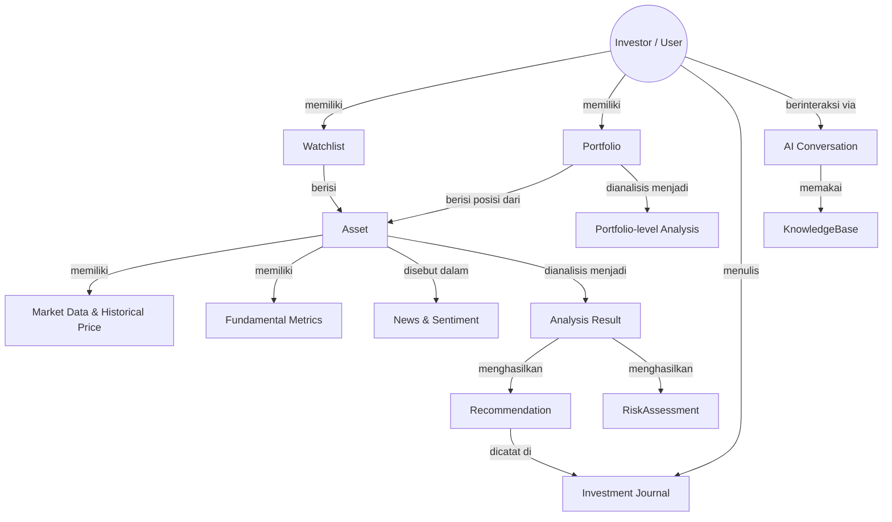
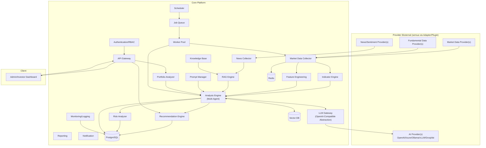
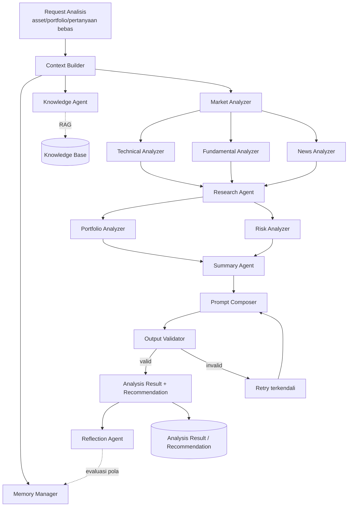
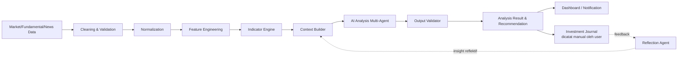
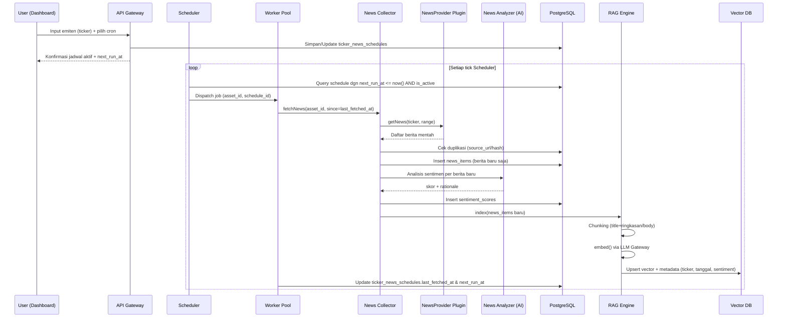
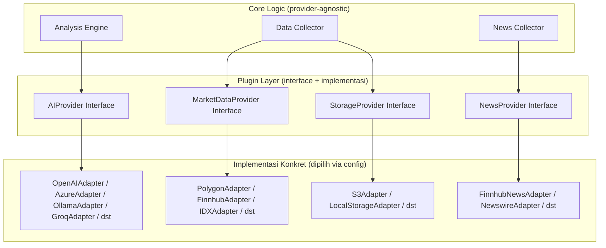
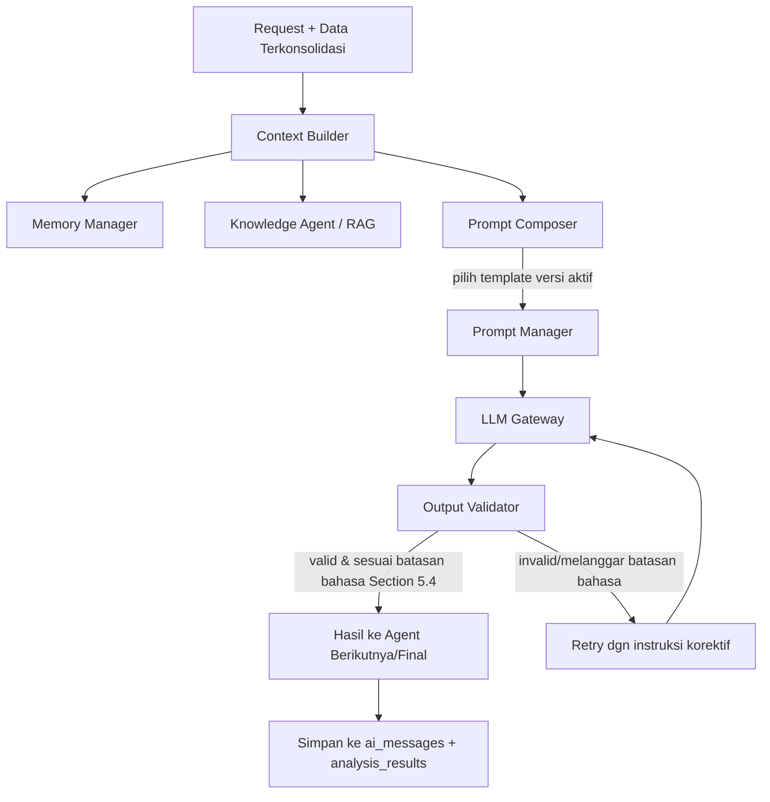

# Dokumen Perencanaan Teknis
## AI Investment Decision Support Platform

**Versi:** 1.0 (Draft Perencanaan)
**Tanggal:** 4 Agustus 2026
**Status:** Research & Planning Phase — belum ada implementasi kode
**Prinsip inti:** Platform ini adalah *decision-support tool*, bukan trading bot. AI menghasilkan analisis, rekomendasi, dan simulasi sebagai bahan pertimbangan. **Tidak ada** koneksi ke broker, tidak ada order execution, tidak ada keputusan investasi otomatis. Seluruh keputusan beli/jual dilakukan manual oleh pengguna di luar sistem ini.

---

## 1. Executive Summary

AI Investment Decision Support Platform adalah sistem modular yang membantu investor menganalisis saham dengan menggabungkan data pasar, data fundamental, berita/sentimen, dan reasoning AI multi-agent — lalu menyajikannya sebagai **analisis terstruktur dan rekomendasi bertingkat (Strong Buy → Sell)** lengkap dengan alasan, confidence score, skenario bullish/bearish, dan level teknikal kunci.

Berbeda dari dua pendekatan sebelumnya (UI Automation & Execution via Broker API), platform ini **secara desain tidak memiliki jalur ke eksekusi transaksi sama sekali** — bukan karena guardrail yang bisa dimatikan, tapi karena memang tidak ada modul Execution Engine atau Broker Adapter dalam arsitektur ini. Ini menyederhanakan banyak aspek: tidak ada risiko finansial langsung dari bug sistem, tidak ada kebutuhan lisensi broker/API trading, dan permukaan risiko keamanan jauh lebih kecil.

**Prinsip desain utama:**

| Prinsip | Penjelasan |
|---|---|
| Read-only by design | Sistem tidak pernah menulis/mengirim apa pun ke sistem eksternal (broker, akun trading) — hanya membaca data & menghasilkan analisis |
| Provider-agnostic di semua layer | AI provider (OpenAI-compatible), market data provider, dan news source semuanya diabstraksi lewat interface yang bisa diganti via konfigurasi |
| Explainability wajib | Setiap rekomendasi harus menyertakan alasan, indikator pendukung/bertentangan, dan skenario — bukan sekadar label |
| AI ≠ Advisor Berlisensi | Output diposisikan sebagai *informational analysis*, bukan nasihat investasi berlisensi — bahasa & disclaimer di seluruh sistem harus konsisten dengan ini |
| Modular & plug-in | Setiap sumber data/provider adalah plugin yang bisa ditambah/diganti tanpa mengubah core logic |
| Full traceability | Setiap output AI tersimpan dengan versi prompt, provider/model yang dipakai, dan data yang jadi konteks — bisa direproduksi/diaudit |

Dokumen ini mencakup 18 deliverable yang diminta, dari Executive Summary hingga Future Enhancement, plus Market Data Research sebagai fondasi Data Architecture.

---

## 2. Product Requirement Document (PRD)

### 2.1 Problem Statement

Investor individu punya akses ke banyak data (harga, laporan keuangan, berita) tapi kesulitan **mensintesis** semuanya menjadi pemahaman yang koheren dan cepat diambil sebelum mengambil keputusan. Tools yang ada umumnya terpecah: charting terpisah dari fundamental, fundamental terpisah dari berita, dan tidak ada yang menjelaskan "kenapa" secara naratif dengan mempertimbangkan konteks lengkap sekaligus dan konsisten.

### 2.2 Target Pengguna

| Persona | Kebutuhan Utama |
|---|---|
| Investor individu aktif | Analisis cepat multi-dimensi (teknikal+fundamental+sentimen) sebelum keputusan manual |
| Investor pemula | Penjelasan indikator & istilah pasar modal yang mudah dipahami (AI Learning Assistant) |
| Pemegang portofolio jangka menengah-panjang | Evaluasi diversifikasi, risiko, dan simulasi perubahan alokasi |
| Peneliti/analis independen | Riset emiten mendalam, perbandingan antar emiten, ringkasan laporan |

### 2.3 Scope

**In-scope:** Ingestion data pasar/fundamental/berita, analisis teknikal & fundamental & sentimen berbasis AI, portfolio analysis (read-only terhadap data yang diinput manual oleh user), recommendation engine (informational), knowledge base & RAG untuk edukasi, prompt engineering terkelola, dashboard laporan.

**Out-of-scope (permanen, bukan hanya fase awal):** Koneksi ke broker/akun trading apa pun, order execution, auto-rebalancing otomatis tanpa persetujuan manusia, sinyal yang diformat sebagai instruksi eksekusi ("beli sekarang", "jual sekarang").

### 2.4 AI Capabilities — Ringkasan Fungsional

| Kapabilitas | Output |
|---|---|
| AI Financial Analyst | Analisis fundamental (rasio, valuasi, pertumbuhan) |
| AI Technical Analyst | Analisis teknikal multi-indikator & multi-timeframe |
| AI Market Research Assistant | Ringkasan berita, riset emiten, perbandingan kompetitor |
| AI Portfolio Advisor | Evaluasi diversifikasi, konsentrasi, simulasi skenario |
| AI Risk Advisor | Estimasi risiko, drawdown historis, korelasi aset |
| AI Learning Assistant | Penjelasan indikator/istilah untuk edukasi pengguna |

### 2.5 Functional Requirements (ringkas)

| ID | Requirement | Prioritas |
|---|---|---|
| FR-01 | Sistem mengambil data pasar/fundamental/berita dari provider terkonfigurasi | Must |
| FR-02 | Sistem menghitung indikator teknikal multi-timeframe | Must |
| FR-03 | AI menghasilkan analisis teknikal, fundamental, dan sentimen terpisah maupun tergabung | Must |
| FR-04 | AI menghasilkan rekomendasi bertingkat (Strong Buy–Sell) dengan struktur lengkap (Section 5.4) | Must |
| FR-05 | Sistem mendukung evaluasi portofolio yang diinput/disinkron manual oleh user | Must |
| FR-06 | Sistem menyediakan knowledge base + RAG untuk edukasi & konteks analisis | Should |
| FR-07 | AI provider dapat diganti via konfigurasi tanpa mengubah kode (OpenAI-compatible) | Must |
| FR-08 | Setiap rekomendasi dapat ditelusuri kembali (prompt version, model, data konteks) | Must |
| FR-09 | Sistem TIDAK memiliki endpoint/modul apa pun yang bisa mengirim order ke broker | **Must (hard constraint arsitektur)** |
| FR-10 | Pengguna dapat menyimpan jurnal keputusan investasi pribadi (manual) untuk direview AI (Reflection) | Should |

### 2.6 Non-Functional Requirements

| Kategori | Requirement |
|---|---|
| Scalability | Setiap layer (data collector, AI engine, RAG) scale independen |
| Maintainability | Provider baru (AI/data) ditambah via plugin, tanpa ubah core |
| Observability | Metrics & tracing di seluruh pipeline, termasuk biaya token per request |
| Security | Lihat Section 13 |
| Auditability | Setiap output AI & keputusan sistem tercatat lengkap dengan konteksnya |
| Performance | Analisis on-demand < 10 detik untuk kasus umum; laporan mendalam bisa async |
| Caching | Data pasar & hasil analisis yang belum stale di-cache agresif untuk kurangi biaya API |
| Asynchronous Processing | Analisis berat (riset mendalam, backfill data) dijalankan via job queue, bukan blocking request |
| Resilience | Kegagalan satu provider (data/AI) tidak menjatuhkan seluruh sistem — fallback/circuit breaker |
| Extensibility | Arsitektur plugin memungkinkan penambahan kapabilitas AI baru tanpa refactor besar |

### 2.7 Asumsi & Constraints

- Data portofolio pengguna diinput/disinkron manual (upload/entry), **bukan** hasil automation terhadap akun broker.
- AI generatif dipakai untuk reasoning & narasi; perhitungan numerik (indikator, rasio keuangan) tetap dilakukan deterministik oleh Indicator Engine/Feature Engineering, bukan diminta LLM menghitung dari nol (mengurangi risiko halusinasi angka).
- Semua sumber data eksternal dipakai sesuai lisensi masing-masing (lihat Section 6.1).
- Output sistem secara konsisten diberi disclaimer bahwa ini adalah *AI-generated analysis for informational purposes*, bukan nasihat investasi dari penasihat berlisensi — penting agar posisi produk jelas secara hukum maupun ekspektasi pengguna.

---

## 3. Domain Model

Sebelum masuk ke desain database teknis, berikut model domain konseptual — entitas inti dan hubungan bisnisnya secara bahasa domain (bukan skema tabel):



**Entitas inti & definisi domain:**

| Entitas | Definisi Domain |
|---|---|
| **Investor** | Pengguna platform; pemilik seluruh data pribadi (watchlist, portfolio, journal) |
| **Asset** | Instrumen investasi (saham, dsb) yang menjadi subjek analisis |
| **Watchlist** | Kumpulan asset yang dipantau investor, belum tentu dimiliki |
| **Portfolio** | Representasi kepemilikan aktual investor (input manual), dasar Portfolio Analysis |
| **Market Data** | Data harga/volume historis & terkini per asset |
| **Fundamental Data** | Data laporan keuangan & rasio per asset |
| **News & Sentiment** | Berita & hasil analisis sentimen terkait asset/pasar makro |
| **Analysis Result** | Output terstruktur dari AI Layer atas satu asset pada satu waktu |
| **Recommendation** | Kesimpulan actionable-informational dari Analysis Result (Strong Buy...Sell + alasan) |
| **Risk Assessment** | Evaluasi risiko terkait satu asset atau satu portofolio |
| **Investment Journal** | Catatan keputusan investor sendiri — dipakai Reflection Agent untuk evaluasi pola keputusan investor (bukan pola strategi bot) |
| **Knowledge Base** | Kumpulan dokumen (istilah, strategi, laporan) untuk RAG |
| **Conversation** | Sesi interaksi investor dengan AI (tanya-jawab bebas maupun terstruktur) |

**Catatan desain penting:** Domain model ini sengaja **tidak memiliki entitas `Order`, `Execution`, atau `Broker`** — konsisten dengan hard constraint bahwa platform ini murni decision-support.

---

## 4. System Architecture



**Prinsip arsitektur kunci:**
- **Tidak ada komponen "Execution"** dalam diagram ini sama sekali — berbeda tegas dari dua desain sebelumnya. Ini bukan modul yang "dinonaktifkan", tapi memang tidak dirancang/dibangun.
- **Empat titik abstraksi provider**: AI Provider (lewat LLM Gateway), Market Data Provider, News Provider, Fundamental Data Provider — masing-masing punya interface plugin sendiri (lihat Section 7).
- **RAG Engine terpisah dari Analysis Engine** agar knowledge retrieval bisa dipakai lintas kapabilitas (technical, fundamental, learning assistant) tanpa duplikasi logic.

---

## 5. AI Architecture

### 5.1 Diagram Alur Multi-Agent



### 5.2 Tanggung Jawab Tiap Agent

| Agent | Tanggung Jawab | Input | Output |
|---|---|---|---|
| **Market Analyzer** | Orkestrasi analisis, sintesis kondisi makro/sektor sebagai konteks awal | Data pasar, indeks, sektor | Ringkasan kondisi pasar |
| **Technical Analyzer** | Interpretasi indikator & pola chart multi-timeframe | Output Indicator Engine | Bias teknikal + level kunci |
| **Fundamental Analyzer** | Evaluasi rasio, valuasi, pertumbuhan, perbandingan industri/kompetitor | Data fundamental | Insight & skor fundamental |
| **News Analyzer** | Analisis berita, sentimen sosial, pengumuman regulator, makro | News/sentiment feed | Skor sentimen + isu utama + alasan |
| **Research Agent** | Riset mendalam emiten (dipicu on-demand, bukan tiap sinyal rutin) — menggabungkan semua analyzer + knowledge base | Output analyzer + KB | Laporan riset naratif |
| **Portfolio Analyzer** | Evaluasi diversifikasi, konsentrasi sektor, alokasi, korelasi, simulasi perubahan | Data portfolio (input manual) | Insight portofolio + hasil simulasi |
| **Risk Analyzer** | Estimasi risiko per-asset & per-portofolio, drawdown historis | Data historis + portfolio | Risk Assessment terstruktur |
| **Knowledge Agent** | Retrieval konteks dari Knowledge Base via RAG | Query dari agent lain | Konteks relevan |
| **Reflection Agent** | Evaluasi pola keputusan investor sendiri (dari Investment Journal) — **bukan** evaluasi strategi trading bot | Journal + hasil historis rekomendasi vs keputusan aktual investor | Insight reflektif untuk investor (mis. "Anda cenderung menahan posisi rugi lebih lama dari rencana awal") |
| **Summary Agent** | Rangkai seluruh insight jadi Analysis Result & Recommendation terstruktur final | Output seluruh agent | Struktur final (Section 5.4) |
| **Context Builder** | Susun konteks input terstandar sebelum prompt (data + memory + preferensi user) | Request + data mentah | Konteks terstruktur |
| **Prompt Composer** | Rangkai template prompt (Section 11) + konteks jadi prompt final | Template + konteks | Prompt siap kirim ke LLM Gateway |
| **Memory Manager** | Simpan & ambil preferensi investor, riwayat interaksi, horizon investasi yang pernah dinyatakan | Interaksi berjalan | Memory terstruktur |
| **Output Validator** | Validasi skema output LLM (mis. semua field rekomendasi wajib terisi, confidence dalam rentang valid) | Output mentah LLM | Output tervalidasi / trigger retry |

### 5.3 Technical & Fundamental & Sentiment Analysis — Cakupan

Perhitungan numerik (indikator teknikal, rasio fundamental) dilakukan oleh **Indicator Engine/Feature Engineering** secara deterministik (bukan LLM yang menghitung), lalu hasilnya diinterpretasikan secara kualitatif oleh AI. Ini mengurangi risiko halusinasi angka.

| Kategori | Cakupan |
|---|---|
| Technical | Trend, Momentum, RSI, MACD, EMA, SMA, Bollinger Band, ATR, ADX, Ichimoku, Volume Analysis, Candlestick Pattern, Support/Resistance, Breakout Detection, Volatility, Market Structure, Smart Money Concept (Order Block/FVG/Supply-Demand — ditandai *lower confidence* karena tidak baku secara statistik, sama seperti pada dokumen sebelumnya), Multi-Timeframe Analysis |
| Fundamental | Financial Ratio, Revenue/Earnings Growth, Cash Flow, Debt, Valuation (P/E, P/BV, EV/EBITDA, dst), Dividend Analysis, Industry & Competitor Comparison |
| Sentiment | Berita, media sosial, laporan perusahaan (ringkasan kualitatif dari filing), pengumuman regulator, makro ekonomi — masing-masing diberi skor + alasan naratif |

### 5.4 Recommendation Engine — Struktur Output Wajib

Setiap rekomendasi yang dihasilkan AI **harus** memenuhi struktur berikut (divalidasi Output Validator sebelum disimpan/ditampilkan):

| Field | Keterangan |
|---|---|
| Label | Strong Buy / Buy / Watchlist / Hold / Reduce / Sell |
| Confidence Score | 0–100, dengan definisi kalibrasi yang konsisten (bukan angka sembarang dari LLM) |
| Alasan Utama | Narasi ringkas kenapa label ini diberikan |
| Indikator Pendukung | List indikator/fakta yang mendukung |
| Indikator Bertentangan | List indikator/fakta yang bertentangan (wajib ada — mencegah bias konfirmasi) |
| Faktor Risiko | Risiko spesifik yang relevan |
| Skenario Bullish | Kondisi & implikasi jika pasar bergerak naik |
| Skenario Bearish | Kondisi & implikasi jika pasar bergerak turun |
| Level Support | Dari Technical Analyzer |
| Level Resistance | Dari Technical Analyzer |
| Target Price | Jika tersedia basis perhitungan (valuasi/teknikal), disertai metodologi singkat |
| Stop Loss Usulan | **Ditandai eksplisit "usulan", bukan instruksi** — sesuai requirement |
| Horizon Investasi | Jangka pendek/menengah/panjang sesuai basis analisis |

> **Batasan bahasa output (hard rule, ditegakkan di level Prompt Composer & Output Validator):** Sistem tidak boleh menghasilkan kalimat berbentuk instruksi eksekusi langsung (mis. "Beli sekarang", "Jual semua posisi Anda sekarang juga"). Bahasa selalu bersifat informasional-kondisional (mis. "Berdasarkan analisis X dan Y, area ini menunjukkan potensi ..., namun perlu dipertimbangkan risiko Z"). Ini diperkuat lewat template prompt (Section 11) dan dicek ulang oleh Output Validator sebagai bagian dari validasi skema/gaya bahasa.

---

## 6. Data Architecture

### 6.1 Market Data Research — Perbandingan Sumber

| Sumber | Kualitas Data | Historical | Realtime | Latency | Biaya | Legal Usage | Rate Limit |
|---|---|---|---|---|---|---|---|
| **Yahoo Finance** (endpoint tidak resmi) | Sedang, kadang tidak konsisten | Cukup panjang, gratis | Delayed (~15 menit) | Sedang | Gratis | **Abu-abu** — bukan API resmi berdokumen, ToS Yahoo membatasi automated commercial use | Tidak terjamin |
| **IDX (Bursa Efek Indonesia)** | **Paling autoritatif untuk saham Indonesia** | Tersedia historis resmi | Delayed di kanal publik; realtime butuh lisensi vendor resmi | Rendah (kanal resmi) | Gratis (delayed) / berbayar (realtime berlisensi) | **Paling legal** untuk data IDX | Bergantung kanal |
| **Alpha Vantage** | Baik (tier berbayar), terbatas di free tier | Baik | Realtime tier tinggi | Sedang | Free tier ketat → berbayar | Resmi, terdokumentasi | Ketat di free tier (5 req/menit) |
| **Finnhub** | Baik, termasuk news/sentiment/earnings | Baik | Realtime (WebSocket) tier berbayar | Rendah–Sedang | Free tier tersedia → berbayar | Resmi, terdokumentasi | Jelas per tier |
| **Polygon.io** | Sangat baik, granular (tick-level) | Sangat baik | Realtime (WebSocket), latency rendah | Rendah | Berbayar untuk realtime/historis granular | Resmi, terdokumentasi | Jelas per tier |
| **Twelve Data** | Baik, indikator siap pakai | Baik | Realtime tier berbayar | Sedang | Free tier terbatas → berbayar | Resmi, terdokumentasi | Jelas per tier |
| **Financial Modeling Prep** | Sangat baik untuk fundamental (laporan keuangan, rasio) | Baik | Umumnya delayed | Sedang | Free tier terbatas → berbayar | Resmi, terdokumentasi | Jelas |
| **TradingView** | Baik untuk visual/charting, bukan untuk pipeline data mentah | Terbatas untuk automation | Realtime di layanan berbayar, tanpa API data resmi untuk redistribusi | — | Berbayar untuk fitur | **Tidak ada API data resmi untuk automation pihak ketiga** — ToS melarang scraping/redistribusi | — |
| **Investing.com** | Sedang, baik untuk referensi manual | Baik untuk referensi | Delayed | — | Tidak ada API resmi publik | **Tidak direkomendasikan** — scraping melanggar ToS | — |
| **Financial News (agregator berlangganan)** | Bervariasi tergantung penyedia | — | Umumnya realtime untuk tier berbayar | Rendah–Sedang | Bervariasi | Pilih penyedia dengan lisensi redistribusi/API resmi (mis. layanan newswire berbayar), hindari scraping situs berita | Bervariasi |
| **Economic Calendar (provider terkonfirmasi API)** | Baik untuk data terjadwal (rilis data makro) | Historis tersedia di sebagian besar provider | Update terjadwal | Rendah | Bervariasi, banyak free tier | Pilih provider dengan API resmi | Bervariasi |

**Rekomendasi kombinasi:**

| Kebutuhan | Rekomendasi Utama | Fallback |
|---|---|---|
| Harga & data resmi IDX | Data resmi/berlisensi IDX atau vendor data resmi Indonesia | Provider agregator Indonesia berbayar dengan lisensi jelas |
| Data global (jika platform mendukung multi-market) | Polygon.io / Finnhub | Twelve Data / Alpha Vantage |
| Fundamental mendalam | Financial Modeling Prep | Data resmi laporan keuangan/keterbukaan informasi IDX |
| Berita & sentimen | Finnhub News/Sentiment + newswire berlisensi | RAG atas dokumen resmi (keterbukaan informasi, siaran pers) |
| **Dihindari sebagai sumber pipeline otomatis** | Yahoo Finance endpoint tidak resmi, scraping TradingView/Investing.com | — karena status legal tidak jelas/eksplisit dilarang ToS |

### 6.2 Data Pipeline



| Tahap | Penjelasan |
|---|---|
| Cleaning & Validation | Deteksi data hilang/outlier, validasi range harga wajar |
| Normalization | Samakan timezone, precision, symbol mapping antar provider |
| Feature Engineering | Turunan fitur (return, volatility rolling) untuk indikator & AI |
| Indicator Engine | Hitung seluruh indikator teknikal deterministik |
| Context Builder | Susun konteks final (data + memory + knowledge) sebelum AI |
| AI Analysis | Multi-agent reasoning (Section 5) |
| Output Validator | Validasi struktur & bahasa sebelum disimpan/ditampilkan |
| Dashboard/Notification | Penyajian ke pengguna |
| Investment Journal → Reflection | Loop pembelajaran personal investor (bukan pembelajaran strategi trading otomatis) |

### 6.3 Scheduled News Ingestion & Sentiment RAG Pipeline (Cron-based)

Ini adalah spesifikasi tugas repetitif untuk pengambilan berita per-emiten sesuai jadwal (cron) yang dipilih pengguna, dari fetching hingga berita tersebut siap dipakai sebagai konteks RAG oleh AI Layer.

#### 6.3.1 Alur Sesuai Requirement

```mermaid
flowchart LR
    A[1. Input Emiten] --> B[2. Pilih Cron]
    B --> C[3. Simpan Jadwal\nticker_news_schedules]
    C --> D[4. Scheduler memicu\nsesuai cron terpenuhi]
    D --> E[5. Fetch Berita\nvia NewsProvider Plugin]
    E --> F[6. Sentiment Analysis\nNews Analyzer Agent]
    F --> G[7. Simpan ke Database\nnews_items + sentiment_scores]
    G --> H[8. Chunking + Embedding]
    H --> I[9. Upsert ke Vector DB\nnews_embeddings]
    I --> J[RAG siap dipakai\nResearch Agent / Knowledge Agent]
```



#### 6.3.2 Sequence Diagram (interaksi antar modul)



#### 6.3.3 Detail Tiap Langkah

| Langkah | Modul Penanggung Jawab | Penjelasan |
|---|---|---|
| **1. Input Emiten** | Dashboard → API Gateway | User memilih/mencari ticker dari `assets`. Bisa lebih dari satu emiten sekaligus (bulk), masing-masing boleh punya cron berbeda |
| **2. Pilih Cron** | Dashboard → Scheduler | User memilih preset (Section 6.3.4) atau custom cron expression; sistem menghitung `next_run_at` awal |
| **3. Simpan Jadwal** | Scheduler / DB | Disimpan sebagai record `ticker_news_schedules` (Section 8.2, tabel baru) — satu record per kombinasi (user/akun, emiten, cron) |
| **4. Trigger Scheduler** | Scheduler | Proses berjalan berkala (mis. tiap 1 menit) memeriksa jadwal mana yang `next_run_at <= now()` dan `is_active = true`, lalu men-dispatch job ke Queue |
| **5. Fetch Berita** | Worker Pool → News Collector → NewsProvider plugin | Fetch **incremental**: hanya berita sejak `last_fetched_at` untuk menghindari duplikasi & menghemat kuota API provider |
| **6. Sentiment Analysis** | News Analyzer (AI Agent, Section 5.2) | Setiap berita baru dianalisis: skor sentimen + alasan singkat, mengikuti kategori prompt "Ringkasan Berita" (Section 11.1) |
| **7. Simpan ke Database** | News Collector | `news_items` (berita mentah) dan `sentiment_scores` (hasil analisis) disimpan; deduplikasi berbasis `source_url`/hash konten sebelum insert |
| **8. Chunking + Embedding** | RAG Engine | Konten berita (judul + ringkasan/isi) dipecah jadi chunk sesuai ukuran optimal untuk embedding, lalu di-embed lewat LLM Gateway (`embed()`, Section 12.3) |
| **9. Upsert ke Vector DB** | RAG Engine | Chunk + vector disimpan dengan metadata (`ticker`, `published_at`, `sentiment_score`) agar retrieval bisa difilter per-emiten/rentang waktu saat dipakai Research Agent atau Knowledge Agent |

**Idempotency & error handling:**
- Setiap job fetch bersifat idempotent — bila gagal di tengah jalan (mis. NewsProvider timeout), `last_fetched_at` **tidak** ter-update, sehingga retry berikutnya otomatis mengambil ulang rentang yang sama tanpa kehilangan berita.
- Kegagalan berulang pada satu jadwal (mis. 5x gagal berturut-turut) memicu notifikasi ke user/admin dan menandai schedule sebagai `needs_attention` (bukan otomatis nonaktif, agar tidak diam-diam berhenti tanpa sepengetahuan user).
- Embedding **tidak diulang** untuk berita yang sudah pernah di-index (dicek via flag `news_items.is_indexed`) — mencegah biaya embedding berulang saat retry.

#### 6.3.4 Preset Cron

Agar user tidak perlu menulis cron expression manual (kecuali power user), Dashboard menyediakan preset:

| Preset | Cron Expression | Cocok untuk |
|---|---|---|
| Setiap 15 menit | `*/15 * * * *` | Investor aktif, emiten watchlist utama |
| Setiap 1 jam | `0 * * * *` | Pemantauan reguler |
| 2x sehari (jelang buka & tutup bursa, WIB) | `0 8,15 * * 1-5` | Ringkasan sebelum & sesudah sesi trading |
| Harian (pagi, sebelum bursa buka) | `0 7 * * 1-5` | Investor jangka menengah–panjang |
| Mingguan (Senin pagi) | `0 7 * * 1` | Watchlist pasif / emiten non-prioritas |
| Custom | Ditentukan user | Power user, kebutuhan spesifik |

> Hari kerja bursa (`1-5` = Senin–Jumat) dipakai sebagai default preset karena relevansi berita emiten Indonesia terkonsentrasi pada hari perdagangan, tapi user tetap bisa memilih cron custom yang mencakup akhir pekan bila diperlukan (mis. berita global/makro yang tidak terikat jam bursa).

> **Batas kewajaran (guardrail operasional):** Sistem menerapkan minimum interval per-schedule (mis. tidak kurang dari 5 menit) untuk mencegah beban berlebih ke NewsProvider dan potensi melanggar rate limit provider (Section 6.1) — validasi ini dilakukan saat user memilih cron di langkah 2.

---

## 7. Plugin Architecture

Seluruh dependensi eksternal diakses lewat interface plugin, bukan pemanggilan langsung ke SDK provider tertentu — ini fondasi requirement "provider dapat diganti melalui konfigurasi".



| Interface | Kontrak Method Kunci | Alasan Desain |
|---|---|---|
| `AIProvider` | `chatCompletion()`, `embed()`, `streamCompletion()` | Detail per Section 12 |
| `MarketDataProvider` | `getQuote()`, `getHistoricalCandles()`, `subscribeRealtime()` | Setiap provider data (Section 6.1) punya adapter sendiri |
| `NewsProvider` | `getNews(ticker, range)`, `getSentiment()` (jika provider menyediakan native) | Bisa dikombinasi dengan sentiment analysis internal jika provider tidak menyediakan skor sentimen |
| `StorageProvider` | `store()`, `retrieve()`, `delete()` | Untuk knowledge base document, laporan, backup |

**Prinsip:** Menambah provider baru = menulis satu adapter baru yang mengimplementasikan interface yang sudah ada, plus entry konfigurasi (`ai_providers`/`data_providers` table, Section 9) — **tanpa mengubah kode Core Logic**. Konfigurasi mendukung multi-provider aktif sekaligus (mis. AI provider berbeda untuk task ringan vs task kompleks — lihat multi-model routing Section 12.10).

---

## 8. Database Design

### 8.1 ERD Konseptual

```mermaid
erDiagram
    USERS ||--o{ WATCHLISTS : owns
    USERS ||--o{ PORTFOLIOS : owns
    USERS ||--o{ INVESTMENT_JOURNAL : writes
    USERS ||--o{ AI_CONVERSATIONS : has
    WATCHLISTS ||--o{ WATCHLIST_ITEMS : contains
    PORTFOLIOS ||--o{ PORTFOLIO_HOLDINGS : contains
    ASSETS ||--o{ WATCHLIST_ITEMS : referenced_by
    ASSETS ||--o{ PORTFOLIO_HOLDINGS : referenced_by
    ASSETS ||--o{ HISTORICAL_PRICES : has
    ASSETS ||--o{ TECHNICAL_INDICATORS : computed_for
    ASSETS ||--o{ FUNDAMENTAL_METRICS : has
    ASSETS ||--o{ NEWS_ITEMS : mentions
    NEWS_ITEMS ||--o{ SENTIMENT_SCORES : analyzed_into
    NEWS_ITEMS ||--o{ NEWS_EMBEDDINGS : chunked_into
    USERS ||--o{ TICKER_NEWS_SCHEDULES : configures
    ASSETS ||--o{ TICKER_NEWS_SCHEDULES : monitored_by
    TICKER_NEWS_SCHEDULES ||--o{ NEWS_ITEMS : triggers_fetch_of
    ASSETS ||--o{ ANALYSIS_RESULTS : analyzed_into
    ANALYSIS_RESULTS ||--o{ RECOMMENDATIONS : produces
    ANALYSIS_RESULTS ||--o{ RISK_ASSESSMENTS : produces
    PORTFOLIOS ||--o{ PORTFOLIO_ANALYSIS : evaluated_into
    RECOMMENDATIONS ||--o{ INVESTMENT_JOURNAL : referenced_by
    AI_CONVERSATIONS ||--o{ AI_MESSAGES : contains
    AI_MESSAGES ||--o{ PROMPT_TEMPLATES : uses
    KNOWLEDGE_BASE ||--o{ KNOWLEDGE_CHUNKS : split_into
    USERS ||--o{ NOTIFICATIONS : receives
    USERS ||--o{ AUDIT_LOGS : generates
    SCHEDULER_JOBS ||--o{ JOB_QUEUE : dispatches
    AI_PROVIDERS ||--o{ AI_MESSAGES : used_by
```



### 8.2 Kelompok Tabel & Rancangan Kolom Kunci

**A. Users & Personal Data**
| Tabel | Kolom Kunci | Catatan |
|---|---|---|
| `users` | id, email, password_hash, mfa_enabled | Akun platform |
| `watchlists` / `watchlist_items` | id, user_id (FK) / watchlist_id (FK), asset_id (FK) | |
| `portfolios` / `portfolio_holdings` | id, user_id (FK) / portfolio_id (FK), asset_id (FK), qty, avg_price, input_method | `input_method` (manual/import) — penting karena tidak ada sinkronisasi otomatis ke broker |
| `investment_journal` | id, user_id (FK), asset_id (FK) nullable, decision, note, recommendation_ref (FK) nullable, created_at | Jurnal keputusan investor sendiri |

**B. Asset & Market Data**
| Tabel | Kolom Kunci | Catatan |
|---|---|---|
| `assets` | id, ticker, exchange, sector, industry | Master data instrumen |
| `historical_prices` | id, asset_id (FK), timeframe, timestamp, OHLCV, source | Partisi per timeframe/tahun |
| `technical_indicators` | id, asset_id (FK), timeframe, timestamp, indicator_name, value (JSONB) | JSONB untuk indikator multi-value |
| `fundamental_metrics` | id, asset_id (FK), period, metric_name, value, source | Rasio & data laporan keuangan |

**C. News, Sentiment & Scheduled Ingestion**
| Tabel | Kolom Kunci | Catatan |
|---|---|---|
| `ticker_news_schedules` | id, user_id (FK), asset_id (FK), cron_expression, preset_label, is_active, status (active/needs_attention), last_fetched_at, next_run_at, created_at | Basis flow Section 6.3 — satu record per kombinasi user+emiten+cron |
| `news_items` | id, asset_id (FK) nullable, schedule_id (FK) nullable, source, source_url, headline, body_summary, published_at, is_indexed (bool) | `source_url` dipakai untuk deduplikasi; `is_indexed` mencegah embedding berulang; `schedule_id` menandai berita ini hasil fetch terjadwal mana (nullable karena bisa juga hasil fetch on-demand) |
| `sentiment_scores` | id, news_item_id (FK), score, model_used, rationale | Hasil News Analyzer |
| `news_embeddings` | id, news_item_id (FK), chunk_text, embedding (vector), metadata (JSONB: ticker, published_at, sentiment_score) | Hasil chunking+embedding (langkah 8–9, Section 6.3) — dipakai RAG Engine saat retrieval, terpisah dari `knowledge_chunks` karena siklus hidup & filter (per-ticker, per-waktu) berbeda dari dokumen statis |

**D. Analysis, Recommendation, Risk**
| Tabel | Kolom Kunci | Catatan |
|---|---|---|
| `analysis_results` | id, asset_id (FK), analysis_type, generated_at, model_used, prompt_version | Satu record per run analisis |
| `recommendations` | id, analysis_result_id (FK), label, confidence, reasoning, supporting_factors (JSONB), conflicting_factors (JSONB), bullish_scenario, bearish_scenario, support_level, resistance_level, target_price, suggested_stop, horizon | Sesuai struktur wajib Section 5.4 |
| `risk_assessments` | id, analysis_result_id (FK) nullable, portfolio_id (FK) nullable, risk_type, score, detail (JSONB) | Bisa per-asset maupun per-portofolio |
| `portfolio_analysis` | id, portfolio_id (FK), diversification_score, sector_concentration (JSONB), correlation_matrix (JSONB), simulated_at | Hasil Portfolio Analyzer |

**E. AI Conversation, Prompt, Knowledge Base**
| Tabel | Kolom Kunci | Catatan |
|---|---|---|
| `ai_providers` | id, name, type (openai-compatible), base_url, is_active, priority | Basis multi-provider config (Section 12) |
| `ai_conversations` | id, user_id (FK), context_type, created_at | Sesi tanya-jawab bebas maupun terstruktur |
| `ai_messages` | id, conversation_id (FK), agent_name, role, content, provider_id (FK), tokens_used, cost_estimate | `cost_estimate` mendukung cost monitoring (Section 12.9) |
| `prompt_templates` | id, name, category, template_text, version, is_active | Versioning wajib |
| `knowledge_base` | id, title, source, category, uploaded_at | Dokumen sumber RAG |
| `knowledge_chunks` | id, knowledge_base_id (FK), embedding (vector), chunk_text | Untuk retrieval |

**F. System — Notification, Audit, Config, Scheduler**
| Tabel | Kolom Kunci | Catatan |
|---|---|---|
| `notifications` | id, user_id (FK), channel, message, status | |
| `audit_logs` | id, actor_type (user/ai/system), actor_id, action, entity, before, after, created_at | Append-only |
| `system_configuration` | id, scope, key, value (JSONB) | Termasuk konfigurasi provider aktif |
| `scheduler_jobs` | id, job_type, cron_expr, is_active | |
| `job_queue` | id, scheduler_job_id (FK) nullable, payload (JSONB), status, retry_count | |

**Alasan desain menyeluruh:**
- **Tidak ada tabel `orders`/`executions`/`brokers`** — konsisten dengan hard constraint arsitektur (Section 3, 4).
- **`recommendations` menyimpan seluruh field struktur wajib** (Section 5.4) sebagai kolom eksplisit (bukan blob teks bebas) agar Output Validator bisa memvalidasi kelengkapan secara terprogram, dan agar UI bisa render konsisten.
- **`ai_providers` + `ai_messages.provider_id`** memungkinkan audit "model/provider mana yang menghasilkan rekomendasi ini" — penting untuk reproducibility & cost tracking multi-provider (Section 12).
- **`portfolio_holdings.input_method`** menjaga kejelasan bahwa data portofolio adalah input pengguna, bukan hasil automation — relevan untuk audit & ekspektasi produk.
- **`investment_journal.recommendation_ref`** menghubungkan keputusan investor dengan rekomendasi yang pernah diberikan (jika relevan), menjadi basis Reflection Agent tanpa mengasumsikan investor selalu mengikuti rekomendasi AI.
- **`ticker_news_schedules` terpisah dari `scheduler_jobs` generik** karena punya siklus hidup & atribut spesifik (per user+emiten, status `needs_attention`) yang akan janggal bila dipaksakan ke tabel job generik; `scheduler_jobs`/`job_queue` tetap dipakai di lapisan eksekusi (Section 6.3.2) sebagai mekanisme dispatch umum.
- **`news_embeddings` terpisah dari `knowledge_chunks`** karena berita punya dimensi waktu (relevansi meluruh) dan filter per-ticker yang tidak berlaku untuk dokumen statis (istilah, strategi) di Knowledge Base — memisahkan keduanya memudahkan strategi retensi/pembersihan berbeda (mis. purge embedding berita lama tanpa menyentuh knowledge base inti).
- **`news_items.is_indexed` & `source_url`** langsung mendukung idempotency pipeline Section 6.3 (cegah duplikasi fetch & embedding berulang).

---

## 9. Module Specification

| Modul | Tujuan | Tanggung Jawab | Input | Output | Dependensi |
|---|---|---|---|---|---|
| Authentication | Login & session | Verifikasi identitas, token management | credentials | session token | — |
| User Management | Kelola profil & preferensi | CRUD user, preferensi horizon investasi | user data | user record | Authentication |
| Market Data Collector | Ambil data pasar/fundamental dari provider terkonfigurasi | Scheduling fetch, normalisasi awal | Provider config | raw+normalized data | MarketDataProvider plugin |
| Indicator Engine | Hitung indikator teknikal | Kalkulasi deterministik multi-timeframe | OHLCV | nilai indikator | Market Data Collector |
| Feature Engineering | Turunkan fitur untuk AI | Rolling stats, normalisasi fitur | data mentah+indikator | feature vector | Indicator Engine |
| News Collector | Ambil berita per-emiten sesuai jadwal cron pengguna (Section 6.3) | Fetch incremental, deduplikasi, trigger sentiment analysis & indexing RAG | `ticker_news_schedules` yang jatuh tempo | raw news tersimpan + trigger embedding | NewsProvider plugin, Scheduler |
| Knowledge Base | Simpan dokumen sumber pengetahuan | Manajemen dokumen (istilah, laporan, strategi) | dokumen | dokumen tersimpan | StorageProvider plugin |
| RAG Engine | Retrieval kontekstual dari Knowledge Base | Chunking, embedding, similarity search | query | konteks relevan | Knowledge Base, LLM Gateway (embedding) |
| LLM Gateway | Abstraksi provider AI (Section 12) | Routing, retry, fallback, rate limit | request terstandar | response terstandar | AIProvider plugin |
| Prompt Manager | Kelola template & versi prompt | Simpan, versi, sajikan template sesuai kategori | request kategori | template terkompilasi | — |
| Analysis Engine | Orkestrasi multi-agent (Section 5) | Jalankan seluruh agent sesuai alur | data + konteks | Analysis Result | Indicator Engine, RAG, LLM Gateway |
| Recommendation Engine | Susun rekomendasi terstruktur final | Validasi kelengkapan struktur (Section 5.4) | Analysis Result | Recommendation | Analysis Engine, Output Validator |
| Portfolio Analyzer | Evaluasi portofolio pengguna | Diversifikasi, konsentrasi, simulasi | Portfolio data | Portfolio Analysis | Analysis Engine |
| Risk Analyzer | Evaluasi risiko asset/portofolio | Estimasi risiko, drawdown, korelasi | Data historis + portfolio | Risk Assessment | Analysis Engine |
| Reporting | Hasilkan laporan (PDF/dashboard) | Kompilasi hasil analisis jadi laporan | request laporan | file/laporan | Analysis Result, Recommendation |
| Notification | Kirim alert (bukan sinyal trading — mis. "analisis baru tersedia", "berita penting") | Kirim multi-channel | event | notifikasi terkirim | Queue |
| Settings | Kelola preferensi & konfigurasi provider aktif | UI/API untuk ubah provider, threshold | input user | config tersimpan | System Configuration |
| Scheduler | Jadwalkan job berkala, termasuk news ingestion per-emiten (Section 6.3) | Polling jadwal jatuh tempo, dispatch ke Queue | `ticker_news_schedules`/`scheduler_jobs` | job terjadwal | Queue |
| Logging | Pencatatan operasional | Log terpusat lintas modul | event | log record | — |
| Monitoring | Observability sistem | Metrics, tracing, dashboard kesehatan | metrics/log | dashboard/alert | Prometheus/Grafana |
| Admin Dashboard | UI kontrol & monitoring untuk admin | Kelola provider, user, lihat metrics | interaksi admin | tampilan & aksi | API Gateway |
| Plugin Manager | Muat & kelola plugin provider | Registrasi, validasi, aktivasi plugin | plugin package | provider terdaftar | Interface plugin masing-masing |
| Configuration | Manajemen config global | Simpan/serve konfigurasi | key/value | config aktif | — |

---

## 10. API Design (Internal, ringkasan)

| Endpoint | Method | Fungsi |
|---|---|---|
| `/auth/login` | POST | Login user |
| `/assets/{ticker}/analysis` | POST | Trigger/ambil analisis terbaru untuk suatu asset |
| `/assets/{ticker}/recommendation` | GET | Ambil rekomendasi terbaru (struktur Section 5.4) |
| `/portfolio` | GET/POST | Kelola data portofolio (input manual) |
| `/portfolio/analysis` | GET | Ambil Portfolio Analysis terbaru |
| `/portfolio/simulate` | POST | Simulasikan perubahan alokasi (what-if, read-only) |
| `/watchlist` | GET/POST/DELETE | Kelola watchlist |
| `/journal` | GET/POST | Kelola Investment Journal |
| `/chat` | POST | Percakapan bebas dengan AI (Learning Assistant, Research Agent) |
| `/knowledge-base` | GET/POST | Kelola dokumen knowledge base |
| `/news-schedules` | GET/POST/PUT/DELETE | Kelola jadwal fetch berita per-emiten (input emiten + pilih cron, Section 6.3) |
| `/news-schedules/{id}/run-now` | POST | Trigger fetch manual di luar jadwal (mis. untuk uji coba) |
| `/assets/{ticker}/news` | GET | Ambil berita & sentimen tersimpan untuk suatu emiten |
| `/providers` | GET/PUT | Kelola konfigurasi AI/data provider aktif (admin) |
| `/audit-logs` | GET | Ekspor audit trail |
| `/assets/{ticker}/strategy` | GET | Pembacaan sikap tersimpan dari dua sisi posisi (Section 20) |
| `/stock-picks` | GET | Penyaringan emiten per horizon, termasuk kandidat dekat-ARA (Section 21) |
| `/monitoring/quotes` | GET | Observasi harga terakhir untuk emiten yang dipantau (Section 22) |
| `/monitoring/poll` | POST | Observasi manual di luar interval worker |
| `/alerts` | GET | Alert yang terbentuk untuk pengguna |
| `/alerts/{id}/acknowledge` | POST | Tandai alert sudah dibaca |
| `/watchlist/categories` | GET | Daftar kelompok watchlist beserta jumlah anggotanya |
| `/watchlist/categories/{name}` | PATCH/DELETE | Ganti nama / hapus kelompok (anggota pindah ke `Default`) |
| `/translate` | POST | Render prosa analisis tersimpan ke bahasa lain (Section 23) |

> **Catatan desain API:** Tidak ada endpoint `/orders`, `/execute`, atau sejenisnya di seluruh permukaan API — konsisten dengan hard constraint arsitektur di Section 3–4.

---

## 11. Prompt Engineering Specification

### 11.1 Kategori Prompt

| Kategori | Dipakai oleh | Tujuan |
|---|---|---|
| Analisis Teknikal | Technical Analyzer | Interpretasi indikator & pola jadi narasi bias teknikal |
| Analisis Fundamental | Fundamental Analyzer | Interpretasi rasio/valuasi jadi insight kualitatif |
| Ringkasan Berita | News Analyzer | Ringkas & beri skor sentimen berita |
| Ringkasan Emiten | Research Agent | Profil emiten ringkas (bisnis, posisi kompetitif) |
| Analisis Portofolio | Portfolio Analyzer | Narasi diversifikasi/konsentrasi/risiko portofolio |
| Evaluasi Risiko | Risk Analyzer | Narasi risk assessment |
| Perbandingan Emiten | Research Agent | Analisis komparatif dua/lebih emiten |
| Penjelasan Indikator | Knowledge Agent / Learning Assistant | Edukasi istilah/indikator untuk pemula |
| Simulasi Skenario | Portfolio Analyzer | Narasi hasil simulasi what-if alokasi |
| Review Keputusan Investasi | Reflection Agent | Evaluasi pola keputusan investor dari Investment Journal |

### 11.2 Alur Prompt



**Prinsip desain prompt:**
- Setiap template prompt untuk kategori yang menghasilkan output actionable-informational (rekomendasi, target price) menyertakan **instruksi eksplisit anti-instruksi-eksekusi** ("gunakan bahasa kondisional-informasional, jangan berikan perintah beli/jual langsung").
- Prompt versioned (`prompt_templates.version`); setiap `ai_messages` mencatat versi yang dipakai untuk reproducibility.
- Output Validator memeriksa dua hal: **kelengkapan struktur** (field wajib Section 5.4 terisi) dan **kepatuhan bahasa** (tidak ada kalimat instruksi eksekusi) sebelum hasil disimpan/ditampilkan.

---

## 12. OpenAI-Compatible Integration Design

### 12.1 Prinsip Abstraksi

LLM Gateway mengimplementasikan kontrak **OpenAI-Compatible** sebagai *lingua franca* internal, karena mayoritas provider (termasuk yang self-hosted) sudah mendukung skema request/response ala OpenAI (`/v1/chat/completions`, `/v1/embeddings`). Provider yang tidak 100% kompatibel dibungkus adapter tambahan agar tetap menyajikan kontrak yang sama ke Core Logic.

```mermaid
flowchart TB
    AE[Analysis Engine / Agent lain] --> LG[LLM Gateway]
    LG --> ROUTER[Model Router\n(pilih provider/model sesuai task+config)]
    ROUTER --> P1["OpenAI Adapter"]
    ROUTER --> P2["Azure OpenAI Adapter"]
    ROUTER --> P3["Ollama Adapter (local)"]
    ROUTER --> P4["vLLM Adapter (self-hosted)"]
    ROUTER --> P5["LM Studio Adapter (local)"]
    ROUTER --> P6["Groq Adapter"]
    ROUTER --> P7["DeepSeek Adapter"]
    ROUTER --> P8["OpenRouter Adapter"]
    ROUTER --> P9["Generic OpenAI-Compatible Adapter"]
    LG --> RETRY[Retry & Backoff Layer]
    LG --> RATELIMIT[Rate Limiter]
    LG --> FALLBACK[Model Fallback Chain]
    LG --> COST[Token Usage & Cost Tracker]
    LG --> CB[Circuit Breaker]
```

### 12.2 Chat Completion

- Kontrak internal mengikuti skema `messages[]` (system/user/assistant/tool), `temperature`, `max_tokens`, `stop`.
- Setiap agent (Section 5) memanggil lewat kontrak yang sama; perbedaan provider ditangani sepenuhnya di adapter, tidak bocor ke logic agent.

### 12.3 Embedding

- Dipakai oleh RAG Engine untuk indexing Knowledge Base & query time retrieval.
- Kontrak: `embed(text[]) → vector[]`. Model embedding dikonfigurasi terpisah dari model chat completion (bisa provider berbeda — mis. embedding lokal untuk hemat biaya, chat completion pakai model cloud untuk kualitas reasoning).

### 12.4 Function Calling / Tool Calling

- Dipakai terutama oleh **Research Agent & Knowledge Agent** untuk memanggil RAG retrieval atau query data terstruktur (mis. "ambil rasio fundamental 3 tahun terakhir untuk ticker X") sebagai *tool*, bukan untuk memanggil aksi eksternal apa pun di luar baca-data.
- **Guardrail penting:** Daftar tool yang bisa dipanggil AI di sistem ini **seluruhnya read-only** (query data, retrieval knowledge base) — tidak ada satu pun tool yang terdaftar untuk menulis/mengeksekusi transaksi, konsisten dengan hard constraint arsitektur.
- Tidak semua provider mendukung tool calling native secara identik — adapter menangani perbedaan skema (mis. Ollama/vLLM versi tertentu mungkin perlu prompting-based tool calling sebagai fallback).

### 12.5 Structured Output

- Untuk output yang harus mengikuti skema ketat (Recommendation Section 5.4), gunakan structured output/JSON mode bila provider mendukung; jika tidak, fallback ke *prompt-enforced JSON + Output Validator* sebagai lapisan keamanan tambahan (jangan hanya mengandalkan provider).

### 12.6 Streaming

- Dipakai untuk UX chat/percakapan bebas (Research Agent, Learning Assistant) agar respons terasa responsif.
- Untuk output terstruktur (Recommendation), **streaming dinonaktifkan** — tunggu response lengkap agar Output Validator bisa memvalidasi keseluruhan struktur sebelum ditampilkan (mencegah tampilan rekomendasi yang "terpotong").

### 12.7 Vision (opsional)

- Dipakai opsional untuk membaca chart/gambar yang diunggah user (mis. screenshot chart dari sumber lain untuk didiskusikan). Bukan untuk membaca UI aplikasi trading (tidak relevan dengan arsitektur ini yang sepenuhnya API-based).

### 12.8 Retry & Rate Limiting

| Mekanisme | Penjelasan |
|---|---|
| Retry dengan backoff eksponensial | Untuk error transient (5xx, timeout) |
| Rate Limiter per-provider | Menghormati limit masing-masing provider (Section 6.1 analog untuk AI provider), mencegah throttling |
| Circuit Breaker | Jika satu provider gagal berulang, alihkan sementara ke fallback tanpa terus mencoba provider yang down |

### 12.9 Token Usage & Cost Monitoring

- Setiap `ai_messages` mencatat `tokens_used` & `cost_estimate` (dihitung dari pricing table per model yang dikonfigurasi).
- Dashboard admin menampilkan agregat biaya per hari/per agent/per user untuk kontrol biaya operasional.
- Budget alert: notifikasi jika biaya harian/bulanan mendekati ambang yang dikonfigurasi.

### 12.10 Multi-Model Routing & Model Fallback

| Strategi | Contoh Penerapan |
|---|---|
| Routing berbasis kompleksitas task | Task ringan (ekstraksi/summary sederhana) → model kecil/murah (mis. via Groq/lokal); reasoning kompleks (Research Agent, Recommendation) → model besar berkualitas tinggi |
| Routing berbasis privasi | Data sensitif/portofolio pribadi → prioritaskan provider self-hosted (Ollama/vLLM) bila kebijakan privasi mengharuskan |
| Fallback chain | Jika provider utama gagal/rate-limited → otomatis coba provider berikutnya dalam chain yang dikonfigurasi (bukan hard fail) |
| A/B & evaluasi kualitas | Kemampuan membandingkan output beberapa model untuk kategori prompt yang sama, guna evaluasi kualitas berkelanjutan |

**Konfigurasi contoh (konseptual, bukan kode):**

| Provider | Role | Prioritas |
|---|---|---|
| OpenAI/Azure OpenAI (model besar) | Reasoning kompleks (Research, Recommendation) | Primary |
| Groq/DeepSeek (latency rendah/murah) | Task ringan (ekstraksi, klasifikasi sentimen) | Primary untuk task ringan |
| Ollama/vLLM/LM Studio (self-hosted) | Data sensitif / fallback saat cloud down / mode privasi tinggi | Fallback / conditional |
| OpenRouter | Akses cepat ke banyak model tanpa integrasi individual | Fallback umum |
| Generic OpenAI-Compatible Server | Server internal kustom masa depan | Extensible slot |

> Semua ini murni **konfigurasi** (`ai_providers` table + `system_configuration`), bukan hard-coded — administrator dapat menambah/mengubah routing tanpa deploy ulang kode.

---

## 13. Security Review

| Area | Rekomendasi |
|---|---|
| **API Key Management** | Kredensial tiap AI/data provider disimpan di vault (mis. cloud secret manager), tidak pernah hardcoded/di-log plaintext |
| **Secret Management** | Rotasi berkala, akses least-privilege per service |
| **User Authentication** | MFA opsional/wajib untuk akun platform |
| **Authorization / RBAC** | Role minimal: Viewer, Investor (kelola watchlist/portfolio/journal sendiri), Admin (kelola provider & konfigurasi sistem) |
| **Encryption** | Data sensitif (portofolio, journal) terenkripsi at-rest; TLS wajib untuk semua komunikasi eksternal |
| **Audit Trail** | `audit_logs` append-only dengan `actor_type` (user/ai/system) |
| **Rate Limiting** | Di API Gateway (terhadap user) dan di LLM Gateway (terhadap tiap AI provider) |
| **Prompt Injection Protection** | (1) Perlakukan seluruh teks eksternal (berita, dokumen upload user) sebagai *data*, bukan instruksi — beri delimiter jelas di prompt; (2) Output Validator menolak output yang menyerupai perubahan instruksi sistem atau kebocoran system prompt; (3) tool calling dibatasi hanya ke tool read-only terdaftar (Section 12.4), sehingga bahkan bila prompt injection berhasil memanipulasi teks, tidak ada aksi berbahaya yang bisa dipicu (tidak ada tool tulis/eksekusi yang tersedia) |
| **Output Validation** | Validasi skema (Section 5.4) + validasi bahasa (tidak ada instruksi eksekusi, Section 5.4) sebelum output disimpan/ditampilkan ke user |
| **Data Privacy Portofolio** | Karena data portofolio adalah data finansial personal sensitif, terapkan enkripsi field-level tambahan & batasi retensi sesuai kebutuhan; pertimbangkan opsi self-hosted AI provider untuk data ini bila user memilih mode privasi tinggi (Section 12.10) |
| **Disclaimer & Positioning Legal** | Bukan pengganti nasihat hukum. Rekomendasi: cantumkan disclaimer konsisten di seluruh output ("AI-generated analysis, bukan nasihat investasi dari penasihat berlisensi") dan tinjau dengan penasihat hukum apakah penyediaan rekomendasi Buy/Sell berskor, meski bersifat informasional, memerlukan status/izin tertentu di bawah ketentuan OJK terkait penyedia riset/rekomendasi investasi — terutama jika platform akan dipakai lebih luas dari personal use |

---

## 14. Deployment Architecture

```mermaid
flowchart LR
    subgraph DEV["Development"]
        D1[Docker Compose lokal\nAI provider mode: mock/local Ollama]
    end
    subgraph TEST["Testing/CI"]
        T1[CI: unit+integration test\ntermasuk Output Validator test]
    end
    subgraph STG["Staging"]
        S1[Kubernetes namespace staging]
        S1DB[(PostgreSQL staging)]
    end
    subgraph PROD["Production"]
        P1[Kubernetes cluster]
        P2[Autoscaling Worker Pool\n(data collector, AI analysis)]
        P3[Redis Cluster]
        P4[PostgreSQL HA]
        P5[Vector DB]
        P6[Object Storage\nknowledge base, laporan]
        P7[Prometheus + Grafana]
        P8["Job Queue (RabbitMQ/NATS)"]
    end
    D1 --> T1 --> S1 --> S1DB
    S1 --> P1
    P1 --> P2
    P1 --> P3
    P1 --> P4
    P1 --> P5
    P1 --> P6
    P1 --> P8
    P1 --> P7
```

| Environment | Karakteristik |
|---|---|
| Development | Docker Compose, AI provider bisa memakai Ollama lokal untuk hemat biaya saat development |
| Testing/CI | Test otomatis termasuk validasi struktur output & bahasa (mencegah regresi ke bahasa instruksi eksekusi) |
| Staging | Mirror production, data provider mode sandbox jika tersedia |
| Production | Kubernetes dengan autoscaling khusus untuk Worker Pool (AI analysis & data collection bersifat bursty), HA database, vector DB terpisah untuk skala RAG |

---

## 15. Development Roadmap

| Phase | Tujuan | Fitur | Dependensi | Risiko | Estimasi Kompleksitas | Deliverables |
|---|---|---|---|---|---|---|
| **1 — Core Platform** | Fondasi auth, config, plugin architecture | Authentication, Configuration, Plugin Manager, System Configuration | — | Desain interface plugin kurang matang di awal → refactor mahal belakangan | Sedang | Core platform berjalan, plugin interface terdefinisi |
| **2 — Market Data** | Data pasar & fundamental mengalir stabil | Market Data Collector, News Collector, provider adapters awal | Phase 1 | Perbedaan skema antar provider lebih besar dari perkiraan | Sedang–Tinggi | Data historis & realtime tersedia dari ≥2 provider |
| **3 — Indicator Engine** | Seluruh indikator teknikal terhitung akurat | Indicator Engine, Feature Engineering | Phase 2 | Kesalahan formula lolos tanpa test memadai | Sedang | Indikator teruji vs referensi terpercaya |
| **4 — AI Analysis** | Multi-agent menghasilkan analisis kualitatif | LLM Gateway (Section 12), Analysis Engine, Prompt Manager, agent inti (Market/Technical/Fundamental/News Analyzer) | Phase 3 | Kualitas reasoning tidak konsisten antar provider | Tinggi | Analisis end-to-end untuk 1 asset berjalan |
| **5 — Recommendation Engine** | Rekomendasi terstruktur sesuai Section 5.4 | Recommendation Engine, Output Validator (skema+bahasa) | Phase 4 | Output tidak konsisten format/bahasa | Sedang–Tinggi | Rekomendasi lolos validasi 100% terhadap skema |
| **6 — Portfolio Intelligence** | Analisis portofolio & risk assessment | Portfolio Analyzer, Risk Analyzer | Phase 5 | Simulasi "what-if" butuh model korelasi yang cukup andal | Sedang | Evaluasi portofolio & simulasi berjalan |
| **7 — Knowledge Base & RAG** | Edukasi & konteks berbasis dokumen | Knowledge Base, RAG Engine | Phase 4 (bisa paralel sebagian) | Kualitas retrieval tergantung kurasi dokumen awal | Sedang | RAG meningkatkan relevansi jawaban terukur |
| **8 — Reporting & Dashboard** | Visualisasi & laporan untuk pengguna | Reporting, Admin Dashboard, Notification | Phase 5–7 | UX kompleksitas tinggi karena banyak dimensi data | Sedang | Dashboard investor & admin fungsional |
| **9 — Production & Optimization** | Observability penuh, cost optimization, hardening | Monitoring, Cost Monitoring (12.9), Security hardening, multi-model routing matang | Phase 1–8 | Biaya AI membengkak tanpa monitoring memadai | Sedang–Tinggi | Sistem production-ready dengan biaya terkontrol |

---

## 16. Sprint Planning (Ringkasan Epic per Phase)

| Phase | Epic | Estimasi | Dev Required | QA Required |
|---|---|---|---|---|
| 1 | Plugin interface (AIProvider/MarketDataProvider/NewsProvider/StorageProvider) + Auth | 3 minggu | 2 backend | 1 QA |
| 2 | Adapter provider data (≥2 provider) + normalization | 3 minggu | 2 data engineer | 1 QA |
| 3 | Implementasi indikator + unit test numerik | 3 minggu | 2 quant dev | 1 QA |
| 4 | LLM Gateway (multi-provider, retry, fallback) + agent inti | 4 minggu | 1 AI engineer, 1 backend | 1 QA |
| 4 | Implementasi seluruh agent (Section 5.2) | 3 minggu | 2 AI engineer | 1 QA |
| 5 | Recommendation Engine + Output Validator (skema & bahasa) | 2–3 minggu | 1 backend, 1 AI engineer | 1 QA (fokus validasi bahasa anti-instruksi-eksekusi) |
| 6 | Portfolio Analyzer + Risk Analyzer + simulasi | 3 minggu | 2 backend/quant | 1 QA |
| 7 | RAG Engine + Knowledge Base ingestion tooling | 3 minggu | 1 AI engineer, 1 backend | 1 QA |
| 8 | Dashboard + Reporting + Notification | 3–4 minggu | 2 frontend, 1 backend | 1 QA |
| 9 | Monitoring, cost tracking, security hardening, load test | 3 minggu | 1 DevOps/Security, 1 backend | 1 QA |

Total estimasi kasar: **~30–35 minggu efektif** dengan tim inti 4–6 orang.

---

## 17. Risk Analysis

| Risiko | Kategori | Likelihood | Impact | Mitigasi |
|---|---|---|---|---|
| AI menghasilkan rekomendasi yang bias/menyesatkan | AI Quality | Sedang | Tinggi | Output Validator, wajib menyertakan indikator bertentangan (mencegah bias konfirmasi), confidence score terkalibrasi |
| Output AI mengandung bahasa instruksi eksekusi tanpa sengaja | **Compliance/Produk** | Sedang (butuh guardrail eksplisit) | Tinggi (bertentangan dengan positioning produk) | Validasi bahasa di Output Validator + testing khusus kategori ini (Section 16, Phase 5) |
| Ketergantungan pada satu AI provider (downtime/perubahan harga) | Operasional | Sedang | Sedang | Multi-provider + fallback chain (Section 12.10) |
| Biaya AI membengkak seiring skala pengguna | Finansial/Operasional | Sedang–Tinggi | Sedang | Model routing berbasis kompleksitas, caching hasil analisis yang belum stale, budget alert |
| Prompt injection lewat berita/dokumen eksternal | Security | Sedang | Sedang (dibatasi karena tidak ada tool tulis) | Delimiter jelas data vs instruksi, tool calling read-only saja (Section 12.4) |
| Penggunaan sumber data yang melanggar ToS (scraping) | **Legal** | Rendah *jika ikuti Section 6.1* | Tinggi | Hanya pakai provider dengan API resmi & ToS yang mengizinkan |
| Rekomendasi berskor (Buy/Sell) dianggap sebagai nasihat investasi berlisensi oleh regulator/pengguna | **Regulatory** | Rendah–Sedang | Tinggi jika terjadi | Disclaimer konsisten, bahasa informasional (bukan instruksi), legal review terhadap posisi produk sebelum skala luas |
| Kebocoran data portofolio pengguna (sensitif) | Security | Rendah–Sedang | Tinggi | Enkripsi, RBAC, opsi self-hosted AI provider untuk data sensitif |
| Kualitas retrieval RAG buruk (jawaban tidak relevan) | Kualitas Produk | Sedang | Sedang | Kurasi awal knowledge base, evaluasi retrieval berkelanjutan |

---

## 18. Future Enhancement

- Model klasifikasi/prediktif kustom (bukan hanya LLM generik) untuk skoring awal sebelum reasoning AI, mempercepat & menghemat biaya.
- Personalisasi lebih dalam: AI menyesuaikan gaya analisis dengan profil risiko & horizon investasi masing-masing pengguna (dari Memory Manager).
- Mode kolaboratif: berbagi watchlist/analisis antar pengguna (**butuh legal review** bila menyentuh redistribusi rekomendasi ke pihak lain).
- Voice/conversational interface untuk Learning Assistant.
- Integrasi kalender earnings & event-driven alert (bukan sinyal trading, sekadar informasi jadwal).
- Explainability visual (bukan hanya teks) — grafik yang menyorot bagian data yang mendasari suatu rekomendasi.
- Dukungan multi-bahasa untuk narasi analisis.

---

## 19. Rekomendasi Langkah Selanjutnya

1. Mulai dari **Phase 1 (Plugin Architecture)** — ini fondasi yang paling menentukan kemudahan pengembangan seluruh fase berikutnya; kesalahan desain interface di sini paling mahal untuk diperbaiki belakangan.
2. Tentukan **provider data awal** (minimal satu sumber IDX resmi + satu provider fundamental) sebelum mulai Phase 2, agar adapter pertama dibangun terhadap kontrak nyata, bukan asumsi.
3. Prioritaskan **Output Validator (skema + bahasa anti-instruksi-eksekusi)** sejak Phase 5 sebagai bagian inti, bukan tambahan di akhir — ini komponen yang paling menentukan apakah produk konsisten dengan positioning "decision-support, bukan trading bot".
4. Siapkan draft **disclaimer & tinjauan posisi produk** (Section 13) secara paralel dengan development, sebelum platform dipakai lebih luas dari personal use.
5. Jika dibutuhkan, saya bisa bantu perdalam: skema JSON penuh untuk `recommendations`, spesifikasi test-case Output Validator (termasuk contoh kalimat yang harus ditolak), atau breakdown sprint 2-mingguan detail per phase — tinggal beri tahu prioritasnya.

---

## 20. Position-Aware Strategy (Sudah Punya vs Belum Punya)

**Masalah yang diselesaikan.** Satu label menjawab dua pertanyaan berbeda. `hold` pada emiten yang Anda miliki berarti *pertahankan*; `hold` pada emiten yang tidak Anda miliki berarti *tidak ada alasan untuk mulai*. Kata yang sama, dua situasi. Itulah sebabnya orang membaca rekomendasi dan tetap bertanya "jadi saya harus apa?".

**Keputusan desain.** Kedua pembacaan **selalu ditampilkan berdampingan**, bukan hanya yang sesuai posisi pembaca. Melihat sisi yang bukan situasi Anda adalah yang membuat asimetrinya terlihat: emiten yang layak dipertahankan tetapi tidak layak dibeli hari ini adalah situasi nyata dan umum, dan layar yang menampilkan satu sisi saja akan menyembunyikannya.

**Diturunkan, tidak ditanyakan ulang.** Strategi adalah proyeksi deterministik dari rekomendasi tersimpan ke dua situasi. Panggilan model kedua bisa bertentangan dengan yang pertama — mengatakan `buy` lalu menyarankan keluar — dan tidak ada cara menentukan mana yang salah. Semuanya mengikuti dari label, level, dan confidence yang sudah tervalidasi dan tersimpan.

| Label | Belum punya | Sudah punya |
|---|---|---|
| `strong_buy` | Kandidat masuk | Kandidat tambah |
| `buy` | Kandidat masuk (≥55 confidence) / Tunggu level | Pertahankan |
| `watchlist` | Tunggu level | Pertahankan |
| `hold` | **Tidak ada dasar masuk** | **Pertahankan** |
| `reduce` | Hindari | Kandidat kurangi |
| `sell` | Hindari | Kandidat keluar |

**Aturan penamaan.** `entry_candidate`, bukan "beli"; `exit_candidate`, bukan "jual". Section 5.4 menempatkan label rekomendasi di bawah aturan sikap-bukan-perintah, dan teks turunan mewarisinya. Setiap sikap wajib menyatakan **apa yang membatalkannya** — sikap tanpa kondisi pembatalan tidak akan pernah bisa dibuktikan keliru, dan justru itulah yang paling lama dipegang orang.

**Confidence menggerbangi masuk, bukan bertahan.** `buy` di bawah 55 confidence menjadi "tunggu level" bagi yang belum punya, tetapi tetap "pertahankan" bagi yang sudah punya. Confidence rendah adalah alasan untuk tidak memulai, bukan alasan untuk keluar; menyamakan keduanya akan mengaduk posisi atas pandangan yang tidak berubah.

---

## 21. Stock Pick & Penyaringan Dekat-ARA

**Ini penyaringan, bukan ramalan.** Perbedaan itu adalah keseluruhan desainnya. Setiap kriteria adalah aturan bernama dan dapat diperiksa atas snapshot indikator yang sudah dihitung mesin. Tidak ada yang meramalkan harga, tidak ada yang melekatkan probabilitas, dan skor adalah **hitungan kondisi yang terpenuhi**, bukan peluang naik.

**Horizon menyebut jendela pembacaan, bukan lama kejadian.** `7d` berarti "kondisi yang lazim dibaca dalam jendela sepekan", bukan "akan naik dalam tujuh hari". Tanpa dinyatakan, angka itu terbaca sebagai yang kedua.

| Horizon | Kondisi yang dibaca |
|---|---|
| 1 hari | Bar naik pada volume di atas rata-rata, menekan resistance, stokastik berbalik, breakout berjalan |
| 7 hari | Histogram MACD positif, RSI pulih di 40–65, SMA20 di atas SMA50, volume mendukung |
| 14 hari | ADX menunjukkan kekuatan tren, +DI di atas −DI, harga di atas SMA50, belum terlalu regang |
| 30 hari | Harga di atas SMA200, SMA50 di atas SMA200, pulih dari drawdown, return 60-bar positif |

**Setiap hasil menyebut alasannya** dalam kosakata pembaca — "MACD histogram positif", bukan "skor 0,72" — beserta kondisi yang **tidak** terpenuhi, karena "kenapa emiten ini tidak muncul" sama seringnya ditanyakan.

**Aturan ARA/ARB adalah konfigurasi, bukan konstanta.** IDX beberapa kali merevisinya. Default: Rp 50–200 → 35%, Rp 200–5.000 → 25%, di atas Rp 5.000 → 20%. Yang dapat dihitung adalah **berapa banyak band sesi hari ini yang sudah terpakai** — itu observasi. Menyebutnya "berpotensi ARA" akan melekatkan klaim yang tidak didukung apa pun di sini.

**Riwayat tidak cukup disebut, bukan dinilai.** Emiten dengan kurang dari 60 bar dilaporkan sebagai tidak cukup riwayat, bukan diperingkat atas data seadanya — memeringkat listing dua minggu berdampingan dengan yang lima tahun adalah membandingkan dua pengukuran berbeda.

---

## 22. Monitoring Mendekati Realtime & Alert

**"Mendekati realtime" adalah nama yang jujur.** Sumber gratis tertunda sekitar 15 menit, dan memoll lebih cepat tidak membuat datanya baru — hanya menanyakan angka basi yang sama lebih sering. Setiap observasi menyimpan apakah penyedia mengaku live, sehingga antarmuka menyatakannya alih-alih menyiratkan kesegaran yang tidak dimiliki siapa pun.

**Alert adalah permukaan paling berbahaya di platform ini.** Ia datang tanpa diminta, dibaca dalam hitungan detik, dan sudah terlepas dari segala hal yang mengelilingi sikap di layar analisis — faktor penyeimbang, confidence terkalibrasi, disclaimer. Notifikasi berbunyi "JUAL BBCA" adalah sinyal trading, apa pun yang dikatakan sisa produk tentang dirinya.

Maka aturannya sempit dan mutlak: **alert menyatakan apa yang terjadi, dan sikapnya berjalan sebagai data.** `AlertKind` adalah enum tertutup berisi observasi. Pesannya kalimat fakta. Ketika sikap relevan, ia masuk ke `context` sebagai field, yang dirender antarmuka di sebelah tautan kembali ke analisis lengkap.

| Jenis | Terpicu saat |
|---|---|
| `level_approached` / `level_crossed` | Harga mendekati atau menembus support/resistance tersimpan |
| `stance_changed` | Analisis terbaru mencapai sikap berbeda dari sebelumnya |
| `limit_proximity` | Harga menghabiskan sebagian besar band ARA sesi |
| `suggested_stop_reached` | Harga mencapai level yang disarankan analisis sebagai stop |
| `unusual_move` | Pergerakan besar **relatif terhadap volatilitas emiten itu sendiri** |

**Deduplikasi per pengguna, per kejadian.** Kondisi yang benar tetap benar, jadi aturan yang dievaluasi tiap beberapa menit akan menyala tiap beberapa menit. Kunci dedup memuat apa yang membuat kejadiannya berbeda — level, sesi, sikap — sehingga penembusan baru tidak ikut terbungkam. Per pengguna, karena kunci bersama berarti siapa pun yang memoll kedua tidak pernah diberi tahu sama sekali.

**Satu panggilan penyedia melayani semua pengikut.** Dua orang memantau BBCA berbiaya satu panggilan, bukan dua.

---

## 22a. Notifikasi

Sampai fase ini `NotificationService` ada, `/notifications` ada, dan **tidak ada satu pun yang pernah menulis notifikasi.** Dua kejadian yang paling layak diberitahukan justru yang paling mudah terlewat: analisis selesai setelah pembaca berpindah layar, dan monitoring menemukan sesuatu pada emiten yang tidak sedang dibuka siapa pun.

**Aturan alert berlaku utuh di sini.** Notifikasi adalah permukaan yang sama berbahayanya — datang tanpa diminta, dibaca dalam hitungan detik, terlepas dari confidence dan faktor penyeimbang di layar analisis. Maka pesannya kalimat fakta, `NotificationEvent` tetap enum tertutup berisi kejadian (tidak ada anggota yang bisa memuat perintah), dan **sikap berjalan sebagai data di `context`**, dirender antarmuka sebagai nilai berlabel di sebelah tautan kembali ke analisis — tidak pernah dilipat ke dalam kalimatnya.

**Notifikasi tidak boleh membiayai pekerjaan yang sudah selesai.** Baik pengumuman analisis maupun alert dijalankan setelah semuanya tersimpan dan dibungkus penjaga: notifikasi yang gagal dicatat sebagai peringatan, bukan dilemparkan ke atas — melemparkannya berarti melaporkan kegagalan atas analisis yang sedang duduk di basis data.

**Satu notifikasi per pengguna per pass monitoring, bukan per alert.** Satu pass atas watchlist pada hari pasar bergerak menaikkan satu alert per emiten; mengirim satu notifikasi masing-masing berarti belasan tiba dalam satu detik, dan itulah cara sebuah fitur dibisukan selamanya. Notifikasinya menyebut berapa banyak dan pada emiten apa; layar alert memuat rinciannya.

**Kalimatnya disusun di klien, bukan dibaca dari server.** Pesan tersimpan ditulis sekali dalam satu bahasa pada saat kejadian, sehingga tidak bisa mengikuti sakelar bahasa yang ditekan pembaca setelahnya. Faktanya berjalan di `context` — ticker, jumlah agen, jumlah alert — dan kedua bahasa menyusun kalimat dari sana. Pesan tersimpan tetap ada sebagai rekaman dan sebagai fallback untuk kejadian yang belum dikenali build frontend.

**Riwayat tidak menghapus dirinya sendiri.** Menandai terbaca sempat mengeluarkan notifikasi dari satu-satunya endpoint yang mengembalikannya, sehingga "alert satu jam lalu itu tentang apa?" tidak punya jawaban. `include_read` memisahkan lonceng (yang belum dibaca) dari panel (yang bisa menampilkan seluruhnya), dan `/notifications/unread-count` melayani lencana dengan satu bilangan — memoll lima puluh baris tiap setengah menit untuk merender satu angka adalah pemborosan yang tidak perlu diadakan.

---

## 23. Terjemahan Analisis (Dwibahasa)

**Desain yang tampak wajar dan salah:** menghasilkan analisis dua kali, satu per bahasa. Dua jalur independen atas bukti yang sama bisa mencapai sikap berbeda. Pembaca yang melihat "beli" di satu kolom dan "tahan" di kolom lain tidak punya cara menyelesaikannya, dan platform telah menerbitkan dua analisis yang bertentangan atas emiten yang sama dengan otoritas setara.

**Maka: satu analisis, terjemahan adalah render darinya.** Aslinya tetap otoritatif, setiap terjemahan menyatakan berasal dari analisis mana, dan terjemahan yang gagal meninggalkan aslinya utuh alih-alih menghasilkan campuran separuh jadi.

- **Hanya prosa yang diterjemahkan.** Label sikap yang diterjemahkan akan menjadi nilai yang tidak ada di enum; harga yang diterjemahkan tidak bermakna. Label, harga, confidence, model, dan versi prompt dibawa apa adanya.
- **Hasil separuh ditolak.** Terjemahan yang menjatuhkan `conflicting_factors` akan tampil sebagai analisis utuh yang kebetulan kehilangan bagian yang membantahnya.
- **Penjaga bahasa-eksekusi berlaku pada keluarannya.** Sumber yang lolos dalam Bahasa Indonesia bisa kembali sebagai "buy now" dalam Bahasa Inggris; aturan yang hanya ditegakkan pada aslinya akan berlubang selebar fitur ini.
- **Refleksi jurnal melewati jalur sensitif**, karena catatan pribadi tidak boleh sampai ke penyedia yang analisisnya sendiri akan ditolak ke sana.

**Bahasa asli datang dari kontennya, bukan dari antarmuka.** Bahasa keluaran adalah setelan server (`AIDSS_ANALYSIS_LANGUAGE`): pada penyebaran default prosanya Bahasa Indonesia apa pun bahasa antarmuka pembaca. Sakelar yang menyimpulkannya dari locale memberi label "EN" pada prosa Indonesia dan, saat ditekan, meminta terjemahan **ke bahasa yang sudah dipakai teks itu** — permintaan yang tidak pernah cocok dengan terjemahan tersimpan mana pun, sehingga ia memanggil endpoint setiap kali untuk hasil yang sudah ada di basis data. Maka setiap respons berprosa menyatakan `language`-nya sendiri, dan sakelarnya menampilkan pasangan itu.

---

## 24. Catatan Implementasi yang Menyimpang dari Rencana Awal

Beberapa hal ditemukan saat membangun dan berbeda dari asumsi dokumen ini. Dicatat agar pembaca berikutnya tidak mengulang jalannya.

- **Yahoo `quoteSummary` menolak (401).** Endpoint `chart` untuk harga tetap terbuka. Workaround tidak diimplementasikan: memakai endpoint tak berdokumen yang terbuka adalah satu hal, menembus kontrol akses yang ditambahkan penyedia adalah hal lain.
- **Alpha Vantage tidak meliput fundamental IDX.** Diuji dengan kunci sungguhan: `BBCA.JKT`, `BBCA.JK`, `BBRI.JKT` semua kosong. Tepat untuk ekuitas AS, keliru untuk pasar ini.
- **Fundamental IDX diambil dari API statistik bursa sendiri**, melalui klien yang menyajikan sidik jari TLS peramban karena endpoint-nya di balik Cloudflare. Tidak ada akun, kredensial, atau paywall di sana — yang dilewati adalah manajemen bot. Yang **tidak** dilewati adalah syarat IDX yang melarang redistribusi komersial; ini aman untuk riset pribadi dan perlu ditinjau ulang sebelum dipakai lebih luas (Section 13).
- **Satuan IDX tidak berdokumen.** Uang dalam miliar rupiah; `roa` dan `roe` dalam persen sementara penyedia lain memakai pecahan. Keduanya ditetapkan dengan membandingkan emiten lintas tiga orde besaran, dan salah menanganinya adalah galat seratus atau semiliar kali lipat yang tidak tertangkap pemeriksaan tipe apa pun.
- **Basis periode `ytd` ditambahkan** ke kosakata `period_type`. IDX melaporkan kumulatif berjalan: laporan bertanggal 30 September memuat sembilan bulan pendapatan. Menyebutnya tahunan melebihkan sepertiga, kuartalan mengurangi tiga kali lipat, dan `ttm` jendela yang sama sekali berbeda.
- **Promosi peran admin adalah perintah shell, bukan endpoint.** Rute yang membagikan peran admin adalah permukaan eskalasi hak akses, dan pendaftaran hanya membuat `investor` — sehingga dengan promosi lewat API, admin pertama tidak akan pernah bisa ada tanpa pintu belakang yang ikut terkirim dalam kode.
- **Retrieval berjalan tanpa model embedding.** Banyak gateway swakelola hanya melayani model chat dan menjawab `/embeddings` dengan 404. Pencarian token eksak — kode emiten, nama metrik, rasio — tidak terpengaruh; yang hilang adalah pencocokan parafrasa.
